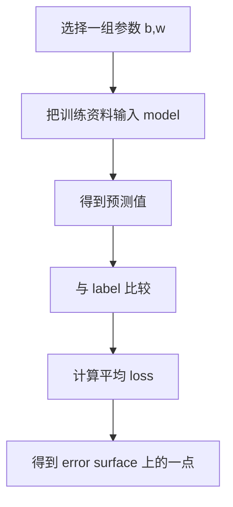
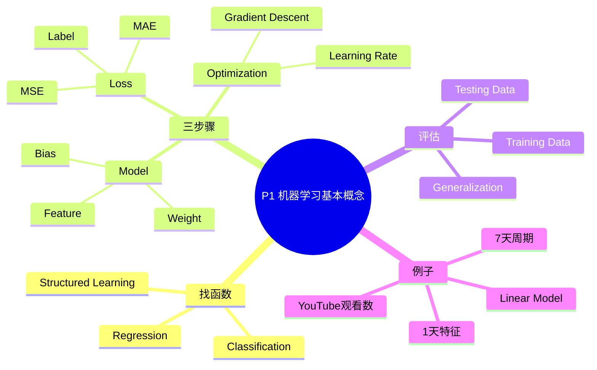

# P1 第一节上：机器学习基本概念简介

来源：`P1【1、第一节 上 机器学习基本概念简介】`

> [!ABSTRACT] 本讲概要
> 本讲回答机器学习课程的第一个问题：机器到底在“学”什么？课程用一句话定义机器学习：让机器自动找一个函数。为了把这个抽象定义落到可操作流程上，老师用 YouTube 频道观看数预测作为贯穿例子，说明一个机器学习任务通常要经历三步：先写出带未知参数的 model，再定义衡量参数好坏的 loss，最后用 gradient descent 等 optimization 方法找出较好的参数。讲到最后，重点已经不只是“训练误差能不能变小”，而是模型在未来没看过的数据上是否仍然可靠。

## 0. 本讲主线


这条主线也是后续所有深度学习主题的基础：不管模型从线性模型变成神经网络，还是任务从数值预测变成图像生成，本质上仍然是在处理“函数、参数、损失、优化、泛化”这几个问题。

## 1. 时间线总览

| 时间 | 内容 |
|---|---|
| 00:00-03:30 | 什么是机器学习：让机器具备找函数的能力 |
| 03:30-08:20 | 机器学习任务类型：regression、classification、structured learning |
| 08:20-10:40 | YouTube 频道观看数预测：把真实问题转成函数问题 |
| 10:40-14:50 | 第一步：写出带未知参数的 model |
| 14:50-24:30 | 第二步：定义 loss，用训练资料评估参数好坏 |
| 24:30-39:50 | 第三步：用 gradient descent 解优化问题 |
| 39:50-43:50 | 训练误差与未来资料误差：评估不能只看训练资料 |
| 43:50-49:50 | 根据资料周期性改进模型：从 1 天特征扩展到 7/28/56 天特征 |

## 2. 机器学习的核心定义：找函数

课程给出的核心定义非常简洁：

```text
Machine Learning = Looking for a function
```

这里的函数不是只指数学课中一条简单曲线，而是广义的输入到输出的映射。只要一个任务可以写成“给机器某种输入，希望机器给出某种输出”，就可以先把它看成一个找函数的问题。

| 任务 | 输入 | 输出 | 要找的函数 |
|---|---|---|---|
| 语音识别 | 一段声音信号 | 对应文字 | 声音到文字的映射 |
| 图像识别 | 一张图片 | 图片类别或内容 | 图像到标签的映射 |
| AlphaGo 下围棋 | 当前棋盘状态 | 下一步落子位置 | 棋局到动作的映射 |
| 观看数预测 | 过去观看数等资讯 | 未来观看数 | 历史资料到未来数值的映射 |

这一定义的价值在于，它把看似差异很大的任务统一起来。语音识别、图像识别、推荐系统、游戏 AI、生成文字或图像，都可以先被问成同一个问题：

```text
输入是什么？
输出是什么？
我们希望机器找到怎样的函数？
```

如果一个函数简单到人类能手写规则，就不一定需要机器学习。例如“摄氏温度转华氏温度”可以直接写公式。但语音转文字、图片识别、围棋落子这类函数非常复杂，人类很难手写完整规则，因此才希望机器从资料中自动找出规律。

## 3. 三类典型任务

### 3.1 Regression：输出是数值

如果函数的输出是一个数值，这类任务叫 **regression**。

例子：预测明天中午的 PM2.5。

```text
输入：今天 PM2.5、今天平均温度、臭氧浓度等
输出：明天中午 PM2.5 数值
```

判断 regression 的关键不是输入是什么，而是输出是否为连续或可度量的数值。房价预测、温度预测、观看数预测都属于这一类。

### 3.2 Classification：输出是类别

如果函数要从预先设定好的选项中选一个输出，这类任务叫 **classification**。

例子 1：垃圾邮件分类。

```text
输入：一封电子邮件
输出：垃圾邮件 / 非垃圾邮件
```

例子 2：AlphaGo。

围棋棋盘有 `19 x 19 = 361` 个可能落子位置。如果把每个位置看成一个类别，AlphaGo 下一步落子也可以被看成一个 361 类分类问题。

Classification 不一定只有两个类别；只要输出是在一组固定选项中选择，就可以是分类。

### 3.3 Structured Learning：输出是有结构的对象

如果输出不是单一数值或单一类别，而是有结构的复杂对象，就进入 **structured learning**。

例子：

| 任务 | 输出为何有结构 |
|---|---|
| 机器翻译 | 输出是一整句文字，词序和语法有结构 |
| 语音识别 | 输出是一串文字，不是单个类别 |
| 图像生成 | 输出是一张由像素组成的图 |
| 文章生成 | 输出是一篇有段落、逻辑和语义的文字 |

课程用比较直观的话说，structured learning 更像是让机器“创造”。它也是后续生成式模型、语言模型、图像生成模型的重要背景。

## 4. 贯穿例子：预测 YouTube 频道观看数

为了说明机器学习流程，课程选择一个具体任务：

```text
输入：YouTube 频道过去若干天的观看数
输出：隔天的总观看次数
```

这个任务的好处是，它既足够简单，可以用一条线性公式解释，又有真实资料中的复杂性，例如星期周期、节假日变化、趋势变化等。

先从最简单的假设开始：

```text
明天观看数可能和前一天观看数有关。
```

于是输入特征可以先选：

```text
x1 = 前一天观看数
```

输出为：

```text
y = 隔天观看数
```

接下来就可以套入机器学习三步骤。

## 5. 第一步：写出带未知参数的 Model

最简单的 model 可以写成：

```text
y = b + w x1
```

| 符号 | 含义 |
|---|---|
| `x1` | feature，前一天观看数 |
| `y` | 预测的隔天观看数 |
| `w` | weight，权重 |
| `b` | bias，偏置 |

这条公式的意思是：

```text
预测观看数 = 偏置 + 权重 x 前一天观看数
```

这里有一个重要定义：

> [!IMPORTANT] Model
> Model 是一个带未知参数的函数。机器学习不是直接凭空产出答案，而是在我们给定的函数形式中，利用训练资料找出合适参数。

在这个例子中，`w` 和 `b` 不是人工凭感觉填进去的，而是后面要通过资料学出来。人工决定的是 model 的形式，比如“要不要只看前一天”“要不要看前七天”“要不要使用线性模型”。这些选择往往来自 **domain knowledge**，也就是对问题领域的理解。

## 6. 第二步：定义 Loss

有了 model 后，还需要定义“这组参数好不好”。这个衡量标准叫 **loss function**。

在本例中，loss 的输入是参数：

```text
L(b, w)
```

它的输出是一个数值，表示当 `b` 和 `w` 取某组值时，模型预测得有多差。loss 越大，参数越差；loss 越小，参数越好。

### 6.1 单笔资料的误差

假设选择：

```text
b = 0.5K
w = 1
```

model 变成：

```text
y = 0.5K + x1
```

如果 1 月 1 日观看数为 `4.8K`，则预测 1 月 2 日观看数为：

```text
5.3K
```

若真实 1 月 2 日观看数是 `4.9K`，则误差为：

```text
|5.3K - 4.9K| = 0.4K
```

这里真实答案称为 **label**。

### 6.2 多笔资料的平均误差

训练资料中有很多天的数据。对每一天都计算预测值与真实 label 的差距，再取平均，就得到整体 loss。

常见 loss 包括：

| 名称 | 形式直觉 | 常见用途 |
|---|---|---|
| MAE, Mean Absolute Error | 绝对误差平均 | 本讲观看数预测示例 |
| MSE, Mean Squared Error | 平方误差平均 | 回归任务常用 |
| Cross Entropy | 概率分布差异 | 分类任务常用 |

本讲重点不是某个 loss 的细节，而是理解 loss 的角色：

```text
loss 把“预测得好不好”变成一个可以优化的数字。
```

## 7. Error Surface：把参数好坏画出来

因为 `L(b, w)` 的输入是两个参数，所以可以想象每一组 `(b, w)` 都对应一个 loss。把这些值画出来，就得到 **error surface**。



课程中用颜色表示 loss 大小：越红代表 loss 越大，越蓝代表 loss 越小。训练的目标就是在这张地形图上找到较低的位置。

## 8. 第三步：Optimization

第三步是解优化问题：

```text
(b*, w*) = arg min L(b, w)
```

意思是：找到一组参数 `b*` 和 `w*`，使 loss 尽量小。

课程介绍的基本方法是 **gradient descent**。

## 9. Gradient Descent 的直觉

先假设只有一个参数 `w`。loss 随 `w` 改变形成一条曲线，目标是走到曲线低点。

Gradient descent 的步骤是：

1. 随机选择初始值 `w0`。
2. 计算当前位置 loss 对 `w` 的微分。
3. 如果斜率为正，往左走；如果斜率为负，往右走。
4. 每次走一小步，反复更新。

更新公式：

```text
w1 = w0 - eta * dL/dw
```

| 符号 | 含义 |
|---|---|
| `eta` | learning rate，学习率 |
| `dL/dw` | loss 对参数 `w` 的微分 |
| `w0` | 当前参数 |
| `w1` | 更新后的参数 |

这个公式中的负号很重要：微分指出 loss 上升最快的方向，负微分方向就是下降方向。

### 9.1 Learning Rate

**Learning rate** 决定每次更新参数走多大一步。

| learning rate 状况 | 可能结果 |
|---|---|
| 太大 | 更新很快，但可能跨过低点甚至震荡 |
| 太小 | 更新稳定，但训练非常慢 |
| 合适 | 能较有效地下降 loss |

Learning rate 不是模型从资料中学出来的，而是人预先设定的训练配置，因此它属于 **hyperparameter**。

> [!NOTE] Parameter 与 Hyperparameter
> Parameter 是模型从资料中学出来的未知数，例如 `w` 和 `b`。Hyperparameter 是训练前由人设定的配置，例如 learning rate、训练次数、特征窗口长度。

### 9.2 停止条件

理论上，当微分为 0 时参数不会再更新。但实际训练中不一定会刚好走到微分为 0 的点，因此常见做法是设定最大更新次数，或根据验证资料表现决定何时停止。

## 10. 多参数 Gradient Descent

如果 model 有两个参数 `w` 和 `b`，就分别计算：

```text
dL/dw
dL/db
```

然后同时更新：

```text
w1 = w0 - eta * dL/dw
b1 = b0 - eta * dL/db
```

如果参数更多，就把所有微分合成一个向量，后续课程会称为 **gradient**。实际深度学习框架，例如 PyTorch，可以自动计算这些微分；学习者仍然需要理解它们在概念上代表“如何改变参数才能让 loss 下降”。

## 11. Local Minimum 与 Global Minimum

在一维曲线图上，gradient descent 可能走到某个低点。这个低点分两类：

| 概念 | 含义 |
|---|---|
| Global minimum | 整个 error surface 上 loss 最小的点 |
| Local minimum | 附近比它高，但全局来看不一定最低的点 |

课程在这里先用图示说明 local minimum 的概念，同时预告：在深度学习实务中，训练困难不一定主要来自 local minimum；更复杂的问题会在后续课程继续讨论。

## 12. 训练误差不等于未来表现

用 2017-2020 年的 YouTube 观看数训练最简单模型：

```text
y = b + w x1
```

可以得到类似结果：

```text
w = 0.97
b = 0.1K
训练资料平均误差 = 0.48K
```

这表示模型在已经看过的历史资料上，平均误差约为 480 人次。但课程马上提醒：这不代表模型真的好。

原因是训练资料已经参与了参数选择。真正重要的是：

```text
模型在未来、没看过的资料上表现如何？
```

用 2021 年 1 月 1 日到 2 月 14 日的资料测试，误差变成：

```text
测试资料平均误差 = 0.58K
```

这说明训练 loss 通常会比未见资料误差更乐观。机器学习的目标不是背熟训练资料，而是学到能迁移到新资料的规律。

## 13. 观察错误并改进 Model

预测图中，红线是真实观看数，蓝线是模型预测观看数。最简单模型只看前一天观看数，所以它的预测大致像是把真实曲线往后平移一天。

观察资料后发现：观看数有明显的一周周期，尤其星期五、星期六观看数较低。于是可以把 feature 从“前一天”扩展成“前七天”。

新模型：

```text
y = b + sum_j w_j x_j, j = 1...7
```

| 符号 | 含义 |
|---|---|
| `x1` | 前 1 天观看数 |
| `x2` | 前 2 天观看数 |
| `...` | ... |
| `x7` | 前 7 天观看数 |
| `w1...w7` | 各天对应权重 |

这一步体现了 domain knowledge 的作用：知道资料有星期周期，就把可能相关的历史窗口加入 feature。

## 14. 从 1 天到 56 天：模型变复杂的效果

课程比较了不同特征窗口长度的结果：

| 模型 | 训练误差 | 测试误差 | 观察 |
|---|---:|---:|---|
| 只看前 1 天 | 0.48K | 0.58K | 过于简单，几乎复制前一天 |
| 看前 7 天 | 0.38K | 0.49K | 捕捉星期周期，明显改善 |
| 看前 28 天 | 0.33K | 0.46K | 继续改善，但幅度变小 |
| 看前 56 天 | 0.32K | 0.46K | 训练更好，测试几乎不变 |

这个表传达两个重要信息：

1. 加入合理 feature 可以同时降低训练误差和测试误差。
2. 模型或 feature 变复杂后，训练误差可能继续下降，但测试误差不一定继续改善。

这为后续讨论 overfitting 埋下伏笔。

## 15. Linear Model

本讲最后把这些模型统一为 **linear model**：

```text
y = b + w1 x1 + w2 x2 + ... + wn xn
```

Linear model 的共同形式是：

```text
把每个 feature 乘上对应 weight，加总后再加 bias。
```

| 元素 | 说明 |
|---|---|
| `x_i` | 第 `i` 个 feature |
| `w_i` | 第 `i` 个 feature 的 weight |
| `b` | bias |
| `y` | 预测输出 |

Linear model 是理解机器学习的好起点，因为它把 feature、parameter、loss、gradient descent 都讲得很清楚。但它的表达能力有限，P2 会接着解释如何用 activation function 和 neural network 表达更复杂的函数。

## 16. 重要术语表

| 术语 | 中文 | 本讲含义 |
|---|---|---|
| Machine Learning | 机器学习 | 让机器自动找函数 |
| Function | 函数 | 输入到输出的映射 |
| Regression | 回归 | 输出是数值的任务 |
| Classification | 分类 | 输出是类别选项的任务 |
| Structured Learning | 结构化学习 | 输出是有结构的对象 |
| Feature | 特征 | 输入中用于预测的资讯 |
| Label | 标签 | 训练资料中的真实答案 |
| Model | 模型 | 带未知参数的函数 |
| Parameter | 参数 | 模型要从资料中学出的未知数 |
| Weight | 权重 | 与 feature 相乘的参数 |
| Bias | 偏置 | 不与 feature 相乘、直接加上的参数 |
| Loss | 损失 | 衡量参数好坏的函数 |
| Error Surface | 误差曲面 | 参数组合与 loss 的对应地形 |
| Optimization | 优化 | 找到让 loss 小的参数 |
| Gradient Descent | 梯度下降 | 沿 loss 下降方向更新参数 |
| Learning Rate | 学习率 | 控制每次更新步伐大小 |
| Hyperparameter | 超参数 | 人预先设定的训练配置 |
| Training Data | 训练资料 | 用来找参数的已知资料 |
| Testing Data | 测试资料 | 未参与训练、用来评估泛化的资料 |
| Linear Model | 线性模型 | feature 乘 weight 后加总再加 bias |

## 17. 易错点与理解提醒

1. 机器学习不是让机器凭空变聪明，而是让机器从资料中找函数。
2. 函数可以很复杂，不必是简单的一元公式。
3. Regression 与 classification 只覆盖部分任务，structured learning 处理更复杂输出。
4. Model 是函数形式，parameter 是函数里的未知数。
5. Loss 是人为定义的衡量标准，不同任务可能需要不同 loss。
6. Gradient descent 的核心是沿着 loss 下降方向更新参数。
7. Learning rate 是 hyperparameter，不是 model parameter。
8. Training loss 小不代表模型真的好，必须看没见过的数据。
9. Domain knowledge 会影响 feature 与 model 的设计。
10. 加更多 feature 可以降低训练误差，但不保证持续降低测试误差。

## 18. 知识地图



## 19. 复习问答

**Q1：本讲如何定义机器学习？**  
A：机器学习就是让机器具备找函数的能力，也就是从资料中自动找出输入到输出的映射。

**Q2：为什么语音识别可以看作找函数？**  
A：因为输入是一段声音信号，输出是对应文字，模型要找的是声音到文字的复杂映射。

**Q3：Regression 与 classification 的差别是什么？**  
A：Regression 的输出是数值；classification 的输出是预先设定的类别。

**Q4：AlphaGo 为什么可以看作 classification？**  
A：因为下一步落子可以视为从 361 个棋盘位置中选择一个类别。

**Q5：什么是 model？**  
A：Model 是一个带未知参数的函数，例如 `y = b + w x1`。

**Q6：什么是 label？**  
A：Label 是训练资料中的真实答案，例如真实的隔天观看数。

**Q7：loss 的作用是什么？**  
A：Loss 把“参数好不好”转成一个可以比较、可以优化的数值。

**Q8：gradient descent 在做什么？**  
A：它计算 loss 对参数的微分，并沿着让 loss 下降的方向更新参数。

**Q9：learning rate 为什么重要？**  
A：它决定每次更新走多大一步；太大可能不稳定，太小会训练很慢。

**Q10：为什么不能只看训练误差？**  
A：训练资料参与了参数选择，误差容易偏乐观；真正目标是模型在未见资料上的表现。

## 20. 本讲总结

P1 建立了整门课的最小工作框架：

```text
机器学习 = 找函数

第一步：写出带未知参数的 model
第二步：定义 loss 衡量参数好坏
第三步：用 optimization 找出让 loss 小的参数
```

YouTube 观看数例子对应为：

| 机器学习概念 | 本讲例子 |
|---|---|
| Task | 预测隔天观看数 |
| Feature | 过去若干天观看数 |
| Label | 真实隔天观看数 |
| Model | `y = b + w x1` 或 `y = b + sum_j w_j x_j` |
| Loss | 预测值与真实值的平均误差 |
| Optimization | Gradient descent |
| Evaluation | 在 2021 年未见资料上测试 |

本讲最应该带走的一句话是：

> [!IMPORTANT] 核心结论
> 机器学习不是只追求训练资料上的 loss 变小，而是要通过合适的 model、loss 与 optimization，找到能在未来资料上仍然有用的函数。
