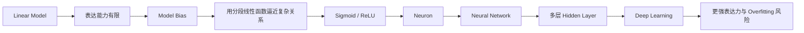
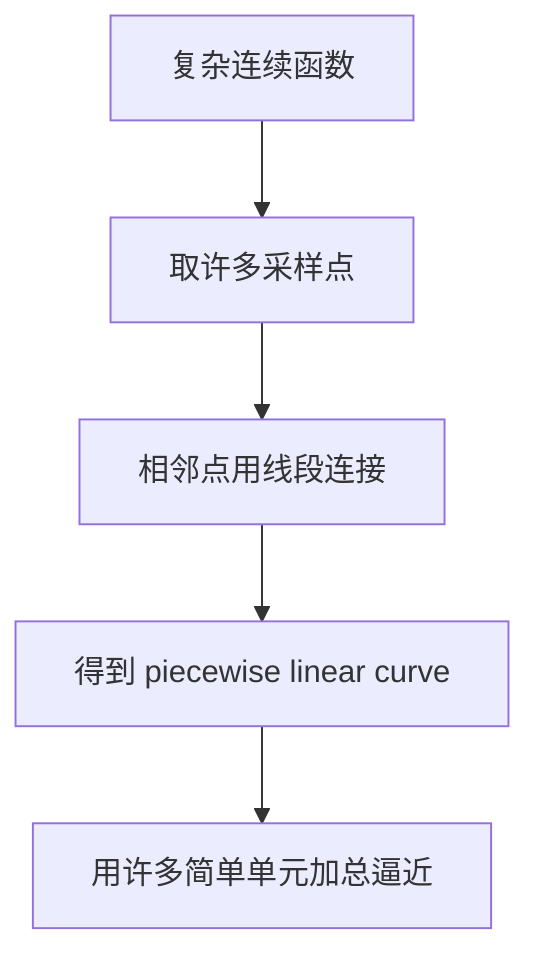
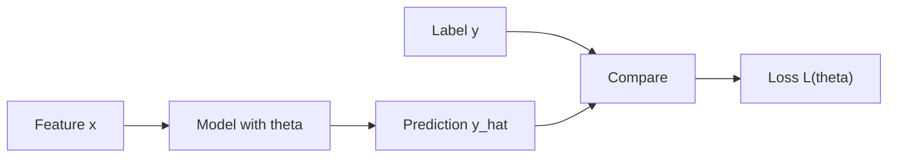
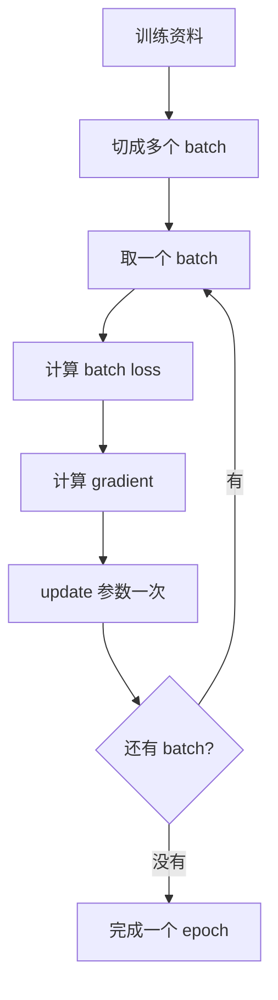
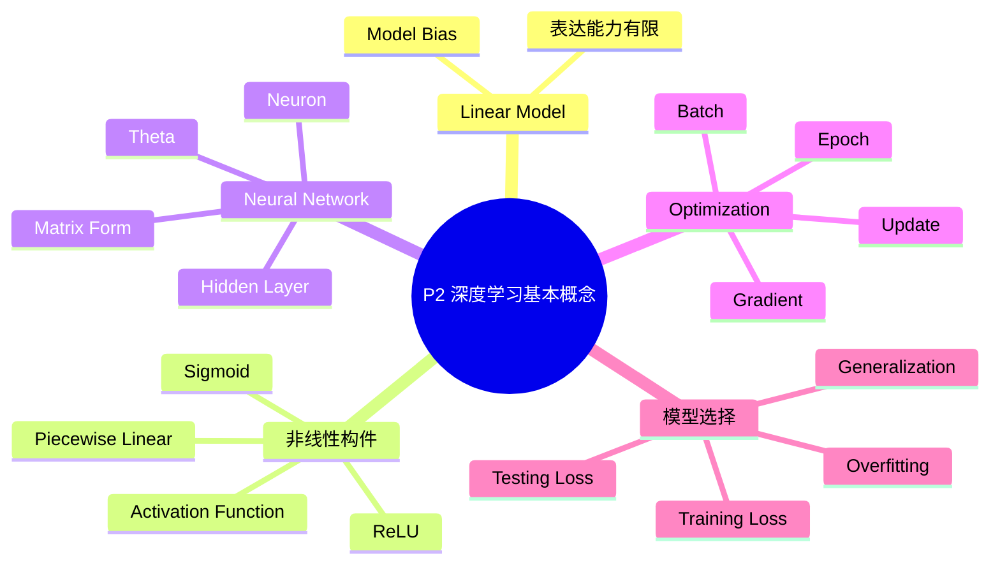

# P2 第一节下：深度学习基本概念简介

来源：`P2【2、下 深度学习基本概念简介】`

> [!ABSTRACT] 本讲概要
> P1 讲完机器学习三步骤后，P2 追问一个关键问题：如果 linear model 太简单，无法描述真实世界中弯曲、转折、非线性的关系，该怎么办？本讲从 model bias 出发，说明为什么要用 sigmoid 或 ReLU 这样的 activation function 组合出复杂函数；再把多个单元写成矩阵运算，得到 neural network；最后说明 deep learning、batch、epoch、overfitting 等基本概念。课程的核心不是背神经网络名词，而是理解：深度学习只是把“找函数”的 model 变得更有弹性，同时仍然要用 loss、gradient descent 和未见资料表现来判断好坏。

## 0. 本讲主线



P2 与 P1 的关系可以概括为：

```text
P1：机器学习的基本流程
P2：把 model 从线性模型扩展到神经网络
```

## 1. 时间线总览

| 时间 | 内容 |
|---|---|
| 00:00-02:30 | 为什么 linear model 太简单：model bias |
| 02:30-08:30 | 用分段线性函数逼近任意连续函数 |
| 08:30-15:40 | Sigmoid function：用可调参数组合复杂曲线 |
| 15:40-25:30 | 多 feature 情况与矩阵/向量表示 |
| 25:30-33:00 | 把所有未知参数合成 `theta`，loss 仍然一样定义 |
| 33:00-40:00 | 多参数 gradient descent、batch、update、epoch |
| 40:00-44:00 | ReLU 与 activation function |
| 44:00-49:00 | 实验：更多 ReLU、更深结构带来更强模型 |
| 49:00-52:30 | Neural network 与 deep learning 的命名 |
| 52:30-56:30 | 为什么要 deep 而不是只变胖；overfitting |
| 56:30-58:30 | 选模型：看没见过资料上的表现 |

## 2. 为什么 Linear Model 不够

P1 最后得到的线性模型可以写成：

```text
y = b + w1 x1 + w2 x2 + ... + wn xn
```

如果只有一个 feature，就是一条直线：

```text
y = b + w x1
```

这类模型的问题在于表达能力有限。无论怎么调整 `w` 和 `b`，输入 `x1` 与输出 `y` 的关系都只能是一条直线。

现实中的关系往往更复杂：

| 可能关系 | 线性模型的问题 |
|---|---|
| 先上升、后下降 | 一条直线无法表达转折 |
| 某些区间变化快、某些区间变化慢 | 单一斜率不够 |
| 具有周期性或局部模式 | 简单加权和表达困难 |
| 多个 feature 之间存在交互 | 纯线性相加不容易描述复杂交互 |

这种由于 model 本身太简单而造成的限制，课程称为 **model bias**。

> [!WARNING] 不要混淆两个 bias
> 公式中的 `b` 是模型参数 bias；本讲说的 model bias 是模型形式造成的表达限制。前者是一个数，后者是模型族的能力问题。

## 3. 从复杂函数到分段线性函数

为了降低 model bias，需要更有弹性的函数形式。课程先提出一个重要观察：

```text
很多复杂连续函数都可以用 piecewise linear curve 近似。
```

也就是说，把一条曲线切成许多小段，每一小段用直线连接。切得越细，分段线性曲线就越接近原本的曲线。



课程接着引入一种“蓝色函数”作为构件：它大致是先水平、再斜坡、再水平的形状。只要能制造很多位置、坡度、高度不同的蓝色函数，再把它们加起来，就能拼出复杂曲线。

核心思想：

```text
复杂函数 ≈ 常数 + 很多个简单函数的加总
```

这就是后续 sigmoid/ReLU 单元的直觉基础。

## 4. Sigmoid Function

课程先用 **sigmoid function** 来制造可调的 S 形构件。

基本形式：

```text
sigmoid(z) = 1 / (1 + exp(-z))
```

放入一个线性输入后：

```text
y = c * sigmoid(b + w x1)
```

也可以写成：

```text
y = c / (1 + exp(-(b + w x1)))
```

### 4.1 Sigmoid 的形状

Sigmoid 输出具有 S 形特征：

| 输入区间 | 输出行为 |
|---|---|
| 输入很小 | 输出接近 0 |
| 中间区间 | 输出快速变化，形成斜坡 |
| 输入很大 | 输出接近上限 |

参数作用如下：

| 参数 | 作用 |
|---|---|
| `w` | 控制斜坡陡峭程度，也影响方向 |
| `b` | 控制函数左右平移 |
| `c` | 控制输出高度 |

调整 `w`、`b`、`c`，就可以得到位置、斜率、高度不同的 sigmoid。多个 sigmoid 加起来，就能近似更复杂的曲线。

## 5. 从一个 Sigmoid 到复杂模型

如果只考虑一个输入 feature，可以把许多 sigmoid 加起来：

```text
y = b + sum_i c_i * sigmoid(b_i + w_i x1)
```

其中 `i` 表示第 `i` 个 sigmoid 单元。

如果输入有多个 feature，例如前 1 天、前 2 天、前 3 天观看数，则每个 sigmoid 的输入可以先做线性组合：

```text
y = b + sum_i c_i * sigmoid(b_i + sum_j w_ij x_j)
```

| 符号 | 含义 |
|---|---|
| `j` | 第 `j` 个 feature |
| `i` | 第 `i` 个 sigmoid 单元 |
| `w_ij` | 第 `i` 个单元中第 `j` 个 feature 的 weight |
| `b_i` | 第 `i` 个单元的 bias |
| `c_i` | 第 `i` 个单元输出后的权重 |

这条式子可以读成三步：

```text
先把多个 feature 加权相加
再通过 sigmoid 产生非线性变化
最后把多个 sigmoid 的输出加权相加
```

它已经是神经网络的雏形。

## 6. 用矩阵和向量表示

为了让公式适合程序实现，课程把多个 sigmoid 单元写成矩阵形式。

假设输入有 3 个 feature：

```text
x = [x1, x2, x3]
```

先做线性变换：

```text
r = xW + b
```

| 符号 | 含义 |
|---|---|
| `x` | feature 向量 |
| `W` | weight matrix |
| `b` | bias vector |
| `r` | 每个 sigmoid 单元的输入 |

再套 activation：

```text
a = sigmoid(r)
```

最后输出：

```text
y = a c^T + b
```

整个流程可以写成：

```text
x -> xW + b -> sigmoid -> a -> a c^T + b -> y
```

> [!NOTE] 图、公式、矩阵是同一件事
> 神经网络图看起来是节点与箭头，公式看起来是 summation，矩阵表示看起来是线性代数。它们描述的是同一组计算，只是表达方式不同。

## 7. 所有未知参数合成 Theta

复杂模型中会有很多未知参数：

| 参数来源 | 例子 |
|---|---|
| 输入到 hidden layer 的权重 | `W` |
| hidden layer 的 bias | `b_i` |
| hidden unit 输出后的权重 | `c_i` |
| 最终输出 bias | `b` |

课程把所有未知参数统一记作：

```text
theta = [theta1, theta2, theta3, ...]
```

于是 P1 的三步骤仍然成立：

```text
第一步：定义带未知参数 theta 的 model
第二步：定义 loss L(theta)
第三步：用 optimization 找 theta*
```

换句话说，深度学习不是换了一套机器学习逻辑，而是换了更复杂、更有弹性的 model。

## 8. Loss 的定义没有改变

在 linear model 中，loss 可以写成：

```text
L(w, b)
```

在复杂模型中，参数太多，所以写成：

```text
L(theta)
```

但意思仍然一样：

```text
给定一组参数 theta
把 feature 输入 model 得到 prediction
把 prediction 与 label 比较
对训练资料误差求和或平均
得到 loss
```



## 9. 多参数 Gradient Descent

当参数很多时，gradient descent 仍然沿用同一个想法：找 loss 下降方向。

步骤：

1. 随机初始化 `theta0`。
2. 对每个参数计算它对 loss 的微分。
3. 把所有微分组成一个向量，称为 **gradient**。
4. 沿着负 gradient 方向更新参数。

更新公式：

```text
theta1 = theta0 - eta * g
```

| 符号 | 含义 |
|---|---|
| `theta0` | 当前所有参数 |
| `g` | gradient，所有偏微分组成的向量 |
| `eta` | learning rate |
| `theta1` | 更新后的参数 |

如果有 1000 个参数，gradient 就是 1000 维向量；如果有上亿参数，gradient 也是上亿维向量。深度学习框架的 automatic differentiation 会负责计算这些梯度，但训练逻辑仍然是 gradient descent 的延伸。

## 10. Batch、Update 与 Epoch

实际训练时，不一定每次都用全部训练资料计算 loss。通常会把资料分成一包一包，每一包叫 **batch**。

训练流程：



### 10.1 Update

每更新一次参数，叫一次 **update**。

### 10.2 Epoch

所有训练资料都被看过一遍，叫一个 **epoch**。

二者关系取决于 batch size：

| 资料量 `N` | Batch size `B` | 一个 epoch 中的 update 次数 |
|---:|---:|---:|
| 10000 | 10 | 1000 |
| 1000 | 100 | 10 |

所以，“训练一个 epoch”不等于“只更新一次参数”。Batch size 也是 hyperparameter。

## 11. ReLU 与 Activation Function

课程接着说明，不一定非要用 sigmoid。另一种常用选择是 **ReLU, Rectified Linear Unit**。

公式：

```text
ReLU(z) = max(0, z)
```

放入线性输入：

```text
c * max(0, b + w x1)
```

它的行为是：

| 条件 | 输出 |
|---|---|
| `b + w x1 < 0` | `0` |
| `b + w x1 > 0` | `b + w x1` |

图像上，ReLU 是一条先水平、到某点后变成斜坡的折线。两个 ReLU 可以组合出类似 hard sigmoid 的形状，因此也能用于构造分段线性函数。

Sigmoid、ReLU 这类函数统称为 **activation function**。

> [!IMPORTANT] Activation Function 的作用
> Activation function 的关键作用是引入非线性。如果没有 activation，多层线性变换叠在一起仍然等价于一个线性变换，模型表达能力不会真正增强。

## 12. 实验：更多 ReLU 与更强表达能力

课程继续使用 YouTube 观看数预测实验。先前 linear model 使用前 56 天资料：

| 模型 | 训练资料 loss | 没看过资料 loss |
|---|---:|---:|
| Linear model，56 天 feature | 0.32K | 0.46K |

换成 ReLU 后：

| 模型 | 训练资料 loss | 没看过资料 loss | 解释 |
|---|---:|---:|---|
| 10 个 ReLU | 接近 linear | 接近 linear | 单元太少，改善有限 |
| 100 个 ReLU | 约 0.28K | 约 0.43K | 能表达更复杂分段线性函数 |
| 1000 个 ReLU | 训练 loss 更低 | 测试改善不明显 | 表达力增强不保证泛化继续变好 |

这个实验说明：

1. 更多 ReLU 通常能降低 training loss。
2. 表达能力增强后，模型可能更好。
3. 但模型更复杂不等于未见资料表现一定更好。

## 13. 从一层到多层

前面结构可以看成一层 hidden layer：

```text
x -> W,b -> ReLU/sigmoid -> a -> output y
```

接着可以把同样操作重复多次：

```text
x -> W1,b1 -> ReLU -> a1
a1 -> W2,b2 -> ReLU -> a2
a2 -> W3,b3 -> ReLU -> a3
...
```

每多一层，就新增一组参数。层数本身也是 hyperparameter。

课程实验结果大致如下：

| 模型深度 | 训练资料 loss | 没看过资料 loss | 观察 |
|---|---:|---:|---|
| 1 层，每层 100 个 ReLU | 0.28K | 0.43K | 比 linear model 好 |
| 2 层 | 0.18K | 更好 | 深度带来进一步改善 |
| 3 层 | 0.14K | 0.38K | 本实验中泛化最好 |
| 4 层 | 0.10K | 0.44K | 训练更好，测试变差 |

这组结果是理解 overfitting 的入口。

## 14. Neural Network 与 Deep Learning 的命名

课程把前面这些 sigmoid 或 ReLU 单元称为 **neuron**。

许多 neuron 连接起来，称为：

```text
Neural Network
```

输入与输出之间的中间层称为：

```text
Hidden Layer
```

如果 hidden layer 很多，就称为：

```text
Deep
```

因此：

```text
很多 hidden layer 的 neural network = deep learning
```

课程也提醒，neural network 并不是全新的概念，早在 1980-1990 年代就已经存在。后来由于更深的结构、更大的资料、更强的算力与更好的训练技巧，它重新变得非常有效，并以 deep learning 的名字流行起来。

## 15. 为什么要 Deep，而不是只变胖

课程提出一个关键问题：

```text
如果一层足够宽就能逼近很多函数，为什么还需要深层网络？
```

也就是：

```text
Fat neural network vs Deep neural network
```

理论上，一层含有足够多 sigmoid/ReLU 的网络可以逼近许多连续函数。但实践上，深度结构往往能用更有效的方式表达复杂规律。课程在这里没有完整展开，而是把它作为后续主题。

本讲需要先记住的是：

| 结构选择 | 含义 |
|---|---|
| 变胖 | 同一层放更多 neuron |
| 变深 | 增加 hidden layer 数量 |
| 二者共同点 | 都增加 model complexity |
| 风险 | complexity 增加后可能 overfit |

## 16. Overfitting：训练变好不等于模型变好

4 层网络的实验非常典型：

```text
3 层：训练 loss = 0.14K，未见资料 loss = 0.38K
4 层：训练 loss = 0.10K，未见资料 loss = 0.44K
```

4 层模型在训练资料上更好，但在没看过的资料上更差。这种现象称为 **overfitting**。

定义：

> [!IMPORTANT] Overfitting
> 模型在训练资料上表现变好，但在未见资料上没有变好，甚至变差，说明模型可能记住了训练资料中的偶然细节或噪声，而不是学到可泛化的规律。

过拟合不是“训练失败”那么简单。它常常表现为 training loss 很漂亮，但真正要用模型时表现不佳。

## 17. 如何选模型

课程最后问：如果要预测 2 月 26 日的观看次数，应该选 3 层网络还是 4 层网络？

答案应偏向 3 层模型。

原因：

| 判断依据 | 3 层 | 4 层 |
|---|---:|---:|
| Training loss | 0.14K | 0.10K |
| 未见资料 loss | 0.38K | 0.44K |
| 是否适合预测未来 | 更适合 | 较不适合 |

预测未来时，2 月 26 日就是没看过的新资料。因此应选择未见资料表现较好的模型，而不是训练 loss 最低的模型。

这延续了 P1 的核心结论：

```text
真正重要的是泛化能力，不是训练资料上的最低 loss。
```

## 18. 重要术语表

| 术语 | 中文 | 本讲含义 |
|---|---|---|
| Linear Model | 线性模型 | feature 乘 weight 后加总，再加 bias |
| Model Bias | 模型偏差/模型限制 | 模型形式太简单，无法表达真实关系 |
| Piecewise Linear Curve | 分段线性曲线 | 由多个线段组成的曲线 |
| Sigmoid | S 型函数 | 可调非线性单元，输出平滑过渡 |
| Hard Sigmoid | 硬 sigmoid | 先水平、再斜坡、再水平的分段线性形状 |
| ReLU | 修正线性单元 | `max(0, z)`，常用 activation function |
| Activation Function | 激活函数 | 给模型加入非线性能力的函数 |
| Neuron | 神经元 | 一个 sigmoid/ReLU 等计算单元 |
| Neural Network | 神经网络 | 许多 neuron 连接形成的模型 |
| Hidden Layer | 隐藏层 | 输入和输出之间的中间层 |
| Deep Learning | 深度学习 | 含多层 hidden layer 的 neural network 学习方法 |
| Theta | 参数向量 | 把所有未知参数合并后的长向量 |
| Gradient | 梯度 | 所有参数对 loss 的微分组成的向量 |
| Batch | 批次 | 每次用来计算 loss 和 gradient 的一小组资料 |
| Update | 参数更新 | 用 gradient 更新一次参数 |
| Epoch | 训练轮次 | 所有训练资料被看过一遍 |
| Overfitting | 过拟合 | 训练资料变好，但未见资料变差或不变 |
| Hyperparameter | 超参数 | 人自己决定的训练设定，例如 batch size、层数、单元数 |

## 19. 易错点与理解提醒

1. Linear model 的问题不是不能训练，而是表达能力有限。
2. Model bias 指模型形式的限制，不是参数 `b`。
3. Sigmoid 和 ReLU 的作用是引入非线性。
4. 多个 sigmoid/ReLU 加起来，可以逼近复杂分段线性曲线。
5. 如果没有 activation function，多层线性变换仍然等价于一层线性变换。
6. 参数很多时，可以统一记作 `theta`，loss 写成 `L(theta)`。
7. 一个 epoch 不等于一次 update；一个 epoch 通常包含很多 update。
8. Batch size 是 hyperparameter，会影响一个 epoch 中 update 的次数。
9. Training loss 越低，不一定代表模型越好。
10. Overfitting 的关键判断是未见资料表现没有同步变好。
11. Deep learning 中的 deep 指 hidden layer 多，不是名字听起来更高级。
12. 选择模型时应看未见资料表现，而不是只看训练资料表现。

## 20. 知识地图



## 21. 与 P1 的对照

| P1 概念 | P2 中的延伸 |
|---|---|
| 找函数 | 找更复杂、更有弹性的函数 |
| Linear model | Neural network |
| 参数 `w, b` | 大量参数合成 `theta` |
| Loss `L(w,b)` | Loss `L(theta)` |
| Gradient descent | 高维参数空间中的 gradient descent |
| Training/testing 差异 | Overfitting 与模型选择 |
| 加 feature 改进模型 | 加 neuron、加 layer 改进模型 |

P2 最重要的观念是：深度学习没有推翻 P1，而是扩展 P1。

## 22. 复习问答

**Q1：为什么 linear model 太简单？**  
A：因为它只能表达线性关系，无法表达转折、弯曲、局部变化等复杂输入输出关系。

**Q2：什么是 model bias？**  
A：模型形式本身带来的限制。例如真实关系很复杂，但模型只能画直线。

**Q3：为什么分段线性曲线重要？**  
A：因为足够多线段可以近似很多连续曲线，sigmoid/ReLU 可以作为构造这些曲线的基本单元。

**Q4：sigmoid 的参数有什么作用？**  
A：`w` 控制斜率和方向，`b` 控制左右平移，`c` 控制高度。

**Q5：ReLU 的公式是什么？**  
A：`ReLU(z) = max(0, z)`。

**Q6：activation function 的作用是什么？**  
A：它引入非线性，让模型不再只是线性函数，从而能表达复杂关系。

**Q7：为什么要把所有参数写成 `theta`？**  
A：神经网络参数很多，统一写成 `theta` 可以简化 loss 与 optimization 的表示。

**Q8：gradient 是什么？**  
A：Gradient 是所有参数对 loss 的微分组成的向量，指出 loss 上升最快方向；更新时沿负 gradient 方向走。

**Q9：batch、update、epoch 有什么区别？**  
A：Batch 是一小组训练资料；update 是参数更新一次；epoch 是所有训练资料被看过一遍。

**Q10：什么是 neural network？**  
A：许多 neuron，也就是 sigmoid/ReLU 等计算单元连接形成的模型。

**Q11：什么是 deep learning？**  
A：含有很多 hidden layer 的 neural network 的学习方法。

**Q12：什么是 overfitting？**  
A：模型在训练资料上表现变好，但在没看过的资料上没有变好甚至变差。

**Q13：为什么 3 层网络可能比 4 层网络更适合预测未来？**  
A：因为 3 层网络在未见资料上的 loss 更低；预测未来时关心的是泛化表现。

## 23. 本讲总结

P2 的核心逻辑链是：

```text
Linear model 太简单
=> 有 model bias
=> 需要更有弹性的函数
=> 用 sigmoid/ReLU 组合复杂函数
=> 多个单元形成 neural network
=> 多层 hidden layer 形成 deep learning
=> 模型越复杂，training loss 可能越低
=> 但未见资料表现可能变差
=> 这就是 overfitting
```

本讲最重要的公式骨架：

```text
y = b + sum_i c_i * sigmoid(b_i + sum_j w_ij x_j)
```

向量化理解：

```text
x -> xW + b -> activation -> a -> output
```

训练流程仍然是 P1 的三步：

```text
1. 写出带未知参数 theta 的 model
2. 定义 L(theta)
3. 用 gradient descent 找 theta*
```

> [!IMPORTANT] 核心结论
> Deep learning 的重点不是名字里的 deep，而是用多层非线性函数提升 model 的表达能力；但模型越复杂越需要用未见资料表现来检查是否真的学到了可泛化的规律。
