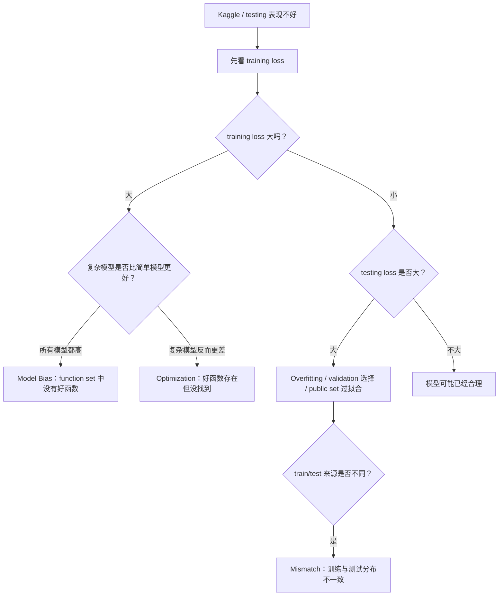
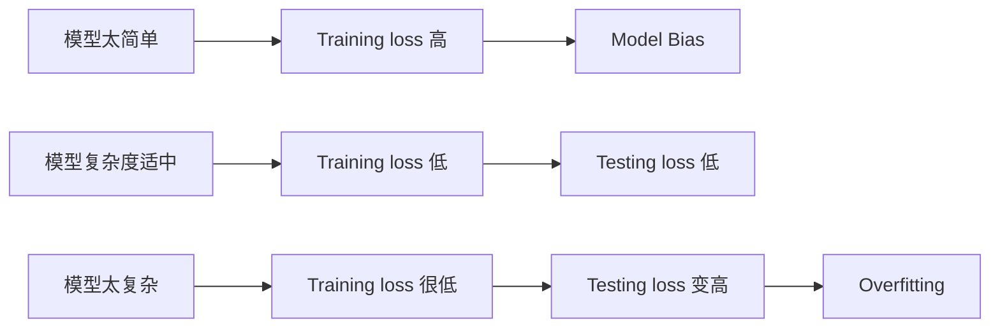
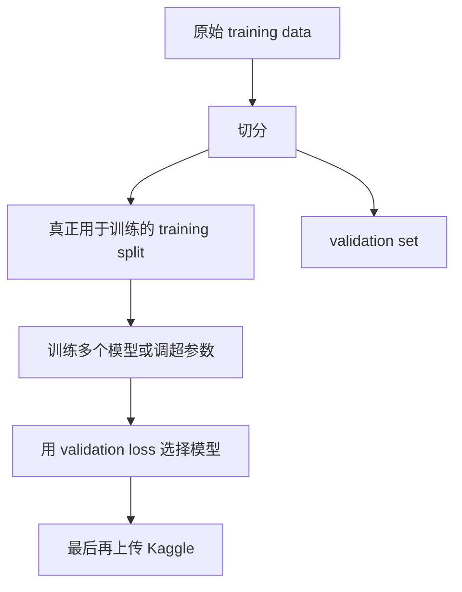
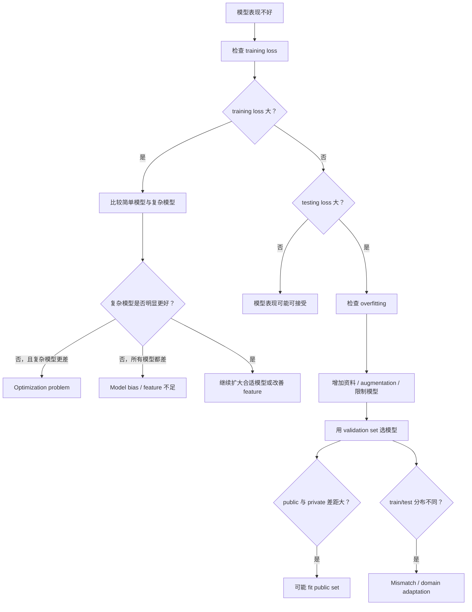
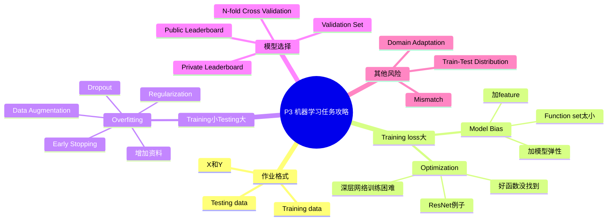

# P3 第二节：机器学习任务攻略

来源：`P3【3、第二节 机器学习任务攻略】`

> [!ABSTRACT] 本讲概要
> 本讲不是介绍一个新模型，而是给出机器学习作业与竞赛的排错攻略。老师强调：当 Kaggle 或测试集分数不好时，不要立刻说“overfitting”，而要先回到 training loss。若 training loss 仍然很大，问题可能是 model bias，也可能是 optimization 没做好；若 training loss 已经很小，但 testing loss 很大，才进入 overfitting、validation set、public/private leaderboard 与 train-test mismatch 的讨论。本讲的核心能力是诊断：看到模型表现不好时，知道下一步该查什么，而不是凭感觉调参。

## 0. 本讲主线



这张图是本讲最重要的思维工具。以后看到模型表现不佳，先不要问“我要不要换更深的模型”，而要先问：

```text
training loss 是大还是小？
testing loss 与 training loss 的差距在哪里？
训练资料和测试资料是否来自同一分布？
```

## 1. 时间线总览

| 时间 | 内容 |
|---|---|
| 00:00-04:20 | 前期作业共同格式：训练资料有 `X/Y`，测试资料只有 `X` |
| 04:20-10:00 | 作业攻略第一步：结果不好先看 training loss |
| 10:00-15:40 | Training loss 大：区分 model bias 与 optimization 问题 |
| 15:40-21:30 | Training loss 小、testing loss 大：overfitting 的直觉 |
| 21:30-28:00 | 解决 overfitting：更多资料、data augmentation、限制模型 |
| 28:00-31:00 | 模型复杂度与 testing loss 的 U 形关系 |
| 31:00-40:00 | 不要用 public testing set 反复调模型 |
| 40:00-46:30 | Validation set 与 N-fold cross validation |
| 46:30-49:30 | 回看上节课预测观看数失败：mismatch |
| 49:30-51:20 | Train-test distribution mismatch 的判断与作业提醒 |

## 2. 前期作业的共同结构

课程先说明，前期许多作业任务不同，但资料格式相似。

训练资料通常包含输入与答案：

```text
(x1, y1), (x2, y2), ..., (xN, yN)
```

测试资料通常只有输入：

```text
x
```

也就是说，训练时你知道 `x` 和它对应的 `y`；测试时你只有 `x`，要让模型输出预测结果。

| 作业 | 任务 | `X` 是什么 | `Y` 是什么 |
|---|---|---|---|
| HW1 | 预测任务 | 输入特征 | 数值标签 |
| HW2 | 语音辨识简化版 | 一小段声音信号 | 对应 phoneme，粗略可想成类似 KK 音标 |
| HW3 | 影像辨识 | 一张图片 | 图片类别 |
| HW4 | 语者辨识 | 一段声音信号 | 正在说话的人是谁 |
| HW5 | 机器翻译 | 某语言的一句话 | 另一种语言的对应句子 |

这些任务背后仍然是 P1/P2 的机器学习三步骤：

```text
1. 写出带未知参数 theta 的函数 f_theta(x)
2. 定义 loss L(theta)
3. 找 theta*，让 loss 尽量小
```

训练完成后：

```text
把 theta* 放回模型
=> 对测试资料 x 输出预测
=> 上传 Kaggle 或交作业系统
```

## 3. 结果不好时，第一件事是看 Training Loss

如果 Kaggle 分数不好，第一件事不是立刻换模型，也不是马上说 overfitting，而是：

> [!IMPORTANT] 第一诊断原则
> 先检查模型在 training data 上的 loss。

原因很简单：如果模型连训练资料都学不好，那么直接讨论测试资料表现意义不大。你必须先知道模型在“已经看过、答案已知”的资料上是否学起来。

可以把问题分成两大类：

| 观察 | 意义 |
|---|---|
| Training loss 大 | 模型在训练资料上都没学好 |
| Training loss 小，testing loss 大 | 模型学会训练资料，但没有泛化到测试资料 |

课程特别提醒：很多同学一看到 testing 分数不好就说 overfitting，这是不严谨的。Overfitting 的前提是：

```text
training loss 已经小，但 testing loss 仍然大。
```

如果 training loss 本身就大，那还没资格谈 overfitting。

## 4. Training Loss 大：两个主要可能

当 training loss 大时，说明模型在训练资料上都表现不好。这时主要有两种可能：

1. **Model bias**
2. **Optimization problem**

它们表面现象一样，都是 training loss 大；但原因完全不同，解法也不同。

## 5. Model Bias：函数集合里没有好函数

所谓 **model bias**，是指模型可以表示的函数集合太小，里面没有任何一个函数能让 loss 足够低。

更形式化地说：

```text
选定一个 model
=> 不同 theta 对应不同函数 f_theta
=> 所有 f_theta 组成 function set
=> 如果 function set 中没有好函数，就是 model bias
```

课程用“大海捞针”比喻：

| 比喻 | 机器学习含义 |
|---|---|
| 大海 | 这个 model 的 function set |
| 针 | loss 很低的好函数 |
| 针不在海里 | model bias |

如果针不在这片海里，无论 optimization 多努力，都不可能捞到针。也就是说，模型形式太弱时，训练算法再认真也只能找到“差模型里相对最好的函数”。

### 5.1 解决 Model Bias

如果问题是 model bias，方向是：

```text
让 model 更有弹性，让 function set 更大或更合适。
```

常见方法：

| 方法 | 直觉 |
|---|---|
| 加更多 feature | 给模型更多有用输入 |
| 设计更大模型 | 提升函数表达能力 |
| 增加 neuron 数量 | 让神经网络能表示更复杂函数 |
| 增加 hidden layer | 用深度结构表达复杂规律 |
| 换更合适架构 | 让模型结构更贴近资料特性 |

P1/P2 的观看数预测例子就是一例：只看前一天观看数时模型太简单，加入前 7 天、28 天、56 天资料后，模型表达能力变强，training/testing 表现也改善。

## 6. Optimization Problem：好函数存在，但没有找到

另一种 training loss 大的原因是 **optimization problem**。

这种情况是：

```text
function set 中其实有好函数
但 gradient descent 或其他训练方法没有找到它
```

仍用大海捞针比喻：

| 比喻 | 机器学习含义 |
|---|---|
| 针在海里 | model 有能力表示好函数 |
| 没捞到针 | optimization 没做好 |

这和 model bias 完全不同。Model bias 是“没有好函数可找”；optimization problem 是“好函数存在，但训练过程没找到”。

深度学习中的 optimization 可能受 learning rate、初始化、网络深度、梯度消失/爆炸、局部几何结构等因素影响。后续课程会专门讨论神经网络训练不起来时该怎么办。

## 7. 如何区分 Model Bias 与 Optimization

课程给出一个实用判断方法：

> [!IMPORTANT] 比较简单模型与复杂模型的 training loss。

直觉是：大模型通常应该至少包含小模型能做的事情。如果复杂模型在 training data 上反而比简单模型更差，就不太像 model bias，而更像 optimization 没做好。

### 7.1 诊断表

| 观察 | 更可能的问题 | 原因 |
|---|---|---|
| 简单模型和复杂模型 training loss 都高 | Model bias 或 feature/model 设计不足 | function set 里可能没有好函数 |
| 简单模型 training loss 低，复杂模型反而高 | Optimization problem | 复杂模型理论上更强，却没训练好 |
| 复杂模型 training loss 明显更低 | Model bias 得到缓解 | 更大的 function set 找到更好函数 |

### 7.2 ResNet 论文例子

课程引用 ResNet 早期论文中的典型现象：

| 模型 | 观察 |
|---|---|
| 20 层网络 | training loss 较低 |
| 56 层网络 | training loss 反而较高 |

这不是 overfitting，因为比较的是 training loss。也不应该简单说 56 层网络 model bias 更大，因为 56 层网络理论上至少可以模拟 20 层网络：前 20 层做同样事情，后面层如果能学成 identity mapping，就不会比 20 层差。

因此，如果 56 层网络训练 loss 更高，重点是：

```text
Optimization 没有成功找到应有的好参数。
```

ResNet 的 residual connection 正是为了让深层网络更容易学到接近 identity 的映射，从而缓解深层网络训练困难。

### 7.3 观看数预测例子

P2 中一层、两层、三层、四层网络的 training loss 逐渐下降。如果某个五层网络 training loss 反而比四层更高，也不应说五层网络 model bias 更大。

原因是：

```text
四层能做到的事，五层理论上应该也能做到。
如果五层训练结果更差，多半是 optimization 失败。
```

## 8. Training Loss 大时的 Debug 顺序

当 training loss 大时，可以按下面顺序检查：

1. 先跑简单模型，例如 linear model、浅层 neural network 或传统方法。
2. 记录简单模型能把 training loss 压到多低。
3. 再跑更复杂模型，例如更深、更宽的 network。
4. 如果复杂模型 training loss 没有更低，怀疑 optimization。
5. 如果所有模型 training loss 都高，怀疑 model bias、feature 不足或任务本身资料信息不够。

简化为：

```text
training loss 大
    ↓
比较简单模型与复杂模型
    ↓
简单模型也差：可能 model bias
复杂模型比简单模型还差：optimization 问题
```

> [!NOTE] 实务提醒
> 诊断模型时，简单 baseline 很重要。没有 baseline，就很难判断复杂模型到底是真的能力不足，还是训练过程出了问题。

## 9. Training Loss 小、Testing Loss 大：Overfitting

如果 training loss 已经很小，但 testing loss 很大，这时才进入 **overfitting** 的讨论。

定义：

```text
Overfitting = 模型在训练资料上表现好，但在没看过的资料上表现差。
```

课程用一个极端函数说明：

```text
如果输入 x 出现在训练资料里，就输出它对应的 y
如果输入 x 没出现在训练资料里，就随机输出
```

这个函数在 training data 上可以 loss 为 0，因为它把训练资料全背下来。但在 testing data 上，它没有学到规律，只能乱猜。

这就是 overfitting 的极端版本：

```text
记住训练资料，不等于学到可泛化规律。
```

## 10. 为什么模型太有弹性会 Overfit

课程用一维函数例子建立直觉：

真实关系可能是一条平滑曲线，但训练资料只给了曲线上的少量点。如果模型太有弹性，它可以刚好穿过所有训练点，让 training loss 很低；但在没有训练点约束的区间，函数可能乱弯，导致 testing loss 很大。

可以概括为：

```text
资料少 + 模型太自由
=> 模型可以贴住训练点
=> 但没有学到真实规律
=> testing loss 大
```

这解释了为什么“更复杂的模型”不是永远更好。复杂模型能降低 training loss，但也更容易利用训练资料中的偶然细节。

## 11. 解决 Overfitting：增加训练资料

最直接、常常也最有效的方法是：

```text
增加训练资料。
```

如果训练点更多，模型就会受到更多约束，不容易在没有资料的地方乱弯。

不过在课程作业中，通常不允许随便额外搜集资料。原因是作业目标是训练建模能力，不是比谁能找到更多外部数据。

## 12. Data Augmentation：合理创造资料

虽然不能随便找外部资料，但可以对已有资料做 **data augmentation**。

Data augmentation 的意思是：根据任务性质，对已有样本做合理变换，产生新的训练样本。

以图像分类为例：

| Augmentation | 是否通常合理 | 原因 |
|---|---|---|
| 左右翻转 | 常常合理 | 多数物体左右翻转后类别不变 |
| 小幅裁切后放大 | 常常合理 | 物体局部变化不应改变类别 |
| 小幅旋转/平移 | 常常合理 | 拍摄角度可能自然变化 |
| 颜色轻微扰动 | 视任务而定 | 可增加光照鲁棒性 |
| 上下颠倒 | 不一定合理 | 真实世界中倒置物体分布可能不同 |

关键原则：

> [!WARNING] Augmentation 不能乱做
> 资料增强必须符合任务与真实资料分布。为了增加资料量而制造不合理样本，反而可能教坏模型。

## 13. 解决 Overfitting：限制模型弹性

另一类方法是限制模型，不让它太自由。

如果你对问题有先验知识，可以把模型限制在合理的函数集合中。例如你知道真实关系大概像二次曲线，就不要让模型随意拟合任意高频波动。

常见限制方法：

| 方法 | 作用 |
|---|---|
| 减少参数数量 | 降低模型自由度 |
| 减少 neuron 数量 | 减少深度模型表达能力 |
| 减少 layer 数量 | 降低复杂度 |
| 减少 feature | 避免模型利用无关输入乱拟合 |
| 参数共享 | 用同一组参数处理不同位置，减少自由度 |
| Regularization | 在 loss 中加入惩罚项，限制参数过大或过复杂 |
| Dropout | 训练时随机丢弃部分 neuron，减少对特定路径依赖 |
| Early stopping | 在 validation 表现变差前停止训练 |

### 13.1 CNN 为什么在影像上有用

课程特别提醒：CNN 并不是因为比 fully connected network 更自由而强。相反，CNN 对模型施加了更多限制，例如局部连接、参数共享等。

这些限制让 CNN 的 function set 更小，但更符合影像资料的结构：

```text
影像中的局部纹理、边缘、形状具有空间结构
CNN 的限制正好利用这些结构
```

因此，好的限制不是坏事。合适的限制可以形成有用的 **inductive bias**，让模型更容易泛化。

## 14. 限制太多会回到 Model Bias

限制模型可以降低 overfitting，但限制过头又会造成 model bias。

例如：

```text
真实关系是二次曲线
你强迫模型只能是一条直线
```

这时模型无法贴合训练资料，也无法在测试资料上表现好。

模型复杂度与 loss 的关系可以这样理解：



Testing loss 往往随模型复杂度呈 U 形：

| 模型复杂度 | Training loss | Testing loss | 主要问题 |
|---|---:|---:|---|
| 太低 | 高 | 高 | Model bias |
| 适中 | 低 | 低 | 泛化较好 |
| 太高 | 很低 | 高 | Overfitting |

目标不是一味增大模型，也不是一味限制模型，而是找到适合资料与任务的复杂度。

## 15. 不要把 Public Leaderboard 当 Validation Set

在 Kaggle 作业中，一个常见诱惑是：

```text
训练很多模型
全部上传
看 public leaderboard 哪个分数最高
就选那个
```

课程不建议这样做，因为 public testing set 也只是测试资料的一部分。如果你反复根据 public score 调模型，就会逐渐 fit 到 public set。

极端例子：

```text
假设你有一兆个随机模型
每个模型对未见资料其实都是乱猜
但只要上传足够多，总会有一个碰巧在 public set 上分数很好
```

这个模型并不是真的好，只是刚好撞中了 public set。到 private set 上就可能崩。

所以：

```text
Public leaderboard 分数好，不保证 private leaderboard 分数好。
```

## 16. Public Set 与 Private Set

Kaggle 常把 testing set 分成两部分：

| 集合 | 作用 | 何时可见 |
|---|---|---|
| Public testing set | 上传后即时显示分数，用于 leaderboard | 比赛过程中可见 |
| Private testing set | 最终排名依据，更接近真实泛化评估 | 截止后公布 |

如果所有 testing set 分数都公开，参赛者可以不断试答案，最后 leaderboard 会变成“谁更会刷 public set”。因此 private set 的存在是为了降低这种过拟合。

课程也借此提醒：许多公开 benchmark 上的高分要谨慎理解。如果一个 benchmark 被反复使用多年，研究者可能在无意中针对它调了很多设计，导致 benchmark 分数高不一定等于真实世界表现同样好。

## 17. 正确做法：划分 Validation Set

更合理的模型选择方法是：

```text
从 training data 中切出 validation set。
```

例如：

```text
90% training set
10% validation set
```

流程：



理想做法是：

```text
用 validation loss 挑模型
不要反复根据 public score 调模型
```

现实中，看到 public score 后完全不受影响很难，但至少要意识到：public set 不应该承担 validation set 的角色。

## 18. N-Fold Cross Validation

如果担心一次 validation 切分不稳定，可以使用 **N-fold cross validation**。

做法：

1. 把训练资料切成 `N` 份。
2. 每次拿其中一份当 validation set，其余 `N-1` 份当 training set。
3. 重复 `N` 次。
4. 把 `N` 次 validation 结果平均。
5. 选择平均 validation 表现最好的模型或超参数。
6. 最后用全部 training data 重新训练选出的配置，再用于 testing set。

3-fold 例子：

| 第几次 | Training set | Validation set |
|---|---|---|
| 1 | 第 1、2 份 | 第 3 份 |
| 2 | 第 1、3 份 | 第 2 份 |
| 3 | 第 2、3 份 | 第 1 份 |

N-fold 的价值是降低“刚好切到奇怪 validation set”的风险，让模型选择更稳定。

## 19. 回看观看数预测失败：Mismatch

P2 末尾，大家根据模型选择逻辑倾向选择 3 层 network 来预测 2021 年 2 月 26 日的 YouTube 观看数。但结果很差，误差约 `2.58K`。

原因是模型根据过去资料学到：

```text
星期五观看人数通常较低。
```

所以它预测 2 月 26 日会是低点。但实际那天是观看人数高峰。

这不是普通 overfitting，而是 **mismatch**：

```text
训练资料和测试资料来自不同分布。
```

如果 test data 的规律和 training data 不一样，模型在 training data 上再成功，也可能无法预测 test data。

## 20. Mismatch 与 Overfitting 的区别

Overfitting 与 mismatch 都会导致 testing 表现差，但原因不同。

| 问题 | 典型现象 | 原因 | 常见解法 |
|---|---|---|---|
| Overfitting | training loss 小，testing loss 大 | 模型记住训练资料细节，泛化差 | 更多同分布资料、augmentation、regularization、dropout、early stopping |
| Mismatch | training/validation 表现可能不错，但真正 test 表现差 | train/test 分布不同 | 收集或适配目标分布资料、domain adaptation、重新定义训练/验证切分 |

课程用 COVID-19 作业举例：如果用 2020 年资料训练、2021 年资料测试，两年的疫情状态、政策、社会行为可能不同，训练分布和测试分布就会不一致。

这种情况下，单纯增加更多旧分布资料不一定有效，因为你增加的仍然不是测试分布。

## 21. 如何判断是否 Mismatch

判断 mismatch 不能只看 loss 数字，还需要理解资料来源。

可以检查：

| 问题 | 可能的 mismatch 来源 |
|---|---|
| training/testing 是否来自不同时间段？ | 季节、政策、趋势变化 |
| 是否来自不同设备？ | 麦克风、相机、传感器差异 |
| 是否来自不同环境？ | 光照、噪声、背景差异 |
| 是否来自不同人群？ | 年龄、地区、语言习惯差异 |
| 图像风格是否不同？ | 真实照片 vs 手绘图、不同拍摄条件 |
| 文字/语音领域是否不同？ | 新闻、社群、客服、学术语料差异 |

如果 train/test 的产生方式有系统差异，就要警惕 mismatch。

课程也提醒：作业通常会尽量避免严重 mismatch，除非这个作业本来就是要训练你处理 mismatch，例如后续 domain adaptation 相关任务。

## 22. 本讲完整 Debug 流程



## 23. 重要术语表

| 术语 | 中文 | 本讲含义 |
|---|---|---|
| Training loss | 训练损失 | 模型在训练资料上的误差 |
| Testing loss | 测试损失 | 模型在未见资料上的误差 |
| Model bias | 模型偏差/模型限制 | 模型太简单，function set 中没有好函数 |
| Optimization problem | 优化问题 | 好函数存在，但训练方法没有找到 |
| Function set | 函数集合 | 某个 model 在所有参数取值下能表示的函数集合 |
| Baseline | 基准模型 | 用来帮助诊断的简单模型 |
| Overfitting | 过拟合 | training loss 小，testing loss 大 |
| Data augmentation | 资料增强 | 根据任务理解，对已有资料做合理变换 |
| Regularization | 正则化 | 在训练目标或模型中加入限制，减少过拟合 |
| Dropout | 随机丢弃 | 训练时随机丢弃部分 neuron，降低过度依赖 |
| Early stopping | 早停 | 在模型过度贴合训练资料前停止训练 |
| Public set | 公开测试集 | 上传后立即显示分数的测试部分 |
| Private set | 私有测试集 | 截止后才用于最终排名的测试部分 |
| Validation set | 验证集 | 从训练资料中切出，用来选择模型和超参数 |
| N-fold cross validation | N 折交叉验证 | 多次切分训练/验证并平均评估 |
| Mismatch | 分布不匹配 | training data 与 testing data 来自不同分布 |
| Domain adaptation | 领域适应 | 处理 train/test 分布差异的一类方法 |

## 24. 易错点与提醒

1. Testing 表现差不等于 overfitting。
2. 判断 overfitting 前，必须先看 training loss。
3. Training loss 大时，优先判断 model bias 还是 optimization。
4. 大模型 training loss 比小模型还高，通常是 optimization 做不好。
5. Model bias 的解法是增加模型弹性或改善 feature，不是 regularization。
6. Optimization 问题的解法是改善训练方法，不是盲目加限制。
7. Overfitting 的解法是更多资料、合理 augmentation 或限制模型。
8. Data augmentation 必须符合真实资料分布，不能乱变换。
9. CNN 强不只是因为“深”，而是因为它对影像任务施加了合适限制。
10. 不要用 public leaderboard 反复调模型，否则会 fit 到 public set。
11. Validation set 是用来选模型的，不是最终 testing set。
12. Public score 只是参考，private score 更接近最终泛化评估。
13. Mismatch 与 overfitting 原因不同，增加旧分布资料不一定解决 mismatch。

## 25. 知识地图



## 26. 复习问答

**Q1：作业结果不好时，第一件事应该做什么？**  
A：检查 training loss，先确认模型在训练资料上是否学起来。

**Q2：training loss 大代表什么？**  
A：代表模型连训练资料都没有学好，可能是 model bias，也可能是 optimization 做不好。

**Q3：model bias 是什么？**  
A：模型太简单或 function set 不合适，导致里面没有任何函数可以让 loss 足够低。

**Q4：optimization problem 是什么？**  
A：模型的 function set 里有好函数，但训练算法没有找到它。

**Q5：如何区分 model bias 与 optimization problem？**  
A：比较简单模型和复杂模型的 training loss。如果复杂模型反而更差，通常是 optimization 问题；如果所有模型都差，可能是 model bias。

**Q6：为什么 ResNet 例子说明 optimization 问题？**  
A：56 层网络理论上应至少能模拟 20 层网络，若 training loss 反而更高，说明深层网络没有被成功优化。

**Q7：overfitting 的判断条件是什么？**  
A：training loss 小，但 testing loss 大。

**Q8：为什么模型太有弹性容易 overfit？**  
A：它可能记住训练点，在没有训练资料约束的地方乱弯，导致未见资料表现差。

**Q9：data augmentation 是什么？**  
A：根据任务理解，对已有资料做合理变换来产生更多训练样本，例如图片左右翻转或小幅裁切。

**Q10：为什么不能只看 Kaggle public score 选模型？**  
A：反复根据 public score 调模型会 fit 到 public set，导致 private set 表现变差。

**Q11：validation set 的作用是什么？**  
A：从训练资料中切出一部分，用来评估模型和选择超参数，避免把 public set 当调参依据。

**Q12：N-fold cross validation 解决什么问题？**  
A：减少单次 validation 切分不稳定的问题，通过多种切分平均评估模型。

**Q13：mismatch 是什么？**  
A：训练资料和测试资料来自不同分布，导致模型学到的规律不能很好迁移到测试资料。

**Q14：mismatch 和 overfitting 有什么区别？**  
A：Overfitting 是模型过度贴合训练资料；mismatch 是训练和测试分布不同。前者常可由更多同分布资料缓解，后者需要处理分布差异。

## 27. 本讲总结

本讲最重要的作业攻略是：

```text
先看 training loss，再谈 testing loss。
```

如果 training loss 大：

```text
可能 model bias：
    模型太小、feature 不够、function set 中没有好函数

可能 optimization：
    模型够大，但 gradient descent 没找到好参数
```

如果 training loss 小、testing loss 大：

```text
可能 overfitting：
    模型记住训练资料，没有学到泛化规律

解法：
    更多资料、data augmentation、regularization、dropout、
    early stopping、降低模型复杂度
```

模型选择时：

```text
不要拿 public leaderboard 当 validation set。
应该从 training data 中切 validation set。
担心切分不稳，就用 N-fold cross validation。
```

最后还要警惕：

```text
如果 train/test 分布不同，就是 mismatch。
这不是普通 overfitting，单纯增加旧分布训练资料可能没用。
```

> [!IMPORTANT] 核心结论
> 机器学习任务失败时，真正重要的是诊断顺序：先确认训练资料是否学好，再判断是 model bias、optimization、overfitting、validation 选择问题，还是 train-test mismatch。会诊断，才知道下一步该改模型、改训练、改资料，还是改评估方式。
