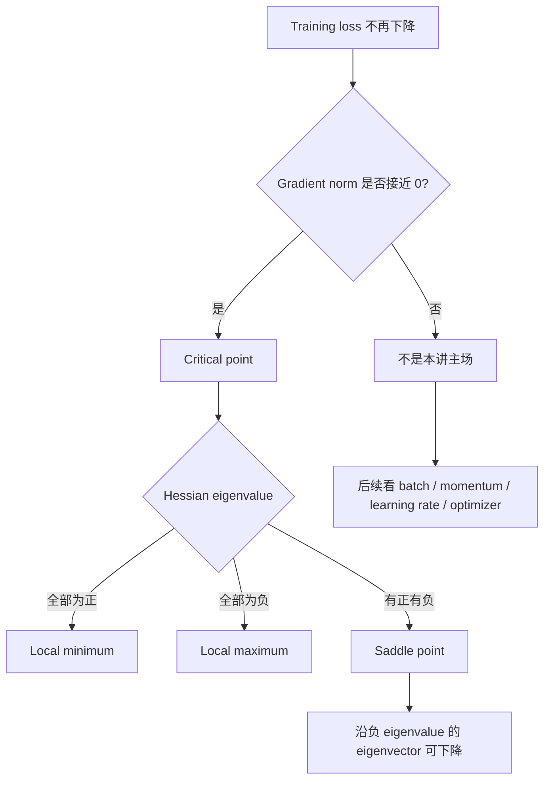
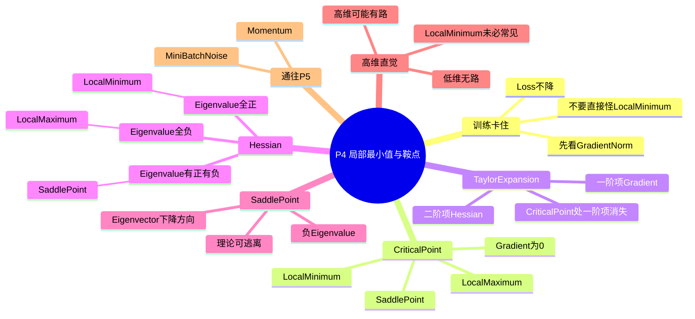

# P4 类神经网络训练不起来怎么办（一）：局部最小值与鞍点

来源：`P4【4、类神经网络训练不起来怎么办一 局部最小值 local】`




## 0. 本节课一句话总结

训练卡住时，不能直接说模型卡在 local minimum。正确的第一步是检查 gradient 是否真的接近 0；如果 gradient 近似为 0，这个点叫 critical point。Critical point 还要用 Hessian 的 eigenvalue 判断：全正是 local minimum，全负是 local maximum，有正有负是 saddle point。Saddle point 并不是绝路，因为负 eigenvalue 对应的方向能让 loss 下降；在高维深度学习中，saddle point 和平坦区域往往比真正的 local minimum 更值得警惕。

## 1. 本讲在 P4-P7 小专题中的位置

P4 是整个“训练不起来”诊断链的第一步：

```text
loss 不降
  -> 先问 gradient 是否接近 0
    -> 如果接近 0：进入 P4 的 critical point 分析
    -> 如果不接近 0：进入 P5/P6，检查 batch、momentum、learning rate、optimizer
```

因此，本讲并不是说训练失败一定来自 critical point，而是先建立一个判断框架：

```text
只有当 gradient 真的很小，
我们才有必要认真讨论 local minimum / saddle point。
```

## 2. 时间线总览

| 时间          | 课堂内容                                      | 主线                                |
| ----------- | ----------------------------------------- | --------------------------------- |
| 00:00-03:10 | Optimization 失败与 local minimum 误解         | loss 不降不能直接怪 local minimum        |
| 03:10-04:20 | Critical point、local minimum、saddle point | gradient 为 0 的点有多种类型              |
| 04:20-09:20 | Taylor expansion 与 Hessian                | gradient 为 0 后，一阶项消失，要看二阶项        |
| 09:20-13:40 | 用 Hessian eigenvalue 判断地貌                 | 全正、全负、有正有负对应不同地形                  |
| 13:40-19:30 | 两参数 toy network                           | 用具体例子算 critical point 和 Hessian   |
| 19:30-25:30 | Saddle point 可以逃离                         | 负 eigenvalue 的 eigenvector 指出下降方向 |
| 25:30-33:40 | 高维空间直觉与经验观察                               | 高维中 local minimum 可能没想象中常见        |

## 3. 术语表

| 术语                   | 中文    | 本讲中的作用                | 容易误解处                              |
| -------------------- | ----- | --------------------- | ---------------------------------- |
| Optimization failure | 优化失败  | 模型有能力，但训练没有找到好参数      | 不等于 overfitting                    |
| Gradient             | 梯度    | 指出 loss 上升最快方向        | Gradient 为 0 不代表一定是 local minimum  |
| Gradient norm        | 梯度长度  | 判断 gradient 是否真的接近 0  | loss 不降时应先看它                       |
| Critical point       | 临界点   | gradient 为 0 的点       | 只是统称，不说明点的类型                       |
| Local minimum        | 局部最小值 | 附近所有方向 loss 都更高       | 深度学习中不一定是训练失败主因                    |
| Local maximum        | 局部最大值 | 附近所有方向 loss 都更低       | 理论上可能，训练中较少成为主角                    |
| Saddle point         | 鞍点    | 有些方向 loss 上升，有些方向下降   | 也是 gradient 为 0 的点                 |
| Hessian              | 海森矩阵  | loss 对参数的二阶微分矩阵       | 用来描述局部曲率                           |
| Eigenvalue           | 特征值   | 判断 Hessian 在某方向上的弯曲正负 | 负值意味着存在下降方向                        |
| Eigenvector          | 特征向量  | 对应某个曲率方向              | 负 eigenvalue 的 eigenvector 可指示逃离方向 |

## 4. Optimization 失败到底是什么

在训练 neural network 时，我们希望参数不断 update 后，training loss 会越来越低：

```text
参数 update
  -> training loss 下降
  -> 模型在训练集上表现更好
```

但实际可能看到：

```text
training loss 降到某个值后不再下降
可是这个 loss 仍然很高
```

这和 overfitting 不一样。Overfitting 是：

```text
training loss 低
testing loss 高
```

而 optimization failure 是：

```text
training loss 本身就降不下去
```

如果 deep network 甚至不如 linear model 或 shallow network，说明不是模型表达能力不够，而是训练没有把能力发挥出来。

## 5. 不要一上来就怪 Local Minimum

看到 loss 不降，常见直觉是：

```text
是不是 gradient = 0？
是不是卡在 local minimum？
```

但这句话只对了一半。

如果参数位置是 $\theta'$，gradient 为：

$$
g = \nabla_\theta L(\theta')
$$

当：

$$
g = 0
$$

我们只能说 $\theta'$ 是 critical point。Critical point 包含三类：

| 类型 | 附近地貌 | 训练意义 |
|---|---|---|
| Local minimum | 附近所有方向 loss 都更高 | 可能较难靠局部下降继续走 |
| Local maximum | 附近所有方向 loss 都更低 | 理论上可离开，但 gradient 本身为 0 |
| Saddle point | 有些方向高，有些方向低 | 仍存在能让 loss 降低的方向 |

所以更准确的说法是：

```text
loss 不降也许是因为走到 critical point，
但不能直接说是 local minimum。
```

> [!IMPORTANT] 本讲第一原则
> “卡住”不是一个解释，而是一个现象。要解释它，先看 gradient norm；如果 gradient 接近 0，再讨论 critical point 类型。

## 6. 为什么要区分 Local Minimum 和 Saddle Point

如果真的到达 critical point，为什么还要继续区分？

因为两者的处置直觉不同。

Local minimum：

```text
附近所有方向 loss 都更高
局部看起来无路可走
```

Saddle point：

```text
某些方向 loss 更高
某些方向 loss 更低
只要找到下降方向，仍可以离开
```

所以，判断一个 critical point 的类型不是纯数学兴趣，而是为了回答：

```text
这里到底是不是真的没路了？
还是只是 gradient 暂时没有告诉我该往哪走？
```

## 7. Taylor Expansion：为什么 Gradient 为 0 后要看 Hessian

神经网络的完整 loss surface 很复杂，通常无法直接画出来。但在某个参数点 $\theta'$ 附近，可以用 Taylor expansion 近似：

$$
L(\theta)
\approx
L(\theta')
+(\theta-\theta')^\top g
+\frac{1}{2}(\theta-\theta')^\top H(\theta-\theta')
$$

其中：

| 符号 | 含义 |
|---|---|
| $\theta'$ | 当前参数位置 |
| $\theta$ | 附近另一个参数位置 |
| $g$ | 在 $\theta'$ 处的 gradient |
| $H$ | 在 $\theta'$ 处的 Hessian |

这个式子可以这样读：

```text
附近 loss
≈ 当前 loss
  + 一阶变化
  + 二阶弯曲变化
```

如果 $\theta'$ 是 critical point，那么：

$$
g = 0
$$

于是中间的一阶项消失：

$$
(\theta-\theta')^\top g = 0
$$

附近地貌主要由二阶项决定：

$$
\frac{1}{2}(\theta-\theta')^\top H(\theta-\theta')
$$

这就是为什么 critical point 分析要看 Hessian：gradient 已经没信息了，只能看 loss surface 如何弯曲。

## 8. Hessian 是什么

假设参数向量是：

$$
\theta = [\theta_1,\theta_2,\ldots,\theta_n]^\top
$$

Hessian 是一个二阶微分矩阵：

$$
H_{ij}
=
\frac{\partial^2 L}{\partial \theta_i \partial \theta_j}
$$

也就是：

$$
H =
\begin{bmatrix}
\frac{\partial^2 L}{\partial \theta_1^2}
&
\frac{\partial^2 L}{\partial \theta_1\partial \theta_2}
&
\cdots
\\
\frac{\partial^2 L}{\partial \theta_2\partial \theta_1}
&
\frac{\partial^2 L}{\partial \theta_2^2}
&
\cdots
\\
\vdots & \vdots & \ddots
\end{bmatrix}
$$

Gradient 告诉你当前点“往哪个方向上升最快”；Hessian 告诉你当前点附近“各个方向是往上弯还是往下弯”。

## 9. 用 Hessian 判断 Critical Point 类型

令：

$$
v = \theta - \theta'
$$

在 critical point 附近，关键看：

$$
v^\top H v
$$

如果对所有非零 $v$ 都有：

$$
v^\top H v > 0
$$

那么附近所有方向 loss 都上升，$\theta'$ 是 local minimum。

如果对所有非零 $v$ 都有：

$$
v^\top H v < 0
$$

那么附近所有方向 loss 都下降，$\theta'$ 是 local maximum。

如果有些方向 $v$ 让它大于 0，有些方向让它小于 0，那么附近有高有低，$\theta'$ 是 saddle point。

实际判断时，不需要把所有 $v$ 都试一遍，只要看 Hessian 的 eigenvalue：

| Hessian eigenvalue | 结论 | 直觉 |
|---|---|---|
| 全部为正 | Local minimum | 所有方向往上弯 |
| 全部为负 | Local maximum | 所有方向往下弯 |
| 有正有负 | Saddle point | 有的方向上升，有的方向下降 |

## 10. Toy Network：一个最小例子

课程用一个极简 network：

$$
y = w_1 w_2 x
$$

训练资料只有一笔：

$$
x = 1,\qquad \hat{y}=1
$$

使用 squared error：

$$
L(w_1,w_2)
=
(\hat{y}-w_1w_2x)^2
=
(1-w_1w_2)^2
$$

这个 network 只有两个参数 $w_1,w_2$，所以可以直接想象它的 error surface。

### 10.1 找 Critical Point

对 $w_1$ 和 $w_2$ 求偏微分：

$$
\frac{\partial L}{\partial w_1}
=
-2(1-w_1w_2)w_2
$$

$$
\frac{\partial L}{\partial w_2}
=
-2(1-w_1w_2)w_1
$$

在原点：

$$
w_1 = 0,\qquad w_2 = 0
$$

两个偏微分都是 0，因此原点是 critical point。

### 10.2 判断它是哪种 Critical Point

Hessian 在原点附近可以算成：

$$
H(0,0)
=
\begin{bmatrix}
0 & -2\\
-2 & 0
\end{bmatrix}
$$

这个矩阵的 eigenvalue 是：

$$
\lambda_1 = 2,\qquad \lambda_2 = -2
$$

有正有负，所以原点不是 local minimum，而是 saddle point。

这就是本讲最重要的例子：即使 gradient 为 0，也不能直接说“卡在 local minimum”。

## 11. Saddle Point 为什么可以逃离

如果 Hessian 有负 eigenvalue，设：

$$
Hu = \lambda u
$$

其中 $u$ 是 eigenvector，$\lambda$ 是对应 eigenvalue。

如果：

$$
\lambda < 0
$$

那么：

$$
u^\top H u
=
u^\top(\lambda u)
=
\lambda \|u\|^2
< 0
$$

把 $v$ 取成 $u$，Taylor expansion 的二阶项就是负的：

$$
\frac{1}{2}u^\top H u < 0
$$

所以如果从 $\theta'$ 沿着 $u$ 方向移动：

$$
\theta = \theta' + \epsilon u
$$

对足够小的 $\epsilon$，loss 有机会下降：

$$
L(\theta) < L(\theta')
$$

这说明 saddle point 并不是绝路。虽然 gradient 在这个点为 0，但 Hessian 的负 eigenvalue 会告诉我们“哪里还有下坡”。

## 12. 为什么实际中很少直接用 Hessian

虽然 Hessian 很有解释力，但实际训练大型神经网络时很少直接用它逃离 saddle point。

原因是：

- Hessian 是二阶微分，计算成本高；
- 参数数量可能是百万、千万、上亿，Hessian 规模巨大；
- 算 eigenvalue / eigenvector 的代价更高；
- 训练中每一步都这样做几乎不可承受。

所以本讲讲 Hessian 的主要目的不是让你实际训练时手算它，而是建立直觉：

```text
如果卡在 saddle point，理论上仍有下降方向。
```

后续 P5 的 noisy mini-batch、momentum，以及 P6 的 adaptive optimizer，都是更实际的训练技巧。

## 13. 高维空间：为什么 Local Minimum 可能没那么常见

课程用一个高维直觉说明：低维看起来封闭的地方，高维可能有路。

在一维或二维图上，一个点可能看起来像 local minimum：

```text
左右都高
前后也高
看起来没有下降方向
```

但神经网络参数空间不是二维。参数有多少，error surface 的维度就有多少：

```text
1000 万个参数 -> 1000 万维 error surface
```

维度越高，可能的方向越多。低维切片中看似无路的地方，在更高维方向上可能仍能下降。

所以我们应该谨慎看待低维可视化：

```text
二维图上的 local minimum
不一定是高维空间里的真正 local minimum
```

它可能只是一个 saddle point，只是下降方向藏在我们没画出来的维度里。

## 14. 经验观察：High Loss 的 Critical Point 往往像 Saddle Point

课程提到一些实验观察：

- 训练多个 network，直到它们停在 gradient 很小的地方；
- 对这些参数计算 Hessian 的 eigenvalue；
- 观察 training loss 和 Hessian eigenvalue 的关系。

一个常见现象是：

```text
loss 还很高的 critical point
往往有很多负 eigenvalue
```

负 eigenvalue 意味着：

```text
仍有方向可以让 loss 下降。
```

因此，高 loss 处的卡住往往不像真正所有方向都上升的 local minimum，而更像 saddle point 或平坦区域。

## 15. 本讲到下一讲的桥

P4 到这里给出一个重要修正：

```text
不要一训练不起来就怪 local minimum。
```

但这还不是完整答案。因为 P4 主要分析的是：

```text
gradient 接近 0 时怎么办？
```

下一讲 P5 会换一个角度看实际训练过程：

```text
训练时我们通常不是用 full batch 算完整 gradient，
而是用 mini-batch 估计 gradient。
```

这会带来两个新问题：

1. Mini-batch 的 gradient 有 noise，这个 noise 是坏事还是好事？
2. 如果当前 gradient 很小，能不能利用过去方向继续走？

这两个问题分别引出：

```text
Batch size
Momentum
```

## 16. 易错点整理

| 易错点                                   | 正确理解                                                          |
| ------------------------------------- | ------------------------------------------------------------- |
| loss 不降就等于 local minimum              | 先看 gradient norm；gradient 为 0 也只是 critical point              |
| critical point 一定是 local minimum      | critical point 可能是 local minimum、local maximum 或 saddle point |
| Hessian 是训练时常用工具                      | Hessian 主要用于理解；大型网络中直接算通常太贵                                   |
| 低维图上的 local minimum 就是真 local minimum | 高维空间可能还有未画出的下降方向                                              |


## 17. 复习问答

**Q1：为什么不能说训练不起来就是卡在 local minimum？**  
A：因为 loss 不降只是现象。即使 gradient 为 0，也只能说明到达 critical point；critical point 不一定是 local minimum。

**Q2：critical point 是什么？**  
A：Gradient 为 0 的点，也就是 $\nabla_\theta L(\theta)=0$ 的点。

**Q3：critical point 有哪些类型？**  
A：Local minimum、local maximum、saddle point。

**Q4：为什么 critical point 附近要看 Hessian？**  
A：因为在 critical point 处 gradient 为 0，Taylor expansion 的一阶项消失，附近地貌主要由二阶项和 Hessian 决定。

**Q5：Hessian eigenvalue 如何判断地形？**  
A：全正是 local minimum，全负是 local maximum，有正有负是 saddle point。

**Q6：saddle point 为什么还能逃离？**  
A：如果 Hessian 有负 eigenvalue，对应 eigenvector 方向会让二阶项为负，沿这个方向移动可以降低 loss。

**Q7：为什么实际训练中很少直接计算 Hessian？**  
A：因为 Hessian 计算量和存储量都很大，求 eigenvalue/eigenvector 代价更高。

**Q8：为什么高维空间中 local minimum 可能没那么常见？**  
A：维度越高，可走方向越多；低维看起来无路的地方，高维可能仍有下降方向。

## 18. 知识地图



## 19. 本讲总结

```text
训练不起来:
  不要马上说 local minimum

第一步:
  检查 gradient norm

如果 gradient 接近 0:
  这是 critical point
  critical point 可能是 local minimum / local maximum / saddle point

判断方式:
  看 Hessian eigenvalue
  全正 -> local minimum
  全负 -> local maximum
  有正有负 -> saddle point

关键直觉:
  saddle point 仍有下降方向
  负 eigenvalue 的 eigenvector 指出可下降方向

深度学习中的重要启发:
  高维空间里 local minimum 未必是最常见障碍
  loss 不降还可能来自 batch、momentum、learning rate、optimizer、loss function
```

> [!IMPORTANT] 核心结论
> P4 的重点不是教你把所有训练失败都解释成 Hessian 问题，而是建立第一层诊断：loss 不降时，先确认 gradient 是否真的接近 0；如果是，再讨论 critical point 的类型。Local minimum 不是唯一可能，saddle point 也会让 gradient 为 0，而且在高维神经网络中，saddle point 和平坦区域往往比真正无路可走的 local minimum 更值得关注。
