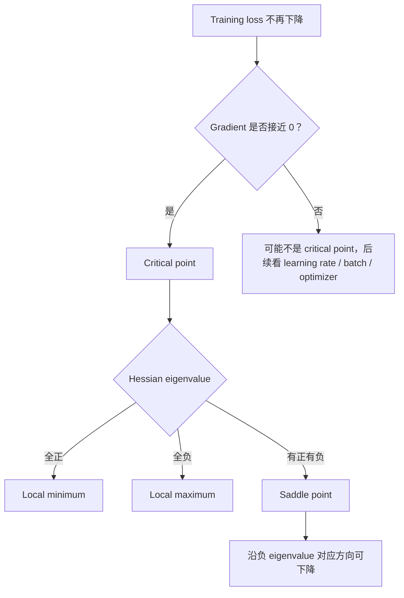
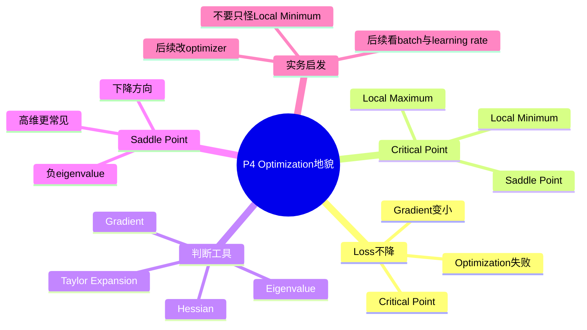

# P4 类神经网络训练不起来怎么办（一）：局部最小值与鞍点

来源：`P4【4、类神经网络训练不起来怎么办一 局部最小值 local】`  

> [!ABSTRACT] 本讲概要
> 本讲接续 P3 的 optimization problem：当 neural network 的 training loss 降不下去时，常见直觉是“卡在 local minimum”。课程要修正这个直觉：gradient 为 0 的 critical point 不一定是 local minimum，也可能是 saddle point 或 local maximum。要判断 critical point 附近的地貌，需要看 Hessian 的 eigenvalue；如果有负 eigenvalue，就存在可以让 loss 下降的方向。更重要的是，在高维参数空间中，真正所有方向都上升的 local minimum 可能没直觉中常见，saddle point 和平坦区域反而更值得注意。



## 0. 本节课一句话总结

当 neural network 训练不起来、loss 不再下降时，常见猜测是“卡在 local minimum”。但课程强调：gradient 为 0 的点不一定是 local minimum，也可能是 saddle point。通过 Hessian 的 eigenvalue 可以判断 critical point 的类型；在高维空间里，saddle point 可能比真正的 local minimum 更常见。

## 1. 时间线总览

| 时间 | 内容 |
|---|---|
| 00:00-03:30 | Optimization 失败：loss 不降、gradient 可能接近 0 |
| 03:30-06:30 | Critical point 不等于 local minimum，也可能是 saddle point |
| 06:30-13:30 | 用 Taylor expansion 和 Hessian 判断地貌 |
| 13:30-20:30 | 一个两参数 toy network 的 Hessian 例子 |
| 20:30-25:30 | Saddle point 其实可以逃离：看负 eigenvalue 对应方向 |
| 25:30-33:40 | 高维空间中 local minimum 可能没那么常见 |

## 2. Optimization 失败的现象

在训练 neural network 时，经常会看到：

```text
参数不断 update
training loss 降到某处后不再下降
但这个 loss 仍然不令人满意
```

这时如果深层网络没有比 linear model 或 shallow network 更好，说明深层网络的能力没有发挥出来，可能是 optimization 出了问题。

更极端时，模型一开始就 train 不起来，不管怎么更新参数，loss 都几乎不下降。

常见猜想：

```text
是不是 gradient = 0，所以 gradient descent 无法继续更新？
是不是卡在 local minimum？
```

课程提醒：gradient 为 0 的点叫 **critical point**，但 critical point 不一定是 local minimum。

## 3. Critical Point 的类型

如果某点 gradient 为 0，它可能是：

| 类型 | 直觉 |
|---|---|
| Local minimum | 附近所有方向 loss 都更高，是局部低点 |
| Local maximum | 附近所有方向 loss 都更低，是局部高点 |
| Saddle point | 有些方向变高，有些方向变低，像马鞍 |

为什么要区分？

- 如果是 local minimum，附近所有方向 loss 都上升，似乎比较难逃。
- 如果是 saddle point，仍然存在某些方向可以让 loss 下降，只要找到方向就有机会逃离。

## 4. Taylor Expansion 与 Hessian

为了判断一个 critical point 附近的地貌，课程使用 Taylor expansion。

设当前点是 `theta'`，附近另一个点是 `theta`。

Loss 可以近似为：

```text
L(theta) ≈ L(theta') + (theta - theta')^T g
           + 1/2 (theta - theta')^T H (theta - theta')
```

其中：

| 符号 | 含义 |
|---|---|
| `g` | gradient，一次微分组成的向量 |
| `H` | Hessian，二次微分组成的矩阵 |

如果 `theta'` 是 critical point，那么：

```text
g = 0
```

于是附近地貌主要由二次项决定：

```text
(theta - theta')^T H (theta - theta')
```

## 5. Hessian 是什么

Hessian 是一个矩阵，里面放的是 loss 对参数的二阶微分。

如果参数是：

```text
theta = [theta1, theta2, ..., thetan]
```

那么 Hessian 的第 `i` 行第 `j` 列是：

```text
∂²L / (∂theta_i ∂theta_j)
```

它描述的是 loss surface 在某点附近的弯曲情况。

## 6. 用 Hessian 判断 Critical Point 类型

关键看 Hessian 的 eigenvalue。

| Hessian eigenvalue 状况 | 结论 |
|---|---|
| 全部为正 | Local minimum |
| 全部为负 | Local maximum |
| 有正有负 | Saddle point |

直觉：

- 全正：所有方向都往上弯，当前点是谷底。
- 全负：所有方向都往下弯，当前点是山顶。
- 有正有负：有些方向上升，有些方向下降，是鞍点。

## 7. Toy Network 例子

课程举了一个非常简单的网络：

```text
y = w1 * w2 * x
```

假设只有一笔资料，loss 用 squared error：

```text
L = (y_hat - w1 w2 x)^2
```

在某些点，例如 `w1 = 0, w2 = 0`，gradient 为 0，因此是 critical point。

计算 Hessian 后，可以得到类似：

```text
H = [[0, -2],
     [-2, 0]]
```

它的 eigenvalue 有正有负，因此这个 critical point 是 saddle point。

课程用这个例子展示：即使 gradient 为 0，也不能直接说是 local minimum。

## 8. Saddle Point 可以逃离

如果 Hessian 有负的 eigenvalue，对应的 eigenvector 就指出了一个能让 loss 下降的方向。

设：

```text
H u = lambda u
```

如果：

```text
lambda < 0
```

那么沿着 eigenvector `u` 的方向移动，二次项会让 loss 变小。

因此：

```text
theta = theta' + u
```

可能会让：

```text
L(theta) < L(theta')
```

这说明 saddle point 并不是绝路。

但实际训练中很少直接计算 Hessian，因为：

- Hessian 是二阶微分，计算量很大；
- 参数很多时 Hessian 矩阵巨大；
- 还要算 eigenvalue/eigenvector，代价更高。

课程讲 Hessian 主要是为了建立直觉：如果卡在 saddle point，理论上是有下降方向的。

## 9. 高维空间中的 Local Minimum 可能不常见

课程用一个高维直觉解释为什么 saddle point 在深度学习中可能更常见。

在低维空间里，看起来封闭、无路可走的地形，到了更高维时可能有额外方向可以离开。

神经网络参数往往动辄百万、千万、上亿。参数多少，error surface 就有多少维。

在非常高维的空间中：

```text
每多一个维度，就多一个可能下降的方向。
```

因此，真正所有方向都往上的 local minimum 可能没有直觉中那么常见；很多看似卡住的点，可能其实是 saddle point 或 saddle point 附近666666的平坦区域。

## 10. 经验观察

课程提到一些实验观察：

- 训练多个 network，等它们卡在 gradient 很小的 critical point。
- 分析 Hessian 的 eigenvalue。
- 如果 loss 还很高，通常会看到很多负 eigenvalue。
- 负 eigenvalue 意味着还有很多方向可以让 loss 下降。

结论：

```text
Loss 很高时卡住，往往不像真正的 local minimum，更像 saddle point 或平坦区域。
```

## 11. 本节重要术语表

| 术语                   | 中文    | 含义                  |
| -------------------- | ----- | ------------------- |
| Optimization failure | 优化失败  | 模型能力够，但训练没找到好参数     |
| Critical point       | 临界点   | gradient 为 0 的点     |
| Local minimum        | 局部最小值 | 附近所有方向 loss 都更高     |
| Local maximum        | 局部最大值 | 附近所有方向 loss 都更低     |
| Saddle point         | 鞍点    | 有些方向高，有些方向低         |
| Hessian              | 海森矩阵  | 二阶微分组成的矩阵           |
| Eigenvalue           | 特征值   | 判断 Hessian 曲率方向的重要量 |
| Eigenvector          | 特征向量  | 对应某个曲率方向            |
| Error surface        | 误差曲面  | 参数到 loss 的地形        |

## 12. 易错点

1. Loss 不降不一定等于卡在 local minimum。
2. Gradient 为 0 只说明是 critical point，不说明是哪一种。
3. Saddle point 也会让 gradient 为 0。
4. Hessian 的 eigenvalue 有正有负，代表 saddle point。
5. 理论上 saddle point 有下降方向，但实际不常直接算 Hessian。
6. 深度学习高维空间中，local minimum 可能不是训练失败的主要原因。
7. 真正训练不起来还可能来自崎岖地形、learning rate、batch、optimizer 等问题。

## 13. 复习问答

**Q1：critical point 是什么？**  
A：Gradient 为 0 的点。

**Q2：critical point 一定是 local minimum 吗？**  
A：不是。它也可能是 local maximum 或 saddle point。

**Q3：如何用 Hessian 判断 local minimum？**  
A：如果 Hessian 所有 eigenvalue 都是正的，该点是 local minimum。

**Q4：如何判断 saddle point？**  
A：如果 Hessian 的 eigenvalue 有正有负，该点是 saddle point。

**Q5：为什么 saddle point 没那么可怕？**  
A：因为它存在让 loss 下降的方向，负 eigenvalue 对应的 eigenvector 可以指出逃离方向。

**Q6：为什么实际中很少直接用 Hessian 逃离 saddle point？**  
A：计算 Hessian 和它的 eigenvalue/eigenvector 代价非常高。

**Q7：本节对 local minimum 的主要观点是什么？**  
A：在高维 deep learning 中，训练失败常常不一定是 local minimum，saddle point 或其他 optimization 困难可能更重要。

## 14. 知识地图



## 15. 本讲总结

```text
Loss 不降
  不要立刻说 local minimum
  先理解 critical point

Critical point:
  gradient = 0
  可能是 local minimum / local maximum / saddle point

判断方法:
  Hessian eigenvalue 全正 -> local minimum
  全负 -> local maximum
  有正有负 -> saddle point

核心直觉:
  高维空间里下降方向很多
  真正的 local minimum 可能没想象中常见
```

> [!IMPORTANT] 核心结论
> 训练卡住时，“卡在 local minimum”只是可能性之一。真正要问的是 loss surface 在当前点附近的几何结构是什么；Hessian 的 eigenvalue 告诉我们是否仍有下降方向，而高维神经网络中 saddle point 往往比低维直觉更重要。
