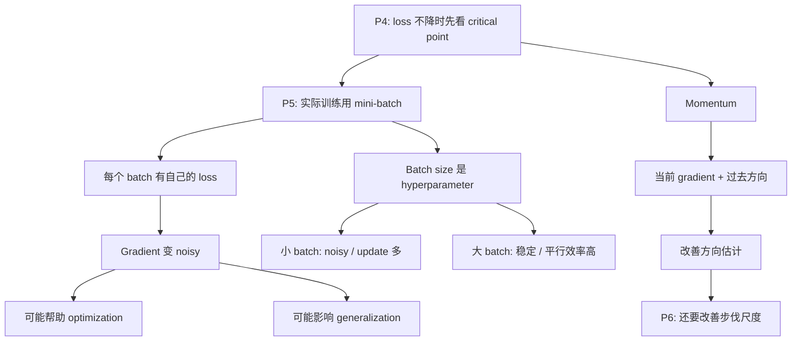
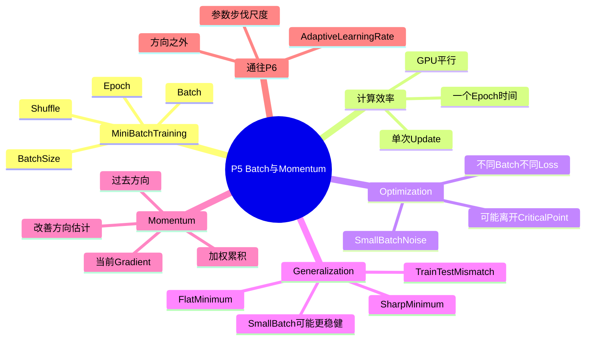

# P5 类神经网络训练不起来怎么办（二）：Batch 与 Momentum

来源：`P5【5、类神经网络训练不起来怎么办二 批次 batch 与动量 momentum】`




## 0. 本节课一句话总结

Batch size 不只是“每次喂多少资料”的工程细节，它会改变训练路径。Small batch 的 gradient 比较 noisy，但这种噪声可能帮助模型离开某些卡住点，并更容易落在对 train/test mismatch 稳健的 flat minimum；large batch 更稳定、更适合平行运算，但可能 optimization 较困难或泛化较差。Momentum 则让更新方向不只依赖当前 gradient，而是结合过去方向，帮助参数穿过平坦区或小阻碍。P5 解决的是“gradient 方向如何被估计和修正”，P6 会继续解决“每个参数走多大”。

## 1. 本讲在 P4-P7 小专题中的位置

P4 讨论的是：

```text
如果 gradient 接近 0，可能是 critical point；
critical point 可能是 local minimum，也可能是 saddle point。
```

但真实训练中，gradient 并不是每次都由完整 training set 精确算出来。通常我们做的是：

```text
从训练资料抽一个 mini-batch
  -> 算这个 batch 的 loss
  -> 算这个 batch 的 gradient
  -> update 参数
```

所以 P5 要回答：

```text
mini-batch 造成的 noisy gradient 是坏事吗？
过去的更新方向能不能帮助当前更新？
```

这会自然引出 P6：

```text
Momentum 改善了方向估计；
但不同参数、不同方向到底该走多大，还需要 adaptive learning rate。
```

## 2. 时间线总览

| 时间 | 课堂内容 | 应该听出的主线 |
|---|---|---|
| 00:00-02:30 | batch / mini-batch / epoch / shuffle | 实际训练不是每次看完整训练集 |
| 02:30-05:30 | full batch vs batch size = 1 | 更新频率、稳定性、noisy gradient 的差别 |
| 05:30-11:40 | GPU 平行运算改变时间直觉 | 大 batch 单次更新不一定慢，一个 epoch 可能更快 |
| 11:40-15:20 | noisy gradient 为什么帮助 optimization | 不同 batch 的 loss 不同，卡住位置不完全相同 |
| 15:20-20:20 | batch size 与 testing performance | small batch 可能更容易找到 flat minimum |
| 20:20-22:40 | 大小 batch 的权衡 | batch size 是 hyperparameter，大 batch 训练需要技巧 |
| 22:40-30:50 | momentum | 不只看当前 gradient，也看过去移动方向 |

## 3. 术语表

| 术语                 | 中文     | 本讲中的作用                       | 容易误解处                           |
| ------------------ | ------ | ---------------------------- | ------------------------------- |
| Batch / Mini-batch | 批次     | 每次用来计算 loss 和 gradient 的资料子集 | 本讲中 batch 和 mini-batch 基本同义     |
| Batch size         | 批次大小   | 一个 batch 中包含多少训练样本           | 不是越大越好，也不是越小越好                  |
| Full batch         | 全批次    | 每次用全部训练资料算 gradient          | gradient 稳定，但 update 次数少        |
| Epoch              | 训练轮次   | 全部训练资料被看过一遍                  | 一个 epoch 不等于一次 update           |
| Shuffle            | 打乱     | 每个 epoch 重新分 batch           | 避免固定 batch 组合造成偏差               |
| Noisy gradient     | 有噪声的梯度 | small batch 估计出的不稳定方向        | 噪声不一定坏，有时能帮助训练                  |
| Optimization       | 优化     | training loss 能否降下来          | training 都差时，不是泛化问题             |
| Generalization     | 泛化     | testing performance 是否好      | training 一样好时，testing 差异才更像泛化差异 |
| Sharp minimum      | 尖锐极小值  | 周围很窄，参数或数据稍变 loss 就升         | 可能对 train/test mismatch 敏感      |
| Flat minimum       | 平坦极小值  | 周围一片低 loss 区域                | 通常更稳健                           |
| Momentum           | 动量     | 把过去更新方向纳入当前更新                | 改的是方向估计，不是 loss function        |

## 4. Batch 是什么

设训练集有 $N$ 笔资料。理论上可以每次用全部训练资料计算 loss：

$$
L(\theta)
=
\frac{1}{N}\sum_{n=1}^{N} \ell(x_n,y_n;\theta)
$$

然后计算完整 gradient：

$$
g
=
\nabla_\theta L(\theta)
$$

但实际训练常把资料切成多个 batch。若 batch $B_t$ 有 $|B_t|$ 笔资料，则这一步使用 batch loss：

$$
L_{B_t}(\theta)
=
\frac{1}{|B_t|}
\sum_{n\in B_t}
\ell(x_n,y_n;\theta)
$$

对应 gradient：

$$
g_{B_t}
=
\nabla_\theta L_{B_t}(\theta)
$$

参数更新变成：

$$
\theta^{t+1}
=
\theta^t
-\eta g_{B_t}
$$

也就是说，mini-batch training 不是每次沿着完整 training loss 的 gradient 走，而是沿着某个 batch 的估计方向走。

## 5. Epoch 与 Shuffle

如果训练资料切成许多 batch：

```text
batch 1 -> update
batch 2 -> update
batch 3 -> update
...
```

当所有训练资料都被看过一遍，叫一个 epoch。

每个 epoch 开始前，通常会重新打乱资料并重新分 batch，这叫 shuffle。

Shuffle 的作用：

- 避免固定 batch 组合带来的偏差；
- 让每个 epoch 看到不同资料组合；
- 让 mini-batch gradient 更像随机抽样；
- 降低训练对资料排列顺序的依赖。

> [!NOTE] 一个常见误解
> 一个 epoch 不是一次 update。一个 epoch 中有多少次 update，取决于训练集大小和 batch size。

如果训练集有 $N$ 笔，batch size 是 $B$，则一个 epoch 大约有：

$$
\frac{N}{B}
$$

次 update。

## 6. Full Batch vs Small Batch

假设有 20 笔训练资料。

Full batch：

```text
batch size = 20
看完全部资料
算一次 gradient
update 一次
```

Batch size = 1：

```text
每看一笔资料
算一次 gradient
update 一次
一个 epoch update 20 次
```

两者差异：

| 项目                   | Full batch | Small batch |
| -------------------- | ---------- | ----------- |
| 每次更新前看的资料            | 全部资料       | 少量资料        |
| 一个 epoch 的 update 次数 | 少          | 多           |
| gradient 稳定性         | 稳定         | noisy       |
| 单次方向准确度              | 高          | 低           |
| 训练路径                 | 平滑         | 抖动          |

直觉上，full batch 每一步更准；small batch 每一步更吵。但这不代表 full batch 一定更好，因为训练不是只看“单步方向准不准”，还要看更新频率、硬件效率、optimization 路径和泛化。

## 7. GPU 平行运算改变“batch 大就慢”的直觉

如果不考虑平行运算，batch size 大似乎一定慢：

```text
看 1000 笔资料
应该比看 1 笔资料慢 1000 倍
```

但 GPU 可以平行处理大量样本，因此在一定范围内：

```text
batch size = 1
batch size = 10
batch size = 100
batch size = 1000
```

单次 update 时间可能差不多。

真正差别体现在一个 epoch 需要多少次 update。

假设 $N=60000$：

| Batch size $B$ | 一个 epoch 的 update 次数 $N/B$ |
|---:|---:|
| 1 | 60000 |
| 10 | 6000 |
| 100 | 600 |
| 1000 | 60 |
| 60000 | 1 |

所以大 batch 虽然每次看更多资料，但因为 update 次数少，一个 epoch 可能更快。

当然，GPU 平行能力有上限。当 batch size 大到超过硬件可有效并行的范围，单次 update 时间仍会明显增加。

## 8. Small Batch 为什么可能帮助 Optimization

看起来 large batch 有两个优势：

```text
gradient 稳定
硬件平行效率高
```

那 small batch 的 noisy gradient 为什么反而可能有帮助？

关键在于：每个 batch 对应的 loss function 不一样。

完整 training loss 是：

$$
L(\theta)
=
\frac{1}{N}\sum_{n=1}^N \ell_n(\theta)
$$

某个 batch 的 loss 是：

$$
L_B(\theta)
=
\frac{1}{|B|}\sum_{n\in B}\ell_n(\theta)
$$

不同 batch 会有不同 $L_B(\theta)$，因此也有不同 gradient：

$$
g_B
=
\nabla_\theta L_B(\theta)
$$

如果 full batch 的 gradient 在某点为 0，普通 full-batch gradient descent 会停住：

$$
\nabla_\theta L(\theta) = 0
$$

但对另一个 mini-batch 来说，未必有：

$$
\nabla_\theta L_B(\theta) = 0
$$

也就是说：

```text
对完整 training loss 是 critical point 的地方，
对某个 batch 的 loss 不一定是 critical point。
```

因此 small batch 的 noise 可能让参数继续移动，离开某些对 full batch 来说卡住的位置。

> [!IMPORTANT] 关键直觉
> Small batch 的 noise 不是单纯“错误方向”。它让训练每一步看到略微不同的 loss surface，因此有时能帮助模型绕开或离开某些不好的位置。

## 9. Batch Size 与 Training Performance

课程中提到一些实验现象：

```text
batch size 越大
training accuracy 反而可能越差
validation accuracy 也可能越差
```

如果 training performance 本身就差，这不是 overfitting。因为 overfitting 的典型形式是：

```text
training 好
testing 差
```

如果是：

```text
training 差
testing 也差
```

更像 optimization 问题。

这点很重要：

| 现象 | 应该怎么解释 |
|---|---|
| large batch training accuracy 也差 | 优先怀疑 optimization |
| large batch training accuracy 好，但 testing accuracy 差 | 才更像泛化 / overfitting 差异 |

所以讨论 batch size 的影响时，要先分清：

```text
它是没有训练好？
还是训练好了但泛化不好？
```

## 10. Batch Size 与 Generalization：Sharp vs Flat Minimum

一些研究会控制条件，让 small batch 和 large batch 都训练到相近的 training accuracy，再比较 testing accuracy。

这时可能看到：

| Batch size | Training accuracy | Testing accuracy |
|---|---:|---:|
| small batch | 高 | 较高 |
| large batch | 高 | 较低 |

这才更像泛化差异。

一种常见解释是：small batch 更可能落到 flat minimum，large batch 更可能落到 sharp minimum。

Sharp minimum：

```text
training loss 在最低点很低
但低 loss 区域很窄
参数或数据稍微变动，loss 就明显升高
```

Flat minimum：

```text
training loss 也很低
而且附近一大片区域 loss 都低
对扰动更稳健
```

如果 training loss 和 testing loss 有 mismatch，例如测试资料是从同一分布抽到的另一批样本，或真实分布和训练集有轻微差异，那么 sharp minimum 更脆弱：

```text
training 上刚好很低
testing surface 稍微偏移
loss 就可能变高
```

flat minimum 则更稳：

```text
附近一大片都低
即使 testing surface 稍微偏移
loss 仍不容易大幅上升
```

### 10.1 为什么 small batch 可能偏向 flat minimum

Small batch 的 gradient noisy，更新方向会抖。

在很窄的 sharp valley 附近：

```text
低 loss 区域很窄
small batch 一抖，可能就跳出去
```

在宽的 flat basin 附近：

```text
低 loss 区域很宽
small batch 即使抖，也仍容易留在低 loss 区域
```

所以一个直觉是：

```text
small batch noise
  -> 不容易被 sharp minimum 困住
  -> 更可能停在 flat minimum
  -> testing performance 可能更好
```

但要注意：这是一种解释，不是所有任务中的绝对定律。Batch size 的实际效果还会受到 learning rate、optimizer、训练时间、模型结构、regularization 等因素影响。

## 11. 大 Batch 和小 Batch 的权衡

| 面向 | Small batch | Large batch |
|---|---|---|
| 单次 gradient | noisy | 稳定 |
| 一个 epoch 的 update 次数 | 多 | 少 |
| 一个 epoch 时间 | 可能较长 | 可能较短 |
| GPU 平行效率 | 较低 | 较高 |
| Optimization | noise 可能有帮助 | 可能需要特别技巧 |
| Generalization | 可能更好 | 可能较差 |
| 调参需求 | 需要选择合适 batch size | 常需配合 LR scaling / warmup 等 |

所以 batch size 是 hyperparameter，不是固定答案。

如果希望获得：

```text
large batch 的平行效率
small batch 的训练和泛化效果
```

通常需要额外技巧，例如 learning rate scaling、warmup、特殊 optimizer 或 schedule。P6 会进一步解释为什么 large batch training 常常和 learning rate schedule、warmup 等技巧一起出现。

## 12. Momentum 的动机

P4 说过：如果走到 saddle point 或平坦区域，当前 gradient 可能很小。普通 gradient descent 只看当前 gradient：

$$
\theta^{t+1}
=
\theta^t
-\eta g^t
$$

如果：

$$
g^t \approx 0
$$

普通 gradient descent 就几乎不动。

Momentum 的想法是：

```text
不要只看当前 gradient；
也看过去移动的方向。
```

直觉像物理中的惯性：一个物体从高处往下运动时，即使到达某个平坦点，也不会立刻停下；它会带着过去速度继续往前。

## 13. Momentum 的更新公式

常见写法之一：

$$
m^t
=
\lambda m^{t-1}
-\eta g^t
$$

$$
\theta^{t+1}
=
\theta^t
+m^t
$$

其中：

| 符号 | 含义 |
|---|---|
| $m^t$ | 第 $t$ 步累积出来的移动方向 |
| $\lambda$ | momentum 系数，控制过去方向保留多少 |
| $\eta$ | learning rate |
| $g^t$ | 当前 gradient |

如果展开 $m^t$，会发现它包含过去所有 gradient 的加权和：

$$
m^t
=
-\eta g^t
-\lambda\eta g^{t-1}
-\lambda^2\eta g^{t-2}
-\cdots
$$

所以 momentum 的本质是：

```text
当前更新方向
  = 当前 gradient 的反方向
  + 过去 gradient 方向的衰减累积
```

## 14. Momentum 为什么有用

Momentum 可能带来几个效果：

| 情况 | 没有 momentum | 有 momentum |
|---|---|---|
| 当前 gradient 很小 | 几乎停下 | 过去方向仍可能推动继续走 |
| gradient 方向来回震荡 | 参数左右摇摆 | 相反方向会部分抵消，路径更平滑 |
| 某方向长期一致 | 每次只走当前步 | 动量累积，加速前进 |
| 小局部阻碍 | 可能停住 | 可能凭惯性越过 |

用 P4 的语言说：

```text
P4:
  如果 gradient 为 0，Hessian 可能指出下降方向。

P5:
  实际训练中，不一定要真的算 Hessian；
  batch noise 和 momentum 也可能帮助参数离开不好的位置。
```

这就是 momentum 在训练技巧上的意义：它不是改变 loss surface，而是改变参数如何在 surface 上移动。

## 15. Momentum 与 P6 的关系

Momentum 改善的是方向估计：

```text
不要完全相信当前 gradient
把过去方向也纳入考虑
```

但它还没有解决另一个问题：

```text
沿着这个方向，每个参数到底该走多大？
```

如果 error surface 是狭长峡谷：

```text
某些方向很陡
某些方向很平
```

即使用了 momentum，所有参数仍可能共享同一个 global learning rate $\eta$。这就是 P6 要继续处理的问题：

```text
adaptive learning rate
```

P6 中 Adam 可以粗略理解成：

```text
Adam = Momentum + RMSProp
```

也就是：

```text
Momentum:
  负责方向估计

RMSProp / adaptive LR:
  负责每个参数的步伐缩放
```

## 16. 易错点整理

| 易错点                            | 正确理解                                              |
| ------------------------------ | ------------------------------------------------- |
| batch size 大一定更慢               | GPU 平行下，大 batch 单次 update 不一定慢，一个 epoch 可能更快      |
| small batch 的 noise 一定坏        | noise 有时帮助离开卡住点，也可能改善泛化                           |
| large batch 泛化差一定是 overfitting | 如果 training 也差，优先是 optimization 问题                |
| 一个 epoch 等于一次 update           | 一个 epoch 包含多个 update，数量约为 $N/B$                   |
| shuffle 只是随机打乱，无关紧要            | shuffle 会改变 batch 组合，降低固定顺序偏差                     |
| momentum 会改变 loss function     | momentum 改的是更新路径，不是 loss function                 |
| momentum 解决所有 optimizer 问题     | momentum 管方向，P6 还要管参数尺度和时间 schedule               |
| small batch 一定比 large batch 好  | batch size 是 hyperparameter，受硬件、LR、optimizer、任务影响 |

## 17. 复习问答

**Q1：什么是 batch？**  
A：每次用来计算 loss 和 gradient 的一组训练资料。本讲中的 batch 和 mini-batch 基本同义。

**Q2：什么是 epoch？**  
A：全部训练资料被看过一遍，叫一个 epoch。一个 epoch 通常包含多次 update。

**Q3：为什么要 shuffle？**  
A：为了让每个 epoch 的 batch 组合不同，避免固定组合和资料顺序造成偏差。

**Q4：为什么 large batch 一个 epoch 可能更快？**  
A：GPU 可以平行处理大量资料，而 large batch 一个 epoch 的 update 次数更少。

**Q5：small batch 的 noisy gradient 为什么可能帮助 optimization？**  
A：不同 batch 的 loss 不同；对 full batch 卡住的位置，对某个 mini-batch 不一定卡住，所以 noise 可能推动参数继续移动。

**Q6：如何区分 optimization 问题和泛化问题？**  
A：如果 training performance 也差，优先怀疑 optimization；如果 training 差不多好但 testing 差，才更像泛化差异。

**Q7：sharp minimum 和 flat minimum 的区别是什么？**  
A：sharp minimum 周围低 loss 区域窄，对扰动敏感；flat minimum 周围低 loss 区域宽，对 train/test mismatch 更稳健。

**Q8：momentum 的核心想法是什么？**  
A：更新方向不只看当前 gradient，也保留过去移动方向。

**Q9：momentum 为什么能帮助穿过平坦区？**  
A：即使当前 gradient 很小，过去累积的移动方向仍可能推动参数继续前进。

**Q10：momentum 和 P6 的 adaptive learning rate 有什么区别？**  
A：momentum 主要改善方向估计；adaptive learning rate 主要调整每个参数的步伐大小。

## 18. 知识地图



## 19. 本讲总结

```text
Batch:
  每次用一部分资料估计 loss 和 gradient

Batch size 影响三件事:
  计算效率
  optimization 路径
  generalization

Small batch:
  gradient noisy
  update 次数多
  noise 可能帮助离开卡住点
  可能更容易落到 flat minimum

Large batch:
  gradient 稳定
  GPU 平行效率高
  一个 epoch 可能更快
  但可能需要额外技巧才能训练得好

Momentum:
  update direction = 当前 gradient 反方向 + 过去移动方向
  它改善的是方向估计

通往 P6:
  有了更好的方向估计还不够
  还要决定每个参数到底走多大
```

> [!IMPORTANT] 核心结论
> P5 的重点不是“小 batch 一定比大 batch 好”，也不是“momentum 是一个公式”。真正要带走的是：实际训练路径由 mini-batch noise、更新频率、硬件效率、过去方向共同塑造。Batch size 改变 gradient 的随机性和训练落点；momentum 改变当前更新方向如何吸收历史信息。P6 会在这个基础上继续回答：方向有了以后，每个参数的步伐尺度该如何自动调整。
