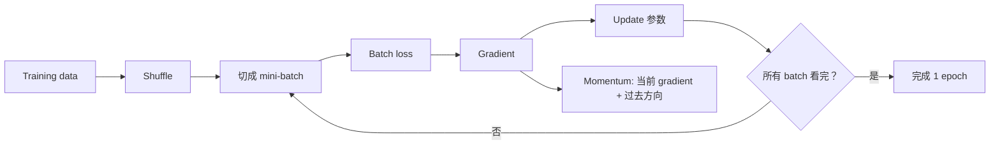
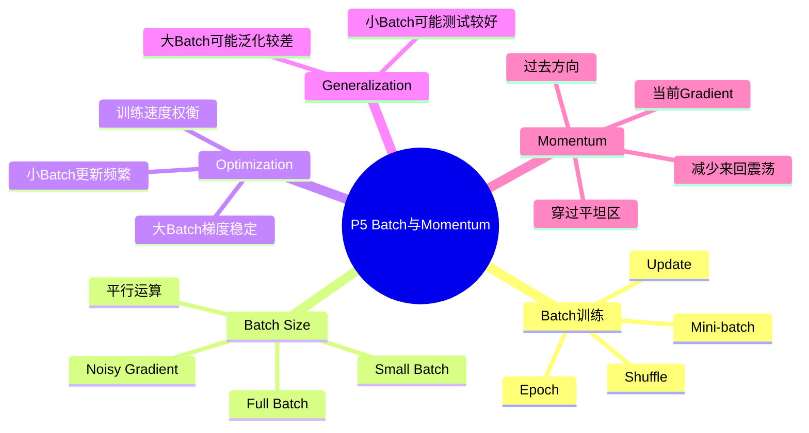

# P5 类神经网络训练不起来怎么办（二）：Batch 与 Momentum

来源：`P5【5、类神经网络训练不起来怎么办二 批次 batch 与动量 momentum】`  

> [!ABSTRACT] 本讲概要
> 本讲继续处理 neural network 训练不起来的问题，但焦点从 loss surface 的几何转向实际训练过程。课程先解释 batch、mini-batch、shuffle、epoch 的关系，再比较 full batch 与 small batch：小 batch 的 gradient 有噪声，却因为 update 更频繁、可能帮助跳出不佳路径，常在 optimization 与泛化上有优势；大 batch 计算更稳定、硬件平行效率高，但不一定带来更好的 testing performance。后半段引入 momentum，把过去的移动方向纳入更新，使参数不只被当前 gradient 牵着走。



## 0. 本节课一句话总结

Batch size 是训练中的重要 hyperparameter。小 batch 的 gradient 比较 noisy，但更新频繁，常常更有利于 optimization 和泛化；大 batch 利用平行运算效率高，但可能训练和测试表现较差。Momentum 则让参数更新不只看当前 gradient，也结合过去的移动方向，帮助穿过平坦区或局部阻碍。

## 1. 时间线总览

| 时间 | 内容 |
|---|---|
| 00:00-03:30 | 什么是 batch / mini-batch / shuffle / epoch |
| 03:30-10:30 | Full batch 与 small batch 的更新频率和计算时间 |
| 10:30-15:30 | 小 batch 的 noisy gradient 反而可能帮助 optimization |
| 15:30-21:30 | 大 batch 与小 batch 对 testing performance 的影响 |
| 21:30-23:30 | Batch size 是 hyperparameter，能否鱼与熊掌兼得 |
| 23:30-30:50 | Momentum：结合过去方向与当前 gradient |

## 2. 什么是 Batch

实际训练时，我们通常不会每次都用所有训练资料计算 loss 和 gradient，而是把训练资料切成一包一包。

每一包叫：

```text
batch 或 mini-batch
```

如果 batch size 是 `B`，表示每次拿 `B` 笔资料出来：

```text
取一个 batch -> 算 loss -> 算 gradient -> update 参数
取下一个 batch -> 算 loss -> 算 gradient -> update 参数
...
```

所有 batch 都看过一遍，叫一个：

```text
epoch
```

## 3. Shuffle

每个 epoch 开始前，通常会重新打乱资料并重新分 batch，这叫：

```text
shuffle
```

这样每个 epoch 中，哪些资料被分在同一个 batch 里会不同。

目的：

- 避免固定 batch 结构带来的偏差；
- 让训练过程看到更多组合；
- 让 mini-batch gradient 更像随机抽样。

## 4. Full Batch vs Small Batch

假设有 20 笔训练资料。

### 4.1 Full Batch

如果 batch size = 20，就等于 full batch。

特点：

- 每次 update 前，要看完全部 20 笔资料；
- 算出来的 gradient 比较稳定；
- 但一个 epoch 只 update 一次参数。

### 4.2 Batch Size = 1

如果 batch size = 1：

- 每看一笔资料就 update 一次；
- 一个 epoch 会 update 20 次；
- gradient 很 noisy，因为只根据一笔资料估计方向。

直觉比较：

| 项目 | Full batch | Small batch |
|---|---|---|
| 每次更新前看的资料 | 很多 | 很少 |
| 更新次数 | 少 | 多 |
| gradient 稳定性 | 稳 | noisy |
| 方向准确性 | 高 | 低 |
| 训练动态 | 慢而稳 | 快但抖 |

## 5. 平行运算改变直觉

直觉上，batch size 大应该更慢，因为要算更多资料。但在 GPU 上，平行运算让这个关系不那么简单。

课程用 MNIST 实验说明：

- batch size 从 1 增加到 1000，单次 update 时间可能差不多；
- 但一个 epoch 所需的 update 次数差很多。

假设训练资料有 60000 笔：

| Batch size | 一个 epoch 的 update 次数 |
|---:|---:|
| 1 | 60000 |
| 1000 | 60 |

因此：

```text
大 batch 单次 update 可能不慢，
而且一个 epoch 需要的 update 次数少，
所以跑完一个 epoch 可能更快。
```

当 batch size 大到超过 GPU 平行能力上限后，时间才会明显增加。

## 6. 小 Batch 为什么可能更好

虽然小 batch 的 gradient noisy，但这不一定是坏事。

课程给出的直觉是：

- Full batch 沿着完整 training loss 的 gradient 走。
- 如果走到某个 critical point，gradient 为 0，就停下来了。
- Small batch 每次看到的是不同 batch 的 loss。
- 对整个训练集来说是 critical point 的地方，对某个 batch 不一定是 critical point。

因此，small batch 的噪声可能帮助模型离开某些卡住的位置。

简单说：

```text
Noisy gradient 有时能帮助 optimization。
```

## 7. Batch Size 与训练表现

课程提到，在一些影像辨识实验中：

- batch size 越大，training accuracy 可能越差；
- validation accuracy 也可能越差。

这不是 overfitting，因为 training performance 也变差了。

在同一个模型架构下，batch size 大导致 training 变差，说明问题更接近：

```text
Optimization 问题
```

## 8. Batch Size 与泛化表现

batch size 不只是影响训练速度，也可能影响模型最后找到的解，以及这个解在测试集上的表现。不过在讨论泛化之前，要先把 optimization 问题排除掉。  
如果直接比较大 batch 和小 batch，可能会看到：

|batch size|training accuracy|testing accuracy|
|---|---|---|
|small batch|95%|90%|
|large batch|88%|84%|

这种结果很难说明“小 batch 泛化更好”，因为 large batch 可能只是**还没训练好**。它在训练集上都比较差，测试集差也很正常。

因此，有些研究会控制实验条件，让两者都训练到差不多的 training accuracy，再比较 testing accuracy：

|batch size|training accuracy|testing accuracy|
|---|---|---|
|small batch|99%|92%|
|large batch|99%|87%|

这时的比较才更有说服力：两者对训练资料都学得差不多，但 small batch 在没见过的测试资料上表现更好。  
这就比较像是**泛化能力不同**，而不是单纯训练没完成。

神经网络的参数空间非常大，同样都能把训练集分类得很好，背后可能对应很多不同的参数解。也就是说，模型可能有很多种方式达到高 training accuracy：

```
解 A：training accuracy = 99%，testing accuracy = 92%
解 B：training accuracy = 99%，testing accuracy = 87%
解 C：training accuracy = 99%，testing accuracy = 89%
```

它们在训练集上的表现差不多，但它们对测试集的稳定性不同。

要理解这种差异，可以把训练神经网络想成在调参数，让 loss 变小。loss surface 像一张复杂地形图：

```
loss 高
  ^
  |
  |        /\        /\
  |       /  \      /  \
  |  ____/    \____/    \____
  |       valley   valley
  +----------------------------> 参数
```

模型训练时，就像一个小球在这个地形上往低处滚。  
滚到某个低谷之后，附近怎么动 loss 都不容易再下降，这个地方就可以叫做一个 **local minimum**，局部最小值。

重点是：**不是所有 local minima 都一样。**  
有些 minima 虽然在 training loss 上很低，但形状很“尖”；有些 minima 也很低，但形状比较“平”。第一种可以想成尖锐峡谷：

```
sharp minimum

loss
 ^
 |        \  /
 |         \/
 |         /\
 |        /  \
 +----------------> 参数
```

第二种可以想成平坦低谷：

```
flat minimum

loss
 ^
 |      \          /
 |       \________/
 |
 +----------------> 参数
```

两者最低点的 training loss 可能都很低。  
也就是说，它们在训练集上都表现很好。

但是它们对参数扰动、数据分布变化、train/test mismatch 的敏感程度不同。

训练集和测试集不是完全一样的。  
测试集可以看作来自同一个真实分布，但具体样本有差异。

所以我们关心的不只是：

```
在训练集上，这组参数的 loss 多低？
```

还关心：

```
如果数据稍微换一换，这组参数还稳不稳？
```

尖锐 minimum 的问题是，它只在非常精确的位置 loss 很低。参数稍微动一点，或者数据分布稍微变一点，loss 就可能明显升高。

像这样：

```
sharp minimum:

           train loss 很低
                v
loss      \     |     /
 ^         \    |    /
 |          \   |   /
 |           \__|__/
 |              ^
 |      参数或数据稍微变化后，loss 可能上升很多
 +------------------------>
```

平坦 minimum 则不同。  
它周围一大片区域 loss 都差不多低：

```
flat minimum:

loss       \             /
 ^          \___________/
 |           low region
 |
 +------------------------>
```

所以即使测试资料和训练资料有一点 mismatch，模型表现也不容易崩。

这就是课程里说的：

> 平坦区域的 minima 对 train/test mismatch 更稳健。

换句话说，flat minimum 往往代表模型学到的是比较稳定、比较宽容的规律；sharp minimum 可能代表模型对训练集细节贴得太紧。

small batch 可能更容易找到 flat minimum，关键在于：**small batch 的 gradient 比较 noisy。**  
训练时，我们通常不是每次用整个训练集算 gradient，而是用一个 mini-batch 估计 gradient。如果 batch size 很大，例如 4096，gradient 会比较接近真实的整体方向：

```
large batch: gradient 稳定、噪声小
```

如果 batch size 很小，例如 32，gradient 会比较吵：

```
small batch: gradient noisy、方向抖动比较大
```

这种 noise 有时反而是好事。

在尖锐峡谷附近，small batch 的更新方向会抖动，可能不容易乖乖掉进去；即使掉进去，也可能被 noisy update 推出来。

可以粗略想成：

```
sharp valley:

      \  /
       \/
       /\

large batch:
方向稳定，可能一路滑进去

small batch:
更新有噪声，可能抖一抖就跳过或逃离
```

而 flat minimum 比较宽，small batch 即使抖动，也容易留在里面：

```
flat valley:

    \            /
     \__________/

small batch:
虽然抖动，但低谷很宽，还是容易待在低 loss 区域
```

所以课程里的直觉是：

```
small batch 的 noisy update
        ↓
不容易被尖锐 minimum 捕获
        ↓
更可能落到平坦 minimum
        ↓
testing accuracy 可能更好
```

large batch 的梯度估计更准确、更平滑，这通常会让 optimization 更稳定，也可能让训练更有效率。  
但副作用是，它可能比较“听话”地沿着 loss 下降最快的方向走，最后进入某些 sharp minima。

这些 sharp minima 在训练集上看起来很好：

```
training loss 低
training accuracy 高
```

但测试时可能比较脆弱：

```
testing loss 较高
testing accuracy 较低
```

所以 large batch 不是一定不好，而是它在某些设定下可能更容易找到泛化较差的解。

前面第 7 节提到的情形是：如果 large batch 连 training accuracy 都比较差，那更像是 optimization 没做好，而不是 overfitting。  
这里讨论的是另一种情况：两种 batch size 都已经把训练集学到差不多好，但测试表现仍然不同：

```
small batch 和 large batch 的 training accuracy 差不多
但 large batch 的 testing accuracy 比较差
```

通常说 overfitting，是指模型在训练集上表现很好，但在测试集上表现不好。  
因此，在 training accuracy 已经差不多的前提下，如果 large batch 的 testing accuracy 明显较低，就可以把它理解成一种泛化差异：large batch 找到的解可能更贴合训练集的特殊细节，而不是学到更稳健、对 train/test mismatch 更不敏感的规律。

换句话说，这里不是说 large batch “训练不起来”，而是说它可能训练到一个在 training set 上很好、但对测试资料比较脆弱的解。  
从这个角度看，也可以说 large batch 找到的解更有 overfitting 倾向。

不过要注意一点：  
这里不是说 large batch 一定导致 overfitting，也不是说 small batch 一定比较好。实际结果还会受到 learning rate、训练时间、optimizer、regularization、模型结构、数据集大小等影响。

## 9. 大 Batch 和小 Batch 的权衡

| 面向 | 小 batch | 大 batch |
|---|---|---|
| 单个 epoch 时间 | 较长 | 较短 |
| 单次 gradient | noisy | 稳定 |
| Optimization | 常有帮助 | 可能较难 |
| Testing performance | 常较好 | 可能较差 |
| 平行运算效率 | 较低 | 较高 |

因此，batch size 是一个需要调的：

```text
hyperparameter
```

## 10. 能不能鱼与熊掌兼得

课程提到，有很多研究试图同时得到：

- 大 batch 的平行运算效率；
- 小 batch 的训练和泛化效果。

一些论文尝试用超大的 batch size 快速训练模型，例如很短时间内训练 BERT、ResNet、ImageNet 等。

这通常需要特别技巧，课程不展开细讲。

## 11. Momentum 的动机

一般 gradient descent 每次只看当前 gradient：

```text
theta_{t+1} = theta_t - eta * g_t
```

也就是说，当前 gradient 指哪里，参数就往反方向走。

Momentum 的想法是：

```text
不要只看当前 gradient，
也看前一步移动的方向。
```

直觉像物理中的惯性：

- 如果之前一直往某方向走，现在即使 gradient 变小，也会继续往前冲一点；
- 如果当前 gradient 和过去方向冲突，最终方向是两者综合。

## 12. Momentum 的更新方向

没有 momentum：

```text
update direction = - current gradient
```

有 momentum：

```text
update direction = 当前 gradient 的反方向 + 前一步移动方向
```

用符号写，常见形式是：

```text
m_t = lambda * m_{t-1} - eta * g_t
theta_{t+1} = theta_t + m_t
```

其中：

| 符号 | 含义 |
|---|---|
| `m_t` | 当前累积的移动方向 |
| `lambda` | momentum 系数，控制过去方向保留多少 |
| `eta` | learning rate |
| `g_t` | 当前 gradient |

## 13. Momentum 为什么有用

Momentum 可以理解为考虑过去所有 gradient 的累积效果。

它可能帮助：

- 穿过 local minimum 或 saddle point 附近的平坦区域；
- 减少来回震荡；
- 让参数沿着持续一致的方向更快前进；
- 在当前 gradient 很小时，仍保留过去方向继续走。

课程用直觉例子说明：

即使走到一个 local minimum 或 saddle point，当前 gradient 变成 0，普通 gradient descent 会停下。但 momentum 仍保留上一段移动方向，可能继续往前走，从而离开卡住的位置。

## 14. 本节重要术语表

| 术语 | 中文 | 含义 |
|---|---|---|
| Batch / Mini-batch | 批次 | 每次用来算 loss/gradient 的一小组资料 |
| Batch size | 批次大小 | 一个 batch 中资料笔数 |
| Full batch | 全批次 | 每次用全部训练资料更新 |
| Shuffle | 打乱 | 每个 epoch 重新随机分 batch |
| Epoch | 训练轮次 | 全部训练资料看过一遍 |
| Update | 参数更新 | 参数被更新一次 |
| Noisy gradient | 有噪声的梯度 | 小 batch 算出的不稳定方向 |
| Momentum | 动量 | 用过去更新方向辅助当前更新 |
| Hyperparameter | 超参数 | 需要人设定的训练配置 |

## 15. 易错点

1. 一个 epoch 不等于一次 update。
2. batch size 大，单次 update 不一定慢，因为 GPU 可平行运算。
3. batch size 大，一个 epoch 通常 update 次数少。
4. 小 batch 的 noisy gradient 不一定坏，可能帮助 optimization。
5. batch size 太大可能 training 和 testing 都变差。
6. batch size 是 hyperparameter，需要根据任务调。
7. Momentum 不是改变 loss，而是改变参数更新方向。
8. Momentum 让更新方向包含过去移动趋势。

## 16. 复习问答

**Q1：为什么训练时用 batch？**  
A：因为每次用一小组资料计算 loss/gradient 可以更频繁更新参数，并利用随机性帮助 optimization。

**Q2：什么是 shuffle？**  
A：每个 epoch 开始前重新打乱资料、重新分 batch。

**Q3：小 batch 的缺点是什么？**  
A：Gradient noisy，方向不稳定；一个 epoch 需要更多 update，时间可能更长。

**Q4：小 batch 的优点是什么？**  
A：更新频繁，noisy gradient 可能帮助离开 critical point，且泛化可能更好。

**Q5：大 batch 的优点是什么？**  
A：能更好利用 GPU 平行运算，一个 epoch 可能更快。

**Q6：momentum 的核心想法是什么？**  
A：参数更新不只看当前 gradient，也结合过去的移动方向。

**Q7：momentum 为什么可能帮助穿过平坦区？**  
A：即使当前 gradient 很小，过去累积的方向仍能推动参数继续前进。

## 17. 知识地图



## 18. 本讲总结

```text
Batch:
  small batch -> noisy, update 多, 常帮助 optimization/泛化
  large batch -> 平行效率高, epoch 快, 但可能训练/泛化较差

Momentum:
  普通 GD: 只看当前 gradient
  Momentum: 当前 gradient + 过去移动方向
  好处: 减少震荡，穿过平坦区，帮助 optimization
```

> [!IMPORTANT] 核心结论
> Mini-batch training 不是 full batch 的廉价替代品，而是会改变 optimization 动态的训练方式；momentum 则进一步让更新方向具有惯性，使模型在复杂 loss surface 中更容易沿长期有利方向前进。
