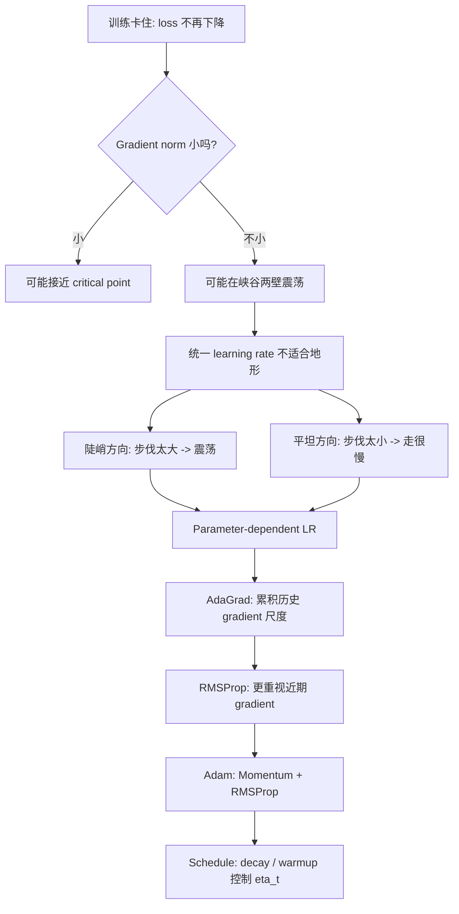
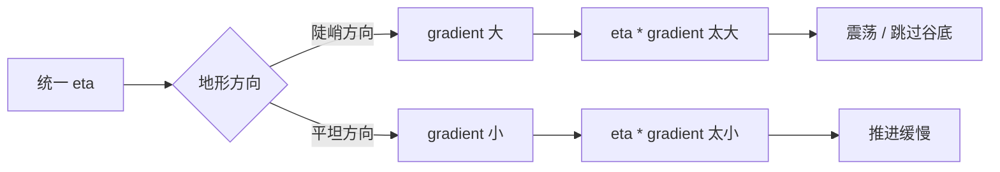
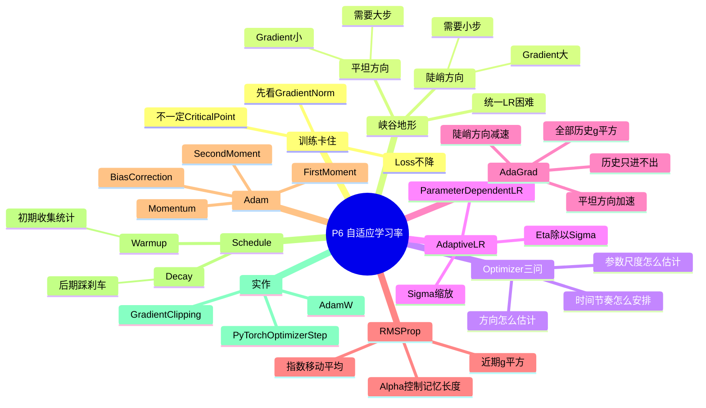

# P6 类神经网络训练不起来怎么办（三）：自适应学习率

来源：`P6【6、类神经网络训练不起来怎么办三 自动调整学习率 Learning Rate】`




## 0. 本节课一句话总结

训练卡住时，不要立刻说“卡在 local minimum”或“卡在 saddle point”。应该先看 gradient norm：如果 gradient 仍然很大，模型可能只是因为 error surface 某些方向太陡、某些方向太平，导致同一个 learning rate 在陡峭方向震荡、在平坦方向走不动。自适应学习率的核心是让不同参数、不同时间点拥有不同的实际步伐；AdaGrad、RMSProp、Adam、decay、warmup 都是在拆解并回答“该往哪走、每个参数走多大、训练到现在整体走多大”。

## 1. 时间线总览

| 时间 | 课堂内容 | 应该听出的主线 |
|---|---|---|
| 00:00-03:35 | Loss 不降不一定是 critical point | 训练卡住要先检查 gradient norm |
| 03:35-05:15 | 走到真正 critical point 其实不容易 | 多数训练问题发生在还没到 critical point 前 |
| 05:15-09:20 | 简单 convex error surface 也可能让 GD 失败 | 统一 learning rate 在峡谷地形中很痛苦 |
| 09:20-12:20 | Parameter-dependent learning rate | 每个参数应有自己的实际 learning rate |
| 12:20-17:10 | AdaGrad：用历史 gradient RMS 缩放步伐 | 平坦方向放大步伐，陡峭方向缩小步伐 |
| 17:10-23:05 | RMSProp：同一参数的 learning rate 也应随时间变 | 用近期历史而不是全部历史决定尺度 |
| 23:05-27:15 | Adam 与 AdaGrad 效果示例 | Adam 约等于 momentum + RMSProp；AdaGrad 可能后期爆冲 |
| 27:15-29:00 | Learning rate decay | 全局 `eta` 后期变小，给训练踩刹车 |
| 29:00-34:10 | Warmup | 初期先小步走，收集可靠的 gradient 尺度统计 |
| 34:10-36:40 | Momentum、sigma、schedule 的统一视角 | Momentum 管方向，sigma 管尺度，schedule 管时间节奏 |
| 36:40-37:40 | 下一步：能不能直接改变 error surface | 接到后续课程：改架构、activation、loss 等 |

## 2. 术语表

| 术语                     | 中文      | 本讲中的作用                               | 容易误解处                         |
| ---------------------- | ------- | ------------------------------------ | ----------------------------- |
| Optimizer              | 优化器     | 根据 gradient 更新参数的算法                  | 不是 loss function，也不是模型结构      |
| Gradient norm          | 梯度长度    | 用来判断 gradient 是否真的接近 0               | loss 不降时 gradient norm 不一定小   |
| Learning rate `eta`    | 学习率     | 控制整体更新步伐                             | 太大震荡，太小走不动                    |
| Parameter-dependent LR | 参数相关学习率 | 每个参数有自己的实际 learning rate             | 不是只有全局 `eta` 一个步伐             |
| `sigma_i^t`            | 缩放因子    | 用来缩放第 `i` 个参数在第 `t` 步的 learning rate | `sigma` 大则实际步伐小               |
| AdaGrad                | 自适应梯度方法 | 用历史 gradient 平方累计调整每个参数步伐            | 历史只增不减，后期可能过小或反应慢             |
| RMSProp                | 均方根传播   | 用指数移动平均估计近期 gradient 尺度              | 重点是让旧历史逐渐淡出                   |
| Adam                   | 自适应矩估计  | Momentum + adaptive learning rate    | 默认好用，但不代表总是最好                 |
| First moment           | 一阶动量    | gradient 的移动平均，负责方向估计                | 保留正负号，因此关心方向                  |
| Second moment          | 二阶动量    | gradient 平方的移动平均，负责尺度估计              | 平方后不关心方向，只关心大小                |
| Learning rate decay    | 学习率衰减   | 训练后期逐渐减小全局 `eta`                     | 和每个参数的 adaptive scaling 是不同层次 |
| Warmup                 | 预热      | 训练初期让 learning rate 从小逐渐变大           | 不是为了学得慢，而是为了先稳定统计量            |
| Schedule               | 学习率排程   | 控制 $\eta_t$ 随训练时间变化                  | 解决“不同阶段整体走多大”                 |

## 3. P6 在 P4-P7 脉络中的位置

这一组课都在回答同一个问题：

```text
为什么神经网络训练不起来？
```

但每讲定位不同：

| 讲次 | 关注点 | 核心问题 |
|---|---|---|
| P4 | Critical point | loss 不降是不是因为 gradient 为 0？ |
| P5 | Batch 与 Momentum | gradient 方向有噪声时，怎样让方向更稳定？ |
| P6 | Adaptive learning rate | gradient 不小但还是走不动时，步伐尺度是否合适？ |
| P7 | Loss function | loss 本身是否造出了不好走的 error surface？ |

所以 P6 的关键不是单纯背 optimizer 名称，而是补上训练诊断里的一个分支：

```text
不是没有方向，而是步伐尺度错了。
```

如果 P5 关心的是“方向的随机性和惯性”，P6 关心的就是“每个方向、每个参数、每个时间点应该走多大”。

## 4. Loss 不降，不代表卡在 Critical Point

很多人看到训练曲线变平，会自然猜：

```text
loss 不降
  -> gradient 变成 0
  -> 卡在 critical point
  -> 可能是 local minimum 或 saddle point
```

本讲一开始就提醒：这个判断太快了。

如果真的卡在 critical point，应该看到：

```text
gradient norm 很小
```

但课堂中的实验现象是：

```text
loss 已经几乎不再下降
gradient norm 却没有接近 0
甚至训练末段 gradient norm 还会上升
```

这说明参数不是“没有力气动”，而是“动了也没有有效降低 loss”。它可能在 error surface 的狭长峡谷两侧来回撞，横向动得很剧烈，但纵向朝最低点推进得很慢。

> [!IMPORTANT] 训练诊断原则
> 看到 loss plateau，不要先讲故事。先看 gradient norm。如果 gradient norm 很小，才进一步讨论 critical point；如果 gradient norm 不小，就要怀疑 learning rate、optimizer、batch noise、loss surface 形状等问题。

## 5. 为什么真正走到 Critical Point 反而不容易

老师在课堂里补了一个很有意思的观察：上一讲那些分析 Hessian eigenvalue、判断 saddle point/local minimum 的实验，并不是普通 gradient descent 轻易训练出来的。

原因是普通 gradient descent 很可能在还没靠近 critical point 之前，就已经因为地形和步伐问题走不下去了：

```text
gradient 仍然不小
loss 却降不动
参数在地形中震荡或推进很慢
```

这并不是说 critical point 不重要，而是说在实际训练中，critical point 常常不是第一只要抓的“主犯”。很多时候真正的问题更朴素：

```text
learning rate 不适合这张 error surface。
```

## 6. 狭长峡谷：为什么简单 Convex Surface 也会让 GD 失败

课程用一个二维 convex error surface 说明，即使地形已经非常简单，gradient descent 也可能很难走好。

想象一张等高线是细长椭圆的地形：

```text
纵向很陡：gradient 很大
横向很平：gradient 很小
最低点在细长山谷深处
```

如果 learning rate 大：

```text
纵向一步太大
参数从一边谷壁跳到另一边谷壁
loss 不再有效下降
gradient norm 仍然很大
```

如果 learning rate 小：

```text
纵向终于不乱跳
但横向推进极慢
走了很多很多步仍靠近不了最低点
```

课堂中的例子甚至提到：调小 learning rate 后，参数可以滑到谷底并转向，但后面在平坦方向走得极慢，更新十万次仍然离终点很远。

这说明问题不是“convex 就一定容易”，而是：

```text
同一个 learning rate 无法同时满足陡峭方向和平坦方向。
```



## 7. Optimizer 到底在做什么

一次训练通常可以拆成三步：

```text
1. forward：用当前参数算 prediction 和 loss
2. backward：用 backpropagation 算每个参数的 gradient
3. optimizer step：根据 gradient 更新参数
```

Gradient 本身只告诉你：

```text
loss 在当前点往哪个方向上升最快
```

Optimizer 才决定：

```text
要不要完全相信当前 gradient？
每个参数走多大？
训练早期和后期是否用同样步伐？
```

普通 gradient descent 对这些问题的回答非常朴素：

$$
\theta_i^{t+1} = \theta_i^t - \eta g_i^t
$$

其中：

| 符号 | 含义 |
|---|---|
| $\theta_i^t$ | 第 `i` 个参数在第 `t` 步的值 |
| $g_i^t$ | 第 `i` 个参数在第 `t` 步的 gradient |
| $\eta$ | 全局 learning rate |

这条公式可以拆成：

```text
更新方向：-g_i^t
更新大小：eta * |g_i^t|
```

它的问题是所有参数共享同一个 `eta`。如果某些方向很陡、某些方向很平，统一步伐自然会出问题。

## 8. 自适应学习率的核心原则

从峡谷例子中可以抽出一个原则：

| 地形 | Gradient 大小 | 希望的 learning rate |
|---|---:|---|
| 平坦方向 | 小 | 大一点 |
| 陡峭方向 | 大 | 小一点 |

也就是说，不同参数、不同方向应该拥有不同的实际 learning rate。

普通更新是：

$$
\theta_i^{t+1} = \theta_i^t - \eta g_i^t
$$

自适应版本写成：

$$
\theta_i^{t+1}
= \theta_i^t - \frac{\eta}{\sigma_i^t} g_i^t
$$

于是第 `i` 个参数在第 `t` 步真正使用的实际 learning rate 是：

$$
\frac{\eta}{\sigma_i^t}
$$

这里的 $\sigma_i^t$ 有两个重要属性：

```text
parameter-dependent:
  不同参数有不同 sigma

iteration-dependent:
  不同训练步骤有不同 sigma
```

如果某参数过去 gradient 大，说明这个方向可能陡峭：

```text
sigma 大 -> eta / sigma 小 -> 步伐小
```

如果某参数过去 gradient 小，说明这个方向可能平坦：

```text
sigma 小 -> eta / sigma 大 -> 步伐大
```

## 9. AdaGrad：用全部历史 Gradient 尺度调整步伐

AdaGrad 的想法是：用过去所有 gradient 的平方来估计某个参数方向的尺度。

一种常见写法是：

$$
s_i^t = \sum_{\tau=1}^{t} (g_i^\tau)^2
$$

更新：

$$
\theta_i^{t+1}
= \theta_i^t - \frac{\eta}{\sqrt{s_i^t+\epsilon}} g_i^t
$$

其中：

| 符号 | 含义 |
|---|---|
| $s_i^t$ | 第 `i` 个参数到目前为止的 gradient 平方累计 |
| $\sqrt{s_i^t}$ | 该参数历史 gradient 尺度 |
| $\epsilon$ | 很小的常数，避免除以 0，提高数值稳定性 |

课程里用 root mean square 的形式解释：

$$
\sigma_i^t
= \sqrt{\frac{1}{t+1}\sum_{\tau=0}^{t}(g_i^\tau)^2}
$$

这和常见累计形式只差常数尺度，直觉相同：

```text
历史 gradient 大 -> sigma 大 -> 实际 learning rate 小
历史 gradient 小 -> sigma 小 -> 实际 learning rate 大
```

### 9.1 AdaGrad 为什么能解决峡谷问题

在狭长峡谷中：

```text
陡峭方向 gradient 常常很大
平坦方向 gradient 常常很小
```

AdaGrad 会自动让：

```text
陡峭方向:
  sigma 变大
  实际 learning rate 变小
  减少左右震荡

平坦方向:
  sigma 变小
  实际 learning rate 变大
  加快沿谷底前进
```

所以它不是简单把全局 learning rate 调大或调小，而是给每个参数一个自己的缩放。

### 9.2 AdaGrad 的局限：历史只进不出

AdaGrad 的问题也来自它的优点：它记住全部历史。

因为：

$$
s_i^t = s_i^{t-1} + (g_i^t)^2
$$

所以 $s_i^t$ 基本只会越来越大，实际 learning rate：

$$
\frac{\eta}{\sqrt{s_i^t+\epsilon}}
$$

会越来越小。

这会带来两个问题：

1. 后期步伐可能过小，训练变慢。
2. 同一个参数所处的地形会随时间改变，但 AdaGrad 让很久以前的 gradient 永远留在统计量里，反应不够灵活。

课堂中的 AdaGrad 例子很形象：它能在平坦方向继续往终点走，比普通 gradient descent 强很多；但走到某些区域后，某方向因为长期看到很小的 gradient，`sigma` 变得很小，实际步伐变得很大，最后可能突然喷出去。喷出去后又因为 gradient 变大，`sigma` 慢慢变大，步伐再缩小，于是又回到峡谷附近。

这说明 AdaGrad 有用，但还不够稳定。

## 10. RMSProp：让近期 Gradient 更重要

RMSProp 可以看成 AdaGrad 的改良：不要让所有历史 gradient 拥有同等权重，而是更重视近期 gradient。

RMSProp 使用指数移动平均：

$$
v_i^t
= \alpha v_i^{t-1} + (1-\alpha)(g_i^t)^2
$$

更新：

$$
\theta_i^{t+1}
= \theta_i^t - \frac{\eta}{\sqrt{v_i^t+\epsilon}} g_i^t
$$

其中 `\alpha` 是 hyperparameter：

| `\alpha` | 意义 |
|---:|---|
| 趋近 1 | 更相信过去，统计变化慢 |
| 趋近 0 | 更相信当前 gradient，统计变化快 |

RMSProp 和 AdaGrad 的核心差别：

| 方法 | 记忆方式 | 分母变化 | 结果 |
|---|---|---|---|
| AdaGrad | 全部历史累计 | 基本只增不减 | 后期步伐容易越来越小，或对地形变化反应慢 |
| RMSProp | 近期历史的指数移动平均 | 可随近期 gradient 变大或变小 | 更能适应同一参数在不同阶段的地形变化 |

### 10.1 为什么同一参数也需要动态 learning rate

课程用新月形 error surface 说明：就算是同一个参数方向，在训练不同位置上也可能一会儿陡、一会儿平。

所以我们不能只说：

```text
这个参数永远该用大 learning rate
那个参数永远该用小 learning rate
```

更合理的是：

```text
这个参数现在处在平坦区域 -> 大步
之后处在陡峭区域 -> 小步
再之后回到平坦区域 -> 再大步
```

RMSProp 的 `\alpha` 就是在控制“最近看到的地形”对 `sigma` 的影响速度。

## 11. Adam：方向估计 + 步伐缩放

课堂把 Adam 说成：

```text
Adam = RMSProp + Momentum
```

这是非常好的直觉。

更完整地说，Adam 同时维护两类统计量：

$$
m_i^t = \beta_1 m_i^{t-1} + (1-\beta_1)g_i^t
$$

$$
v_i^t = \beta_2 v_i^{t-1} + (1-\beta_2)(g_i^t)^2
$$

其中：

| 统计量 | 记录什么 | 作用 |
|---|---|---|
| `m_i^t` | gradient 的指数移动平均 | 一阶动量，平滑更新方向 |
| `v_i^t` | gradient 平方的指数移动平均 | 二阶动量，估计梯度尺度 |

Adam 的更新直觉是：

$$
\theta_i^{t+1}
= \theta_i^t - \eta \frac{m_i^t}{\sqrt{v_i^t}+\epsilon}
$$

也就是：

```text
分子 m:
  决定往哪个方向走

分母 sqrt(v):
  决定这个参数走多大

外面的 eta:
  控制整体步伐
```

### 11.1 为什么 momentum 和 sigma 不会互相抵消

课堂最后特别提醒：有人可能会困惑，momentum 和 `sigma` 都在使用过去 gradient，一个放分子，一个放分母，会不会抵消？

不会。因为它们使用 gradient 的方式不同：

| 组件 | 使用方式 | 是否保留方向 | 回答的问题 |
|---|---|---|---|
| Momentum / $m_t$ | 对 gradient 做移动平均 | 保留正负号 | 往哪里走 |
| RMS / $v_t$ / $\sigma_t$ | 对 gradient 平方做移动平均 | 不保留正负号 | 这个方向尺度多大 |

Momentum 关心：

```text
过去的 gradient 多数往左还是往右？
```

Second moment 关心：

```text
过去的 gradient 大不大？
```

所以它们不是同一件事。

### 11.2 Adam 的 Bias Correction

课程没有细讲 Adam 公式，但如果要把机制想通，需要知道 Adam 还有 bias correction。

因为 $m_t$ 和 $v_t$ 一开始通常从 0 初始化，训练初期的移动平均会偏小。Adam 会用：

$$
\hat{m}_t = \frac{m_t}{1-\beta_1^t}
$$

$$
\hat{v}_t = \frac{v_t}{1-\beta_2^t}
$$

修正早期统计偏差。完整直觉版更新可以写成：

$$
\theta_i^{t+1}
= \theta_i^t
- \eta
\frac{\hat{m}_i^t}{\sqrt{\hat{v}_i^t}+\epsilon}
$$

要知道 Adam 的完整结构：

```text
一阶动量 m:
  平滑方向

二阶动量 v:
  缩放步伐

bias correction:
  修正训练初期统计量从 0 开始造成的低估

epsilon:
  防止分母为 0，提升数值稳定性
```

### 11.3 Adam 是好默认值，但不是永远最好

实践上，PyTorch、TensorFlow 等框架已经把 Adam 写好，很多时候默认参数就是不错起点：

```text
beta1 = 0.9
beta2 = 0.999
epsilon = 1e-8
```

但不要把 Adam 理解成“更高级所以一定更好”。它通常收敛快、调参压力小，但有些任务上 SGD + momentum 的泛化效果可能更好。课程这里真正要传达的是 Adam 的结构，而不是给出所有任务的唯一答案。

## 12. Learning Rate Schedule：`eta` 也要随时间变

到目前为止，adaptive learning rate 主要解决：

```text
不同参数之间的相对步伐怎么调？
```

但更新公式里还有一个全局 `eta`：

$$
\theta_i^{t+1}
= \theta_i^t - \frac{\eta}{\sigma_i^t}g_i^t
$$

或 Adam 形式：

$$
\theta_i^{t+1}
= \theta_i^t
- \eta
\frac{\hat{m}_i^t}{\sqrt{\hat{v}_i^t}+\epsilon}
$$

这个 `eta` 不一定要固定。Learning rate schedule 的想法是：

```text
eta -> eta_t
```

也就是让全局 learning rate 随训练时间变化。

这解决的是另一个层次：

```text
训练到不同阶段，整体应该走大步还是小步？
```

## 13. Learning Rate Decay：后期踩刹车

Learning rate decay 的思想：

```text
随着训练进行，让 eta_t 逐渐变小。
```

直觉是：

```text
训练初期:
  离目标较远，可以走大步，快速降低 loss

训练后期:
  接近较好区域，需要小步微调，避免震荡或喷出去
```

课程中 AdaGrad 的例子说明：即使有 adaptive scaling，某些方向的实际步伐也可能因为 `sigma` 很小而变得过大。Decay 可以把全局 $\eta_t$ 压下来：

```text
局部想乱喷
但全局 eta_t 已经很小
所以整体更新被刹住
```

常见 decay 形式包括：

| Schedule | 直觉 |
|---|---|
| Step decay | 每隔一段时间把 LR 乘上固定比例 |
| Exponential decay | LR 按指数逐渐减小 |
| Cosine decay | LR 按余弦曲线平滑减小 |
| Linear decay | LR 线性减小 |

本讲不要求掌握所有形式，重点是区分两层控制：

| 层次 | 控制对象 | 代表方法 |
|---|---|---|
| 参数层次 | 不同参数谁走大步、谁走小步 | AdaGrad、RMSProp、Adam |
| 时间层次 | 当前训练阶段整体激进还是保守 | decay、warmup |

## 14. Warmup：为什么一开始反而要小步走

Warmup 指：

```text
训练一开始 eta_t 很小
随后逐渐增大
达到峰值后再进入 decay
```

整体形状常常是：

```text
小 -> 大 -> 小
```

这听起来反直觉：既然训练初期离目标远，为什么不一开始就用大 learning rate？

课堂给出的可能解释是：自适应方法需要估计 `sigma` 或 $v_t$，而这些统计量一开始不可靠。

以 RMSProp / Adam 为例，它们都需要根据过去 gradient 估计：

```text
某个方向到底陡不陡？
某个参数该走多大？
```

但训练刚开始时：

```text
看过的 gradient 很少
sigma / v_t 统计不准
如果 eta_t 太大，可能在统计可靠前就走太远
```

所以 warmup 的作用可以理解为：

```text
先小步探索
收集 error surface 和 gradient 尺度信息
等 sigma / v_t 比较可靠后
再把 eta_t 提高
```

> [!NOTE] Warmup 和 Adam bias correction 的关系
> Adam 的 bias correction 会修正早期 $m_t$、$v_t$ 从 0 开始造成的统计偏差；warmup 则是在训练系统层面进一步限制早期更新幅度。两者不矛盾：bias correction 修公式，warmup 控节奏。

### 14.1 Warmup 为什么常出现在大模型和 Transformer 中

课堂提到 warmup 不是 BERT/Transformer 以后才出现的技巧，早期 ResNet 等论文中也已经使用。只是 Transformer、BERT 等模型让 warmup 变得更常被讨论。

原因是大模型训练初期尤其不稳定：

```text
参数多
梯度尺度复杂
normalization、residual、attention 等模块相互影响
一开始直接大 learning rate 容易爆掉
```

所以许多训练 recipe 会使用：

```text
warmup + decay
```

先稳定，再加速，再收敛。

## 15. 用一条公式统一本讲

本讲最适合用一条总公式来理解：

$$
\Delta \theta_i^t
=
-\eta_t
\cdot
\frac{\text{direction estimate}_i^t}
{\text{scale estimate}_i^t}
$$

也就是：

```text
参数更新
  = 全局时间步伐
  * 方向估计
  / 每个参数的尺度估计
```

不同 optimizer 其实是在改这三个部件：

| 部件 | 回答的问题 | 朴素做法 | 改进做法 |
|---|---|---|---|
| Direction estimate | 往哪里走？ | 当前 gradient | Momentum / Adam 一阶动量 |
| Scale estimate | 每个参数走多大？ | 不缩放 | AdaGrad / RMSProp / Adam 二阶动量 |
| $\eta_t$ schedule | 训练不同阶段整体走多大？ | 固定 LR | decay / warmup |

这就是为什么课程最后说，现代 optimizer 的很多变形并没有脱离这几个核心：

```text
要么换方向估计
要么换 sigma / scale 估计
要么换 learning rate schedule
```

## 16. AdaGrad、RMSProp、Adam 对比

| 方法 | 使用的历史信息 | 解决的问题 | 可能的问题 | 一句话记忆 |
|---|---|---|---|---|
| SGD | 当前 gradient | 最基本更新 | 方向噪声大，统一 LR 难调 | 只看此刻 |
| Momentum | 过去 gradient 的移动平均 | 平滑方向，减少摇摆 | 仍没有参数级尺度调整 | 带惯性地走 |
| AdaGrad | 全部历史 `g^2` | 每个参数自动调 learning rate | 历史只进不出，后期可能步伐过小或反应慢 | 陡处小步，平处大步 |
| RMSProp | 近期 `g^2` 的移动平均 | 让尺度估计随近期地形变化 | 需调 `alpha`，仍需全局 schedule | 只让近期历史更有话语权 |
| Adam | 近期 `g` + 近期 `g^2` | 同时平滑方向和缩放步伐 | 默认好用但不总是泛化最好 | Momentum + RMSProp |

## 17. 训练卡住时的诊断表

P6 是“训练不起来”系列，因此最有用的不是只背 optimizer，而是能诊断现象。

| 现象 | 可能原因 | 优先检查 / 尝试 |
|---|---|---|
| loss 不降，gradient norm 很小 | 可能接近 critical point、activation 饱和、loss 设计问题 | 检查 gradient norm、activation、initialization |
| loss 不降，gradient norm 不小 | 可能在峡谷两壁震荡，learning rate 不合适 | 降 LR、换 Adam/RMSProp、看 loss 是否震荡 |
| loss 大幅震荡 | 全局 LR 太大，或某方向步伐太大 | 降 LR、加 decay、gradient clipping |
| loss 初期直接爆炸 | 初始 LR 太大，warmup 不够，统计量未稳定 | 加 warmup、减小初始 LR |
| loss 下降很慢 | LR 太小，平坦方向推进不足 | 提高 LR、用 adaptive optimizer |
| 前期快，后期不稳 | 全局 $\eta_t$ 后期太大 | 加 decay / cosine schedule |
| Adam 很快收敛但泛化一般 | optimizer 与 regularization 选择可能不合适 | 试 SGD + momentum、调整 weight decay |

这个表不是替代实验，而是提醒排查顺序：先看现象，再猜原因，最后改 optimizer 或 schedule。

## 18. 实作提醒

### 18.1 PyTorch 里常见写法

Adam 常见写法：

```python
optimizer = torch.optim.Adam(
    model.parameters(),
    lr=1e-3,
    betas=(0.9, 0.999),
    eps=1e-8,
)
```

训练循环中：

```python
optimizer.zero_grad()
loss.backward()
optimizer.step()
```

这里 `loss.backward()` 只负责算 gradient；真正更新参数的是 `optimizer.step()`。

### 18.2 AdamW 与 weight decay

现代训练中常看到 AdamW：

```python
optimizer = torch.optim.AdamW(
    model.parameters(),
    lr=1e-4,
    weight_decay=0.01,
)
```

AdamW 的核心是 decoupled weight decay：把 weight decay 从 adaptive gradient update 中解耦出来。对 Transformer/BERT 类模型，AdamW 往往比普通 Adam 加 L2 式 weight decay 更常用。

这不是本讲主线，但它能帮你把课程内容和现代训练实践接起来：

```text
Adam:
  解决方向与参数尺度问题

AdamW:
  在 Adam 基础上更合理地处理 weight decay
```

### 18.3 Gradient clipping 不是 adaptive LR，但常一起出现

如果训练中出现梯度爆炸，常见补救是 gradient clipping：

```python
torch.nn.utils.clip_grad_norm_(model.parameters(), max_norm=1.0)
```

它和 adaptive learning rate 不是同一件事：

```text
adaptive LR:
  根据历史 gradient 尺度调整每个参数步伐

gradient clipping:
  当前 gradient norm 太大时直接截断
```

但在大模型、RNN、Transformer 等训练中，它们经常和 warmup、AdamW 一起构成训练 recipe。

## 19. 易错点整理

| 易错点                          | 正确理解                                        |
| ---------------------------- | ------------------------------------------- |
| loss 不降就等于卡在 local minimum   | 先看 gradient norm；gradient 不小则可能是步伐或地形问题     |
| gradient 大就一定能继续降 loss       | 方向可能在峡谷两侧来回震荡，没有有效向谷底推进                     |
| learning rate 只需要调一个全局值      | 不同参数、不同方向可能需要不同实际 learning rate             |
| AdaGrad 只是自动调大 LR            | AdaGrad 会根据历史 gradient 尺度同时放大平坦方向、缩小陡峭方向    |
| RMSProp 和 AdaGrad 差不多        | RMSProp 让近期 gradient 更重要，旧历史会逐渐淡出           |
| Adam 只是更高级的 SGD              | Adam 同时做方向平滑和参数尺度缩放                         |
| Momentum 和 second moment 会抵消 | Momentum 保留方向，second moment 只看大小，不会抵消       |
| decay 和 adaptive LR 是一回事     | adaptive LR 管参数间相对步伐，decay 管全局时间节奏          |
| warmup 是为了让模型一开始慢慢学          | warmup 更重要的是让早期统计量稳定，避免一开始走太猛               |
| Adam 默认一定最好                  | Adam 是好起点，但不同任务可能需要 SGD、AdamW 或其他 optimizer |

## 20. 复习问答

**Q1：loss 不降时，为什么不能马上说卡在 critical point？**  
A：因为 critical point 意味着 gradient 接近 0，但实际训练中 loss plateau 时 gradient norm 可能仍然很大。此时更可能是参数在崎岖地形中震荡或步伐不合适。

**Q2：为什么简单 convex error surface 也可能难训练？**  
A：如果地形是狭长峡谷，陡峭方向需要小 learning rate，平坦方向需要大 learning rate。单一全局 LR 无法同时满足两个方向。

**Q3：自适应 learning rate 的大原则是什么？**  
A：gradient 大的方向通常较陡，实际 learning rate 应小；gradient 小的方向通常较平，实际 learning rate 应大。

**Q4：AdaGrad 如何计算每个参数的尺度？**  
A：它累计该参数过去 gradient 的平方，再开根号作为分母，用来缩放实际 learning rate。

**Q5：AdaGrad 的主要问题是什么？**  
A：它记住全部历史，累计量基本只增不减，因此后期实际 learning rate 可能过小，也可能对地形变化反应慢。

**Q6：RMSProp 相比 AdaGrad 改进在哪里？**  
A：RMSProp 用指数移动平均，让近期 gradient 更重要，旧历史逐渐淡出，所以同一参数的 learning rate 可以随当前地形动态调整。

**Q7：Adam 为什么可以理解成 Momentum + RMSProp？**  
A：Adam 用一阶动量 $m_t$ 平滑方向，用二阶动量 $v_t$ 缩放每个参数步伐，所以结合了 momentum 和 adaptive learning rate。

**Q8：Momentum 和 `sigma` 为什么不会互相抵消？**  
A：Momentum 保留 gradient 的正负号，关心方向；`sigma` 来自 gradient 平方，关心大小。它们回答的问题不同。

**Q9：learning rate decay 的目的是什么？**  
A：训练后期减小全局 $\eta_t$，让参数更新变谨慎，避免在低 loss 区域震荡或因为局部尺度估计导致爆冲。

**Q10：warmup 的可能原因是什么？**  
A：训练初期 `sigma`、$v_t$ 等统计量不可靠，先用小 learning rate 收集梯度尺度信息，等统计较稳定后再提高 learning rate。

**Q11：optimizer 的三个核心问题是什么？**  
A：方向怎么估计、每个参数的尺度怎么估计、不同训练阶段全局步伐怎么安排。

**Q12：AdamW 和 Adam 有什么关系？**  
A：AdamW 在 Adam 的基础上把 weight decay 从 adaptive update 中解耦出来，是现代深度学习，尤其 Transformer 类模型中常见的 optimizer。

## 21. 知识地图



## 22. 本讲总结

```text
训练卡住时:
  不要马上说卡在 local minimum / saddle point
  先检查 gradient norm

如果 gradient 不小但 loss 不降:
  参数可能在峡谷两壁震荡
  或在平坦方向推进太慢

根本问题:
  单一 learning rate 不适合所有参数和所有方向

自适应学习率:
  theta_i <- theta_i - eta / sigma_i * g_i
  sigma 大 -> 实际步伐小
  sigma 小 -> 实际步伐大

AdaGrad:
  用全部历史 gradient 平方估计尺度
  可自动放大平坦方向、缩小陡峭方向
  但历史只进不出

RMSProp:
  用近期 gradient 平方移动平均估计尺度
  可以更快适应地形变化

Adam:
  一阶动量管方向
  二阶动量管尺度
  bias correction 修正早期统计偏差

Schedule:
  decay 管训练后期踩刹车
  warmup 管训练初期缓启动

最核心的统一公式:
  update = eta_t * direction estimate / scale estimate
```

> [!IMPORTANT] 核心结论
> Optimizer 不是神秘黑盒。它本质上在回答三个问题：这一步往哪里走、每个参数走多大、训练到现在整体该走多大。Momentum 改善方向估计，AdaGrad/RMSProp/Adam 改善参数尺度估计，decay/warmup 改善时间节奏。理解这三个部件，就能把本讲的 optimizer 名称串成一条清楚的训练诊断逻辑。
