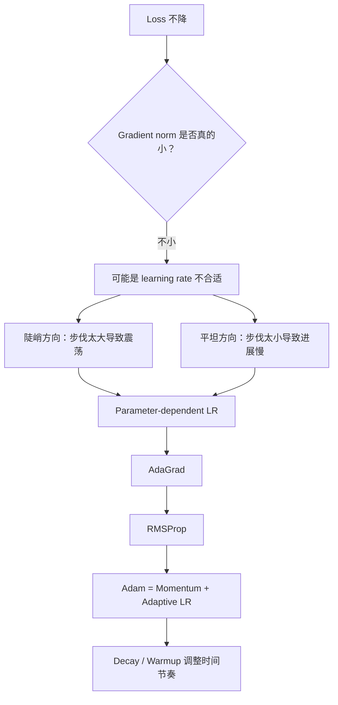
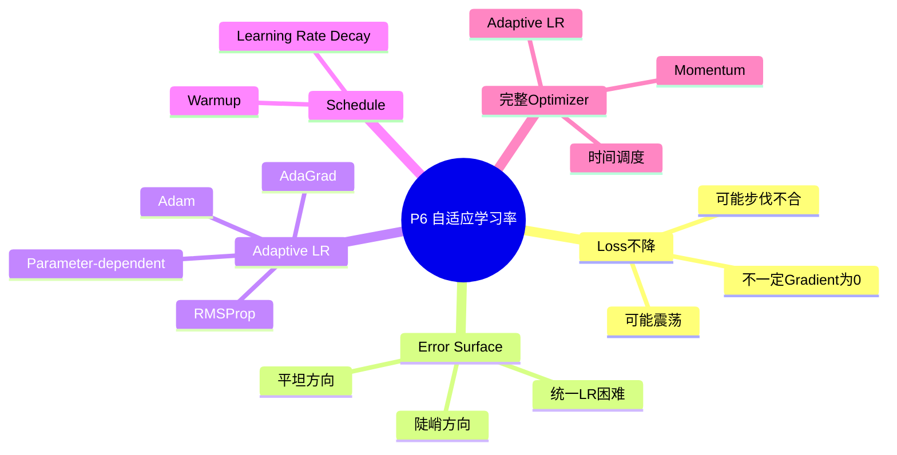

# P6 类神经网络训练不起来怎么办（三）：自适应学习率

来源：`P6【6、类神经网络训练不起来怎么办三 自动调整学习率 Learning Rate】`  

> [!ABSTRACT] 本讲概要
> 本讲修正一个常见误判：loss 不降不一定代表 gradient 已经接近 0，也可能是 learning rate 与 loss surface 的形状不匹配。若某些方向很陡、某些方向很平，统一 learning rate 会让参数在陡峭方向震荡、在平坦方向走得太慢。课程因此引入 parameter-dependent learning rate、AdaGrad、RMSProp 与 Adam，并说明 learning rate decay 和 warmup 如何作为 schedule 调整整体步伐。本讲的主旨是：optimizer 的核心问题不是“要不要走”，而是“每个方向、每个时间点该走多大一步”。



## 0. 本节课一句话总结

训练卡住时，gradient 不一定真的很小；很多时候是 error surface 某些方向很陡、某些方向很平，统一 learning rate 会导致震荡或走不动。自适应学习率的核心是：给每个参数、每个方向动态调整 learning rate。AdaGrad、RMSProp、Adam、learning rate decay 和 warmup 都是在解决“步伐大小怎么设”这个问题。

## 1. 时间线总览

| 时间 | 内容 |
|---|---|
| 00:00-04:30 | Loss 不降时，gradient 不一定小 |
| 04:30-09:30 | 简单 convex error surface 也可能让 gradient descent 卡住 |
| 09:30-16:30 | Parameter-dependent learning rate 与 AdaGrad |
| 16:30-23:30 | RMSProp：同一参数的 learning rate 也要随时间调整 |
| 23:30-27:30 | Adam 与 adaptive learning rate 的效果和问题 |
| 27:30-32:30 | Learning rate decay 与 warmup |
| 32:30-37:40 | Momentum + adaptive learning rate + schedule 的完整优化器直觉 |

## 2. Loss 不降不一定是 Critical Point

上一节讲 critical point、local minimum、saddle point。但本节开头强调：

```text
critical point 不一定是训练中最大的障碍。
```

很多人看到 loss 不再下降，就猜：

```text
是不是 gradient 变成 0？
是不是卡在 critical point？
```

但课程提醒：你真的检查过 gradient norm 吗？

有些实验中：

- loss 已经几乎不再下降；
- 但 gradient norm 并没有接近 0；
- 甚至训练最后 gradient norm 还上升。

这说明训练卡住可能不是因为 gradient 为 0，而是因为参数在复杂地形中来回震荡，无法有效降低 loss。

## 3. 崎岖 Error Surface 的问题

课程用一个简单的二维 error surface 说明：

- 某个方向很陡，gradient 很大；
- 另一个方向很平，gradient 很小；
- 最低点在远处，但普通 gradient descent 很难顺利走过去。

如果 learning rate 太大：

```text
在陡峭方向会震荡甚至飞出去。
```

如果 learning rate 太小：

```text
在平坦方向走得极慢，update 很多次仍靠近不了最低点。
```

关键问题是：

```text
所有参数用同一个 learning rate 不够。
```

## 4. 自适应学习率的核心原则

不同参数、不同方向应该使用不同 learning rate。

大原则：

| 地形 | Gradient 大小 | 希望 learning rate |
|---|---|---|
| 平坦方向 | 小 | 大一点 |
| 陡峭方向 | 大 | 小一点 |

这样可以：

- 在平坦方向加速前进；
- 在陡峭方向避免震荡或爆炸。

## 5. Parameter-Dependent Learning Rate

普通更新：

```text
theta_i^{t+1} = theta_i^t - eta * g_i^t
```

自适应版本：

```text
theta_i^{t+1} = theta_i^t - eta / sigma_i^t * g_i^t
```

其中：

| 符号 | 含义 |
|---|---|
| `eta` | 全局 learning rate |
| `g_i^t` | 第 i 个参数在第 t 步的 gradient |
| `sigma_i^t` | 第 i 个参数的缩放因子 |

如果某参数过去 gradient 很大，则 `sigma` 大，实际 learning rate 小。  
如果某参数过去 gradient 很小，则 `sigma` 小，实际 learning rate 大。

## 6. AdaGrad

AdaGrad 的 `sigma` 由过去 gradient 的 root mean square 计算。

大致形式：

```text
sigma_i^t = sqrt( average of (g_i^0)^2, (g_i^1)^2, ..., (g_i^t)^2 )
```

更新：

```text
theta_i^{t+1} = theta_i^t - eta / sigma_i^t * g_i^t
```

直觉：

- 如果某方向一直 gradient 大，说明该方向陡峭，步伐要小。
- 如果某方向一直 gradient 小，说明该方向平坦，步伐要大。

### 6.1 AdaGrad 的局限

AdaGrad 累积的是过去所有 gradient。

问题：

```text
同一个参数所需 learning rate 会随训练阶段改变。
```

例如某方向一开始很陡，后来变平坦；AdaGrad 因为过去累积了很多大 gradient，可能反应太慢。

## 7. RMSProp

RMSProp 改进 AdaGrad，让 `sigma` 更重视最近的 gradient。

大致形式：

```text
sigma_t = sqrt( alpha * sigma_{t-1}^2 + (1 - alpha) * g_t^2 )
```

其中 `alpha` 是 hyperparameter：

- `alpha` 趋近 1：更重视过去；
- `alpha` 趋近 0：更重视当前 gradient。

RMSProp 的好处：

```text
可以动态调整每个参数的 learning rate。
```

当地形从平坦突然变陡时，RMSProp 能较快增大 `sigma`，让步伐变小，相当于踩刹车。

## 8. Adam

课程提到，深度学习框架中常用的 optimizer 已经把这些技巧封装好了。

今天最常用的 optimizer 之一是：

```text
Adam
```

Adam 可以粗略理解为：

```text
Momentum + RMSProp / adaptive learning rate
```

也就是：

- 用 momentum 处理更新方向；
- 用 adaptive learning rate 处理步伐大小。

实践建议：

```text
在 PyTorch 等框架中，直接调用 Adam，默认参数往往已经不错。
不要随便乱调，调不好反而可能变差。
```

## 9. Adaptive Learning Rate 的效果与问题

课程用例子说明，AdaGrad 可以让原本走不动的地形继续前进，因为在平坦方向 learning rate 会自动变大。

但也可能出现新问题：

- 在某方向长时间 gradient 很小，`sigma` 累积得很小；
- 突然遇到该方向变陡，实际步伐可能过大；
- 参数可能突然喷出去或震荡。

因此还需要配合 learning rate schedule。

## 10. Learning Rate Decay

Learning rate decay 的思想：

```text
随着训练进行，让 eta 越来越小。
```

直觉：

- 一开始离目标远，可以走大步；
- 后来越接近目标，应该放慢；
- 减少后期震荡，让训练更稳定。

形式可以很多，重点是：

```text
eta 不再是常数，而是随时间变化。
```

## 11. Warmup

Warmup 是另一种常用 schedule：

```text
learning rate 先变大，再变小。
```

听起来反直觉，但很多经典模型中都使用过，例如 ResNet、Transformer、BERT 相关训练。

可能解释：

- Adam/RMSProp 需要估计 `sigma`；
- 一开始统计还不准；
- 如果初始 learning rate 太大，参数会在统计稳定前跑太远；
- 先用小 learning rate 探索，收集 error surface 的统计；
- 等统计较稳定后，再逐步增大 learning rate；
- 后期再 decay。

Warmup 的具体长度、上升速度、下降速度都属于 hyperparameter。

## 12. 完整优化器的组合

课程把 optimization 技巧总结成几个部分：

```text
Update direction:
  不是只看当前 gradient
  而是结合过去 gradient
  -> momentum

Step size:
  不是所有参数同一个 learning rate
  而是除以 sigma
  -> adaptive learning rate

Global eta:
  不是固定常数
  而是随时间变化
  -> learning rate schedule
```

许多 optimizer 的变形本质上都在改：

- 怎么算 momentum；
- 怎么算 `sigma`；
- 怎么安排 learning rate schedule。

## 13. 本节重要术语表

| 术语 | 中文 | 含义 |
|---|---|---|
| Gradient norm | 梯度长度 | gradient 向量大小 |
| Adaptive learning rate | 自适应学习率 | 不同参数/时间使用不同步伐 |
| AdaGrad | 自适应梯度方法 | 用历史 gradient RMS 缩放 learning rate |
| RMSProp | 均方根传播 | 用指数移动平均动态估计 gradient RMS |
| Adam | 自适应矩估计 | momentum + adaptive learning rate |
| Sigma | 缩放因子 | 用来调整每个参数实际 learning rate |
| Learning rate decay | 学习率衰减 | 训练过程中逐渐减小 learning rate |
| Warmup | 预热 | learning rate 先增大后减小 |
| Learning rate schedule | 学习率排程 | learning rate 随时间变化的规则 |

## 14. 易错点

1. Loss 不降不代表 gradient 一定很小。
2. 训练卡住不一定是 critical point。
3. 同一个 learning rate 用在所有参数上往往不够。
4. 平坦方向需要较大学习率，陡峭方向需要较小学习率。
5. AdaGrad 会累积所有过去 gradient，可能反应慢。
6. RMSProp 更重视近期 gradient，能动态调整。
7. Adam 默认参数通常已经不错，不要盲目乱调。
8. Learning rate decay 是后期踩刹车。
9. Warmup 是前期先小步探索，再逐步放大学习率。

## 15. 复习问答

**Q1：loss 不降时，为什么不能马上说卡在 critical point？**  
A：因为 gradient norm 可能并不小，模型可能只是在崎岖地形中震荡。

**Q2：为什么每个参数需要不同 learning rate？**  
A：不同方向坡度不同。平坦方向需要大步，陡峭方向需要小步。

**Q3：AdaGrad 的 sigma 怎么来？**  
A：由过去所有 gradient 的平方平均再开根号得到。

**Q4：RMSProp 相比 AdaGrad 改进在哪里？**  
A：它用指数移动平均，让近期 gradient 影响更大，可以动态调整。

**Q5：Adam 可以怎么理解？**  
A：粗略理解为 momentum 加 RMSProp/adaptive learning rate。

**Q6：learning rate decay 的目的是什么？**  
A：训练后期减小步伐，避免震荡，更稳定地收敛。

**Q7：warmup 的可能原因是什么？**  
A：训练初期 adaptive statistics 还不准确，先用小 learning rate 收集统计，再逐渐增大。

## 16. 知识地图



## 17. 本讲总结

```text
训练卡住:
  不一定 gradient = 0
  可能是 learning rate 不适合地形

解决:
  每个参数独立 learning rate
  平坦方向大步，陡峭方向小步

方法:
  AdaGrad -> 历史 gradient RMS
  RMSProp -> 近期 gradient 更重要
  Adam -> momentum + adaptive LR
  decay -> 后期减小 LR
  warmup -> 前期先小后大再衰减
```

> [!IMPORTANT] 核心结论
> 自适应学习率的目的不是让学习率“自动变神奇”，而是让不同参数、不同时间点的更新步伐更符合 loss surface 的局部形状；Adam、decay、warmup 等技巧都是围绕“步伐大小如何控制”这个问题展开。
