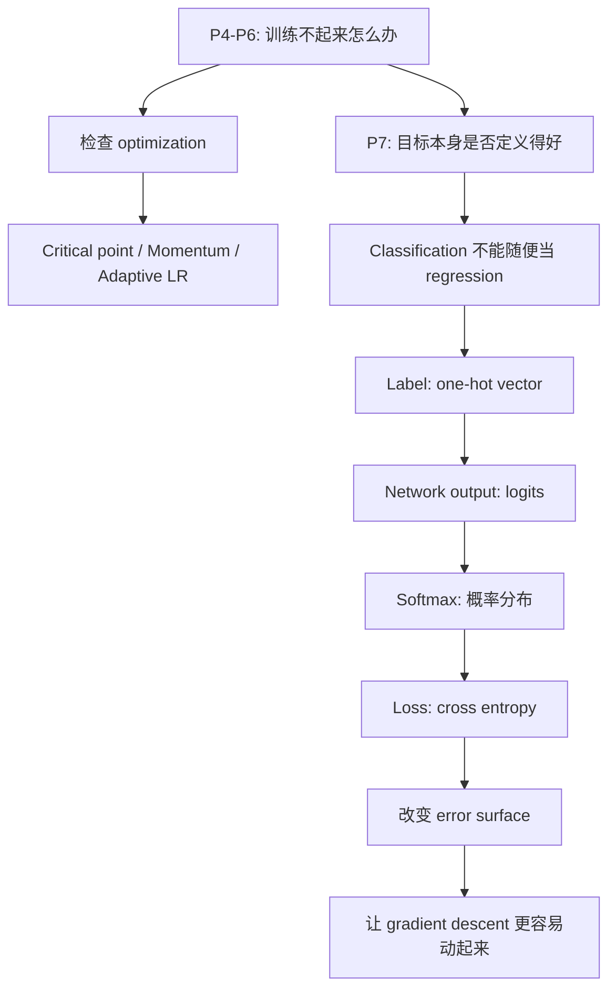
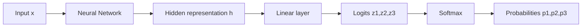
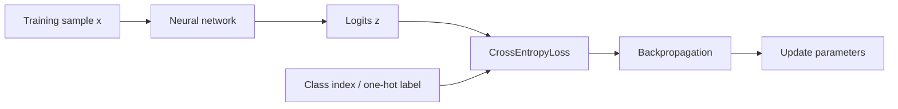
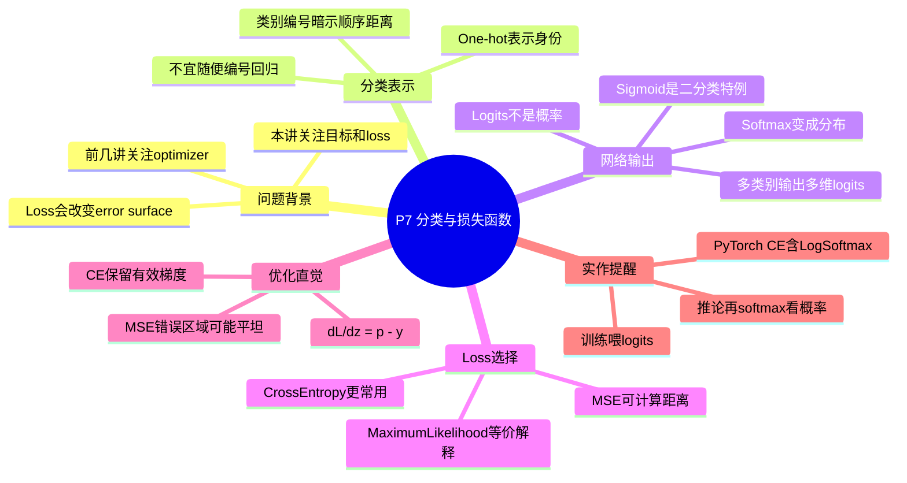

# P7 类神经网络训练不起来怎么办（四）：分类与损失函数

来源：`P7【7、类神经网络训练不起来怎么办四 损失函数 Loss 也】`




## 0. 本节课一句话总结

分类任务的重点不是让模型输出一个“接近类别编号”的数字，而是让模型输出对每个类别的信心分布。做法是：用 one-hot vector 表示类别，让神经网络输出 logits，再用 softmax 把 logits 转成总和为 1 的分布，最后用 cross entropy 训练。Cross entropy 不只是一个评价公式，它会改变 error surface；相较于 MSE，它通常在模型严重分错时给出更有效的 gradient，所以分类任务更容易训练起来。

## 1. 时间线总览

| 时间 | 课堂内容 | 应该听出的主线 |
|---|---|---|
| 00:00-01:35 | 课程从 regression 转向 classification | 输出形式要跟任务类型匹配 |
| 01:35-03:30 | 把 class 编成 1/2/3 再做 regression 的问题 | 类别编号会偷塞“距离”和“顺序”假设 |
| 03:30-05:35 | One-hot vector 与多输出神经网络 | 分类 label 变成向量，网络最后一层也要变成向量 |
| 05:35-10:05 | Softmax 的功能、公式、例子 | Logits 不是概率；softmax 把原始分数变成分布 |
| 10:05-11:05 | 二分类中的 sigmoid 与 softmax | 二分类 sigmoid 可以看成二类 softmax 的等价写法 |
| 11:05-14:25 | MSE、cross entropy 与 maximum likelihood | 交叉熵是分类的标准 loss，也等价于最大似然 |
| 14:25-15:10 | PyTorch 中 softmax 与 cross entropy 绑在一起 | 实作时不要重复加 softmax |
| 15:10-19:25 | 从 error surface 解释为什么 CE 比 MSE 好训练 | Loss function 本身会改变 optimization 难度 |

## 2. 术语表

| 术语                 | 中文        | 本讲中的作用                       | 容易误解处                                                        |
| ------------------ | --------- | ---------------------------- | ------------------------------------------------------------ |
| Regression         | 回归        | 输出连续数值，让预测值接近真实数值            | 不是所有问题都适合把答案编码成一个数                                           |
| Classification     | 分类        | 输出类别                         | 类别常常没有天然大小顺序                                                 |
| Label              | 标签 / 正确答案 | 课程记号中通常写作 $\hat{y}$          | 不同教材可能把 model output 写成 $\hat{y}$，记号没有绝对标准                   |
| One-hot vector     | 独热向量      | 用 `[1,0,0]` 这类向量表示类别         | 它表示“哪个类别正确”，不是类别之间的语义相似度                                     |
| Logits             | 原始分数      | softmax 前网络输出的任意实数           | Logits 不是概率，可以为负，也不需要相加为 1                                   |
| Softmax            | 软最大函数     | 把 logits 转成 0 到 1 且总和为 1 的分布 | 它不只是缩放，还会放大相对差距                                              |
| Sigmoid            | S 型函数     | 二分类时把一个实数转成 0 到 1            | 二分类 sigmoid 与二类 softmax 本质等价                                 |
| MSE                | 均方误差      | 一种向量距离，可用于比较预测与 label        | 用在分类时可能让错误区域梯度很小                                             |
| Cross Entropy      | 交叉熵       | 分类最常用 loss                   | 对 one-hot label 而言，本质上惩罚正确类概率太低                              |
| Maximum Likelihood | 最大似然      | cross entropy 的统计解释          | 在分类中 maximize likelihood 与 minimize cross entropy 是同一件事的两种说法 |
| Error Surface      | 误差地形      | 参数或输出变化时 loss 的形状            | Loss function 会直接改变这张地形                                      |

## 3. 本讲在“训练不起来”系列中的位置

P4-P6 已经给出一条思路：

```text
loss 不降
  -> 不一定是 local minimum
  -> 可能是 saddle point
  -> 可能需要 momentum
  -> 可能是 learning rate / optimizer 不适合地形
```

P7 要补上另一条同样重要的思路：

```text
loss 不降
  -> 也可能是一开始定义任务的方式就让 optimization 变难
  -> label 表示方式会影响学习目标
  -> loss function 会改变 error surface
```

optimizer 是在既定 loss surface 上走路，而 loss function 决定了这张地形长什么样。你不能只问“用什么 optimizer”，也要问“我给 optimizer 造出来的地形是否适合它走”。

## 4. 从 Regression 到 Classification：为什么不能直接编号

Regression 的形式很简单：

```text
输入 x -> 神经网络 -> 输出 y
目标：让 y 接近 label \hat{y}
```

如果硬把分类也写成 regression，似乎可以这样做：

```text
class 1 -> 1
class 2 -> 2
class 3 -> 3
```

然后让模型输出一个数字 `y`，希望它接近正确类别编号。

这个方法表面上可行，但它偷偷加入了一个很强的假设：

```text
class 1 和 class 2 比较近
class 1 和 class 3 比较远
class 2 夹在 class 1 和 class 3 中间
```

如果类别本来有顺序，这样未必荒谬。老师举的例子是：根据身高、体重预测小学生是一年级、二年级还是三年级。年级确实有自然顺序，一年级和二年级通常比一年级和三年级更接近。

但多数分类任务没有这种顺序。比如：

```text
猫、狗、车
宝可梦、数码宝贝、普通动物
美国不同州
新闻类别：体育、财经、科技
```

如果把它们任意编成 1、2、3，编号只是人为排序，不应该被模型当作真实几何关系。模型会被迫学习一个不存在的距离结构，这就是把 classification 草率当成 regression 的核心问题。

> [!IMPORTANT] 关键判断
> 当类别有真实顺序或连续程度时，可以考虑 ordinal regression 或数值回归式建模；当类别只是互斥身份时，通常应使用分类建模，而不是把类别编号当连续数值。

## 5. One-hot Vector：把类别表示成“身份”而不是“大小”

分类任务更常用 one-hot vector 表示 label。若有三个类别：

```text
class 1 -> [1, 0, 0]
class 2 -> [0, 1, 0]
class 3 -> [0, 0, 1]
```

这表示：

```text
正确类别所在位置为 1
其他类别位置为 0
```

one-hot 的好处是它不会暗示类别有大小关系。如果用欧氏距离看，三个 one-hot 类别两两距离相同：

$$
\|[1,0,0] - [0,1,0]\|_2 = \sqrt{2}
$$

$$
\|[1,0,0] - [0,0,1]\|_2 = \sqrt{2}
$$

$$
\|[0,1,0] - [0,0,1]\|_2 = \sqrt{2}
$$

所以 one-hot 表示的是：

```text
这些类别彼此不同，但没有谁天然离谁更近。
```

当然，这并不代表真实世界中类别没有语义相似度。猫和狗可能比猫和汽车更像，但 one-hot label 不负责表达这种相似度。本讲只处理标准监督分类：训练信号告诉模型“正确类是哪一个”，不额外告诉它类别之间的语义距离。

## 6. Label 变成向量，网络输出也要变成向量

当 label 是三维 one-hot vector 时，网络最后也要输出三个数。原来做 regression 时，最后一层可能是：

```text
hidden representation -> 一个输出 y
```

现在做三分类，最后一层变成：

```text
hidden representation -> y1, y2, y3
```

用矩阵形式写，就是：

$$
z = W h + b
$$

其中：

| 符号 | 含义 |
|---|---|
| `h` | 前面神经网络提取出的 hidden representation |
| `W` | 最后一层权重矩阵 |
| `b` | bias |
| `z = [z_1,z_2,z_3]` | 每个类别的原始分数，也就是 logits |

课程中常把这些输出写成 `y_1, y_2, y_3`，现代深度学习框架里更常叫它们 logits。为了避免和 softmax 后的概率混淆，本讲后面用 $z_i$ 表示 logits，用 $p_i$ 表示 softmax 后的概率。



## 7. Logits 不是概率：为什么还要 Softmax

网络最后一层输出的 logits 可以是任意实数：

```text
[-5.2, 0.7, 13.4]
[3, 1, -3]
[100, -20, 0.5]
```

但 one-hot label 只有 0 和 1，而且我们希望模型最终表达的是“各类别的相对信心”。所以分类模型通常把 logits 送进 softmax：

$$
p_i = \frac{\exp(z_i)}{\sum_j \exp(z_j)}
$$

softmax 输出有两个性质：

$$
0 \le p_i \le 1
$$

$$
\sum_i p_i = 1
$$

因此可以把 $p_i$ 理解为模型分配给第 `i` 个类别的概率或信心。

### 7.1 Softmax 的计算例子

假设 logits 是：

```text
z = [3, 1, -3]
```

先取 exponential：

```text
exp(3)  ≈ 20.09
exp(1)  ≈ 2.72
exp(-3) ≈ 0.05
```

再除以总和：

```text
sum ≈ 22.86
p ≈ [0.88, 0.12, 0.00]
```

这说明 softmax 不只是“把数压到 0 到 1”。因为 exponential 会放大大值与小值的相对差距，原本 `[3, 1, -3]` 这种普通分数差异，会变成非常明确的类别倾向。

> [!NOTE] 读 softmax 的正确方式
> softmax 看的是相对大小，不是绝对大小。`[3,1,-3]` 和 `[13,11,7]` 的 softmax 一样，因为所有 logits 同时加上常数不会改变 softmax 结果。

## 8. 二分类：Sigmoid 和两类 Softmax 是同一件事

如果只有两个类别，可以直接用二类 softmax：

$$
p_1 = \frac{e^{z_1}}{e^{z_1}+e^{z_2}}, \quad
p_2 = \frac{e^{z_2}}{e^{z_1}+e^{z_2}}
$$

把 $p_1$ 改写一下：

$$
p_1
= \frac{1}{1 + e^{z_2-z_1}}
= \sigma(z_1-z_2)
$$

其中：

$$
\sigma(a) = \frac{1}{1+e^{-a}}
$$

这就是 sigmoid。

所以二分类时常见的两种写法本质等价：

| 写法                        | 网络输出      | 输出转换    | 常见 loss              |
| ------------------------- | --------- | ------- | -------------------- |
| 二类 softmax                | 两个 logits | softmax | cross entropy        |
| sigmoid binary classifier | 一个 logit  | sigmoid | binary cross entropy |

课程的重点不是说二分类不能用 softmax，而是提醒：如果看到二分类使用 sigmoid，不要以为它和 softmax 是完全不同的理论；它可以看成二类 softmax 的简化形式。

## 9. 分类的 Loss：MSE 可以，但 Cross Entropy 更常用

softmax 后，模型输出：

```text
p = [p1, p2, p3]
```

正确答案是：

```text
\hat{y} = [1, 0, 0]
```

现在要衡量 `p` 和 $\hat{y}$ 的距离。最直接的想法是 MSE：

$$
\mathrm{MSE}(p,\hat{y}) = \sum_i (p_i - \hat{y}_i)^2
$$

如果预测和 label 一样，MSE 最小。比如：

```text
p = [1,0,0], \hat{y} = [1,0,0] -> MSE = 0
```

但分类更常用 cross entropy：

$$
\mathrm{CE}(\hat{y},p) = -\sum_i \hat{y}_i \log p_i
$$

如果 $\hat{y}$ 是 one-hot，假设正确类是 class 1：

```text
\hat{y} = [1,0,0]
```

那么：

$$
\mathrm{CE} = -\log p_1
$$

也就是说，cross entropy 只关心正确类别的预测概率是否够高：

| 正确类概率 $p_1$ | Cross entropy $-\log p_1$ | 含义 |
|---|---:|---|
| 0.99 | 0.010 | 几乎正确，惩罚很小 |
| 0.80 | 0.223 | 还不错 |
| 0.50 | 0.693 | 不确定 |
| 0.10 | 2.303 | 错得明显 |
| 0.01 | 4.605 | 非常确信地错了 |

## 10. Cross Entropy 与 Maximum Likelihood 的关系

老师在课堂上提到，如果从更完整的统计观点来看：

```text
minimize cross entropy = maximize likelihood
```

这里可以补上被短版课程跳过的推理。

假设一个样本的正确类别是 `k`，模型给各类的概率是：

```text
p1, p2, ..., pK
```

那么模型“把这个样本判为正确类别 k”的 likelihood 就是：

$$
p_k
$$

如果有很多训练样本，最大似然希望让所有样本正确类别的概率乘积最大：

$$
\max \prod_n p_{n, y_n}
$$

乘积不好优化，通常取 log：

$$
\max \sum_n \log p_{n, y_n}
$$

深度学习训练通常写成 minimize loss，所以加负号：

$$
\min -\sum_n \log p_{n, y_n}
$$

这正是 one-hot label 下的 cross entropy：

$$
-\sum_n \sum_i \hat{y}_{n,i} \log p_{n,i}
$$

因此，不要把 maximum likelihood 和 cross entropy 理解成“很像但略有差别”。在这个分类设定下，它们就是同一件事情的两种语言：

```text
统计语言：最大化训练资料出现的概率
深度学习语言：最小化 cross entropy loss
```

## 11. PyTorch 中的实作重点：CrossEntropyLoss 已经包含 Softmax

课堂特别提醒：在 PyTorch 中，`CrossEntropyLoss` 常常让初学者困惑，因为它把两件事绑在一起：

```text
CrossEntropyLoss = LogSoftmax + Negative Log Likelihood Loss
```

所以在 PyTorch 多分类训练中，通常应该让 network 输出 raw logits：

```python
logits = model(x)
loss = torch.nn.CrossEntropyLoss()(logits, target_class_index)
```

这里的 `target_class_index` 往往不是 one-hot，而是类别编号，例如：

```text
class 0, class 1, class 2
```

这不是前面批评的“把类别编号当 regression”。这里的编号只是告诉 loss 正确类别是哪一格，不是让模型输出一个连续数值去接近它。

容易犯错的是在模型最后自己加 softmax：

```python
# 容易出错：CrossEntropyLoss 里面已经会做 softmax/log_softmax
prob = torch.softmax(model(x), dim=-1)
loss = torch.nn.CrossEntropyLoss()(prob, target_class_index)
```

这样等于把概率再拿去做一次内部的 log-softmax，训练信号会变怪。实际训练多分类模型时，请记住：

```text
训练时:
  model 输出 logits
  CrossEntropyLoss 接 logits

推论/显示概率时:
  logits 再经过 softmax
```

> [!WARNING] 实作口诀
> 用 PyTorch `CrossEntropyLoss` 时，模型最后一层通常不要手动加 softmax。需要概率解释时，再在 evaluation 或 inference 阶段对 logits 做 softmax。

## 12. 为什么 Cross Entropy 比 MSE 更适合分类

MSE 和 cross entropy 有一个共同点：

```text
当预测分布和正确 one-hot label 一样时，loss 都小。
```

所以如果只看“最理想的终点”，它们似乎都合理。

但训练神经网络不是直接跳到终点，而是靠 gradient descent 一步一步走。于是真正的问题变成：

```text
从错误的地方出发时，loss surface 有没有给出足够清楚的下坡方向？
```

课程用三分类例子说明：

```text
正确答案 = [1,0,0]
网络输出 logits = [z1,z2,z3]
softmax 后 = [p1,p2,p3]
```

为了画图，固定 `z3 = -1000`，让 `p3` 几乎为 0，只观察 `z1` 和 `z2` 的变化。

如果：

```text
z1 很大，z2 很小
```

则：

```text
p1 接近 1，p2 接近 0
```

这是正确区域，MSE 和 cross entropy 的 loss 都小。

如果：

```text
z1 很小，z2 很大
```

则：

```text
p1 接近 0，p2 接近 1
```

模型把 class 2 当成答案，但正确答案是 class 1。这是严重错误区域，loss 应该大。

关键差异在于：

| Loss | 严重错误区域的地形 | 对 gradient descent 的影响 |
|---|---|---|
| MSE | 可能非常平坦 | 明明错很大，gradient 却很小，参数不容易动起来 |
| Cross entropy | 仍有明显斜率 | 错得越离谱，仍能给出推动正确类 logit 上升的信号 |

这就是本讲的 optimization 观点：选择 loss function 等于选择 error surface。Cross entropy 的优势不只是“分类界常用”，而是它会给 gradient descent 更适合的地形。

## 13. 梯度直觉：Softmax + Cross Entropy 为什么特别顺

这一段是课堂快速带过、但理解脉络很有帮助的知识。

设 logits 为 `z`，softmax 输出为：

$$
p_i = \frac{e^{z_i}}{\sum_j e^{z_j}}
$$

cross entropy 为：

$$
L = -\sum_i \hat{y}_i \log p_i
$$

把 softmax 和 cross entropy 合起来，对 logit $z_i$ 求导，会得到一个非常简洁的结果：

$$
\frac{\partial L}{\partial z_i} = p_i - \hat{y}_i
$$

这行公式很重要，因为它直接说明了训练信号长什么样。

假设正确答案是 class 1：

```text
\hat{y} = [1,0,0]
```

模型却预测：

```text
p = [0.01,0.98,0.01]
```

那么 logits 上的梯度是：

```text
p - y_hat = [-0.99, 0.98, 0.01]
```

梯度下降更新时，会把正确类 logit 往上推，把错误高分 class 2 的 logit 往下压。这个信号非常直接：

```text
正确类概率太低 -> 大力提高正确类 logit
错误类概率太高 -> 大力降低错误类 logit
```

这也是 softmax + cross entropy 成为经典组合的原因之一。它不只在概率解释上自然，在梯度形式上也很干净。

> [!NOTE] 和 MSE 的差别
> 若使用 softmax 后接 MSE，梯度还会多乘上 softmax 的导数。当模型已经极端自信但方向错了时，softmax 导数可能很小，导致整体梯度变弱。这就是课堂图中 MSE 在严重错误区域仍可能很平坦的直觉来源。

## 14. Loss Function 会改变 Optimization 难度

本讲最后的结论要和前几讲接起来看。

P6 讲 optimizer 时，我们关注：

```text
同一张 error surface 上，参数该怎么走？
```

P7 讲 loss function 时，我们关注：

```text
能不能换一张更好走的 error surface？
```

这两件事不是互相替代，而是互相配合：

| 问题层次 | 你能调整什么 | 例子 |
|---|---|---|
| Label 表示 | 正确答案怎么编码 | class index、one-hot、soft label |
| Output 设计 | 模型最后输出什么 | scalar、logits、probabilities |
| Loss function | 怎么衡量预测错多少 | MSE、cross entropy |
| Optimizer | 在 loss surface 上怎么走 | SGD、Momentum、AdaGrad、Adam |
| Schedule | 训练过程中步伐如何变 | decay、warmup |

“可以改 loss function 来改变 optimization 的难度”提醒我们：训练不起来时，不要只在 optimizer 上打转。对于分类任务，若用 MSE 训练效果差，问题可能不是模型不够大，也不一定是学习率没调好，而是 loss 本身给的地形不适合。

## 15. 从模型训练到实际使用：完整流程

一个标准多分类训练流程可以这样记：



训练时：

```text
输入 x
  -> 模型输出 logits
  -> loss 函数内部处理 softmax/log-softmax
  -> 计算 cross entropy
  -> backprop 更新参数
```

推论时：

```text
输入 x
  -> 模型输出 logits
  -> argmax(logits) 得到预测类别
  -> 若需要置信度，再 softmax(logits)
```

注意：如果只需要预测类别，`argmax(logits)` 和 `argmax(softmax(logits))` 的结果一样，因为 softmax 不改变 logits 的大小顺序。

## 16. 分类任务的几个延伸知识

### 16.1 One-hot 不是唯一的 label 表示

本讲使用 one-hot，是标准多分类入门设定。但实际研究和工程中也会看到：

| Label 形式 | 例子 | 用途 |
|---|---|---|
| One-hot | `[1,0,0]` | 标准单标签分类 |
| Soft label | `[0.8,0.1,0.1]` | label smoothing、知识蒸馏 |
| Multi-hot | `[1,0,1]` | 多标签分类，一个样本可同时属于多个类别 |
| Ordinal label | 一星到五星 | 类别有天然顺序 |

这些扩展都在回答同一个问题：

```text
label 中到底有哪些信息应该被模型学习？
```

P7 的核心原则仍然适用：label 表示会影响模型学到什么，也会影响 loss surface。

### 16.2 Softmax 适合互斥多分类，不适合所有分类问题

softmax 的输出总和为 1，所以它天然表达：

```text
这些类别互斥，只能选一个。
```

如果任务是多标签分类，例如一张图片可以同时包含“人”“车”“夜晚”，通常不用单个 softmax，而是对每个标签各自用 sigmoid，再配 binary cross entropy。

### 16.3 Cross entropy 的数值稳定性

实际框架通常不先显式算 softmax 再取 log，因为：

```text
exp(很大的 logit) 可能 overflow
log(非常小的概率) 可能数值不稳定
```

所以框架会使用稳定的 `log_softmax` 实作。这也是 PyTorch 把 `LogSoftmax` 和 `NLLLoss` 合在 `CrossEntropyLoss` 里的原因之一。

## 17. 易错点整理

| 易错点                         | 正确理解                               |
| --------------------------- | ---------------------------------- |
| 把 class 1/2/3 当连续数值         | 只有类别有真实顺序时才合理；一般分类会制造错误距离          |
| 以为 one-hot 表示类别语义相似度        | one-hot 只表示正确类别身份，默认类别两两等距         |
| 把 logits 当概率                | logits 是 softmax 前的任意实数            |
| 以为 softmax 只是 normalization | softmax 还会通过 exponential 放大相对差距    |
| 二分类 sigmoid 和 softmax 完全无关  | sigmoid 可看作二类 softmax 的等价形式        |
| 用 PyTorch CE 前手动 softmax    | `CrossEntropyLoss` 通常要吃 raw logits |
| 认为 MSE 和 CE 终点一样所以训练效果一样    | 终点类似不代表路好走；gradient 地形可能差很多        |
| 只从评价指标理解 loss               | loss 也是 optimization landscape 的设计 |

## 18. 复习问答

**Q1：为什么不能直接把 class 1/2/3 编成 1/2/3 做 regression？**  
A：因为编号会暗示大小、顺序和距离。除非类别本来有自然顺序，否则这种距离关系是人为制造的，会误导模型。

**Q2：什么时候类别编号做 regression 可能是合理的？**  
A：当类别确实有顺序或连续程度时，例如年级、评级、严重程度等。但这类问题更准确地说常属于 ordinal regression 或有序分类，不是一般 nominal classification。

**Q3：one-hot vector 解决了什么问题？**  
A：它把类别表示成互斥身份，而不是连续数字。这样不会暗示 class 1 比 class 2 小，或 class 1 离 class 2 更近。

**Q4：logits 是什么？**  
A：logits 是 softmax 前网络最后一层输出的原始分数，可以是任意实数，不是概率。

**Q5：softmax 的公式是什么？**  
A：`p_i = exp(z_i) / sum_j exp(z_j)`。它输出 0 到 1 之间且总和为 1 的向量。

**Q6：softmax 为什么会让类别倾向更明显？**  
A：因为它先对 logits 取 exponential，大值会被指数放大，小值会相对更小，再 normalize 后差距更明显。

**Q7：二分类为什么常用 sigmoid？**  
A：二类 softmax 可化简为 `sigmoid(z1-z2)`，所以 sigmoid 是二分类的简洁等价写法。

**Q8：cross entropy 对 one-hot label 会变成什么？**  
A：如果正确类是 `k`，则 `CE = -log p_k`，也就是惩罚正确类别概率太低。

**Q9：maximum likelihood 和 cross entropy 有什么关系？**  
A：在多分类设定下，最大化正确类别概率的 log likelihood，等价于最小化 cross entropy。

**Q10：为什么 MSE 用在分类上可能训练困难？**  
A：模型严重分错时，MSE 搭配 softmax 可能出现大 loss 但小 gradient 的平坦区域，gradient descent 难以推动参数离开。

**Q11：softmax + cross entropy 的梯度为什么漂亮？**  
A：对 logit 的导数是 `p_i - y_i`。正确类概率低就提高它，错误类概率高就降低它，训练信号直接且稳定。

**Q12：PyTorch 中 `CrossEntropyLoss` 的输入应该是什么？**  
A：通常输入 raw logits，不要先手动 softmax；target 通常是类别 index。

## 19. 知识地图



## 20. 本讲总结

```text
分类任务不是 regression 的简单换皮。

如果把类别编成 1/2/3:
  会制造顺序和距离假设
  多数分类任务不应该这样做

标准多分类流程:
  label -> one-hot / class index
  network -> logits
  logits -> softmax -> probability distribution
  loss -> cross entropy

为什么 cross entropy:
  概率解释上 = maximize likelihood
  优化角度上 = 比 MSE 更适合 gradient descent
  梯度形式上 = dL/dz = p - y

本讲真正的 takeaway:
  训练不起来时，不只要调 optimizer
  也要检查 output 表示和 loss function
  因为 loss function 本身会决定 error surface 是否好走
```

> [!IMPORTANT] 核心结论
> 对分类任务而言，softmax + cross entropy 不是随便选出来的惯例。softmax 把 logits 解释为类别分布，cross entropy 对正确类别概率过低进行强惩罚；两者合起来还给出简洁有效的梯度 `p - y`。因此，loss function 不只是“怎么算错多少”，它也在塑造 optimization 的道路。
