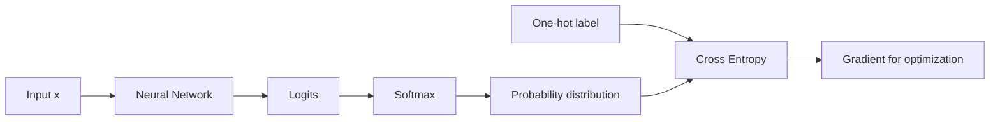
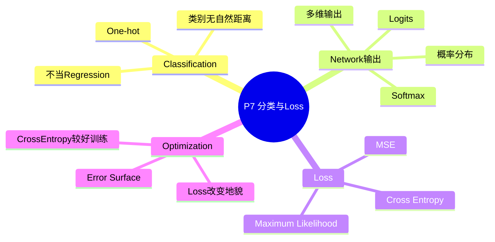

# P7 类神经网络训练不起来怎么办（四）：分类与损失函数

来源：`P7【7、类神经网络训练不起来怎么办四 损失函数 Loss 也】`  

> [!ABSTRACT] 本讲概要
> 本讲把前面主要以 regression 为例的训练流程转向 classification。分类任务通常不能把类别编号当连续数值回归，因为类别编号会人为制造大小和距离关系；更合理的做法是用 one-hot vector 表示 label，让 network 输出每个类别的 logit，再通过 softmax 转成总和为 1 的分布。最后，课程比较 MSE 与 cross entropy，说明 loss function 不只是评价标准，还会改变 optimization 的难度；分类任务常用 cross entropy，是因为它通常提供更适合训练的 error surface。



## 0. 本节课一句话总结

分类任务通常不把类别编号当作连续数值回归，而是把类别表示成 one-hot vector；network 输出多个 logits，再经过 softmax 变成 0 到 1 且总和为 1 的向量，最后用 cross entropy 衡量预测和正确答案的距离。相较于 MSE，cross entropy 通常更适合分类，因为它的 error surface 更利于 optimization。

## 1. 时间线总览

| 时间 | 内容 |
|---|---|
| 00:00-03:30 | 为什么不直接把分类当 regression |
| 03:30-06:00 | One-hot vector 表示类别，network 输出多维向量 |
| 06:00-10:30 | Softmax：把 logits 转成 0-1 且总和为 1 |
| 10:30-14:30 | Cross entropy 与 MSE，为什么分类常用 cross entropy |
| 14:30-19:20 | 从 optimization 角度看 cross entropy 更好训练 |

## 2. Regression 与 Classification 的差别

Regression 的输出是一个数值：

```text
输入 x -> 输出 y
```

目标是让预测 `y` 接近真实 label。

如果把 classification 硬当 regression，也可以把 class 编号：

```text
class 1 -> 1
class 2 -> 2
class 3 -> 3
```

然后让模型输出一个数字接近类别编号。

但这通常不合理。

问题是：类别编号会暗示距离关系。

例如：

```text
class 1 和 class 2 距离比较近
class 1 和 class 3 距离比较远
```

但如果这些类别本来没有自然顺序，这种距离关系就是人为制造的错误假设。

## 3. One-Hot Vector

分类任务更常用 one-hot vector 表示类别。

假设有三个类别：

```text
class 1 -> [1, 0, 0]
class 2 -> [0, 1, 0]
class 3 -> [0, 0, 1]
```

好处：

- 不暗示类别之间有大小顺序；
- 类别之间两两距离相同；
- 适合让 network 输出一个多维向量。

如果 label 是三维 one-hot vector，那么 network 也应该输出三个数值。

## 4. Network 如何输出多类别结果

假设有三个类别，network 最后一层输出：

```text
y1, y2, y3
```

这些原始输出通常叫：

```text
logits
```

Logits 可以是任意实数：

```text
正数、负数、大数、小数都可以
```

但 one-hot label 里的值只有 0 和 1。为了比较预测和 label，通常会先把 logits 通过 softmax。

## 5. Softmax

Softmax 输入 logits：

```text
y1, y2, y3
```

输出：

```text
y1', y2', y3'
```

计算方式：

```text
y_i' = exp(y_i) / sum_j exp(y_j)
```

Softmax 输出满足：

```text
0 <= y_i' <= 1
sum_i y_i' = 1
```

因此它可以被理解成每个类别的分数或概率。

## 6. Softmax 的效果

Softmax 不只是 normalize 到 0-1，它还会放大大值和小值的差距。

例子：

```text
logits = [3, 1, -3]
```

取 exponential：

```text
exp(3) ≈ 20
exp(1) ≈ 2.7
exp(-3) ≈ 0.05
```

Normalize 后：

```text
[0.88, 0.12, 约 0]
```

所以原来只差几个单位的 logits，经过 softmax 后会变成更明确的类别倾向。

## 7. 二分类与 Sigmoid

如果只有两个类别，可以直接使用 softmax。

但更常见的是：

```text
二分类使用 sigmoid
```

课程提到，两个 class 的 softmax 和 sigmoid 本质上可以推导成等价形式。实际写法不同，但思想相近：把任意实数转成 0 到 1 之间的输出。

## 8. 分类的 Loss：MSE vs Cross Entropy

得到 softmax 输出后，需要计算预测向量和 one-hot label 的距离。

一种方法是 MSE：

```text
MSE = sum_i (y_i' - y_hat_i)^2
```

但分类更常用：

```text
Cross Entropy
```

公式：

```text
CE = - sum_i y_hat_i log(y_i')
```

其中：

- `y_hat` 是 one-hot label；
- `y'` 是 softmax 后的预测。

如果正确类别是 class 1：

```text
y_hat = [1, 0, 0]
```

那么 cross entropy 实际上只看：

```text
-log(y1')
```

也就是说，正确类别的预测概率越高，loss 越小。

## 9. Cross Entropy 与 Maximum Likelihood

课程提到，如果从更完整的统计观点解释，minimize cross entropy 等价于 maximize likelihood。

但本节为了快速讲完分类，没有详细展开 likelihood。

需要记住：

```text
分类问题中，softmax 和 cross entropy 通常是搭配使用的一组。
```

## 10. 为什么分类常用 Cross Entropy

课程从 optimization 角度解释：MSE 和 cross entropy 的 error surface 不一样。

在分类任务中，假设正确答案是：

```text
[1, 0, 0]
```

模型先输出 logits，再经过 softmax。我们希望正确类别的 softmax 输出接近 1，其他类别接近 0。

如果用 MSE，有些 loss 很大的区域可能非常平坦，gradient 很小。

这会导致：

```text
模型明明错得很离谱，
但 gradient 很小，
gradient descent 很难开始修正。
```

如果用 cross entropy，在错误很大的区域仍然有明显斜率，gradient 可以推动参数往正确方向走。

因此：

```text
Cross entropy 通常比 MSE 更适合分类训练。
```

## 11. Loss Function 会改变 Optimization 难度

本节的关键延伸是：

```text
训练不起来不只可能因为 optimizer，
也可能因为 loss function 选得不好。
```

同一个分类任务：

- 用 MSE，error surface 可能有大片平坦区域；
- 用 cross entropy，error surface 可能更适合 gradient descent。

这说明你可以通过修改 loss function 改变 optimization 的难度。

## 12. 本节重要术语表

| 术语 | 中文 | 含义 |
|---|---|---|
| Classification | 分类 | 输出类别的任务 |
| One-hot vector | 独热向量 | 用一个位置为 1、其他为 0 表示类别 |
| Logits | 逻辑值/原始分数 | softmax 前 network 输出的任意实数 |
| Softmax | 软最大 | 把 logits 转成 0-1 且总和为 1 的向量 |
| Sigmoid | S 型函数 | 二分类中常用的输出函数 |
| MSE | 均方误差 | 预测和标签差的平方和/平均 |
| Cross Entropy | 交叉熵 | 分类常用 loss |
| Maximum Likelihood | 最大似然 | 与 minimize cross entropy 等价的统计观点 |

## 13. 易错点

1. 不要随便把类别编号当连续数值回归。
2. 类别编号会引入不真实的距离关系。
3. 多分类通常用 one-hot label。
4. Network 最后一层输出 logits，不一定已经是概率。
5. Softmax 输出介于 0 和 1，且总和为 1。
6. Softmax 会放大 logits 的相对差距。
7. 二分类常用 sigmoid，多分类常用 softmax。
8. 分类通常用 cross entropy，而不是 MSE。
9. Cross entropy 和 softmax 常常绑在一起使用。
10. Loss function 本身会影响 optimization 是否容易。

## 14. 复习问答

**Q1：为什么不直接把 class 1/2/3 编成 1/2/3 做 regression？**  
A：因为这样会暗示类别之间有大小和距离关系，但很多分类任务中类别没有这种关系。

**Q2：one-hot vector 如何表示三个类别？**  
A：class 1 是 `[1,0,0]`，class 2 是 `[0,1,0]`，class 3 是 `[0,0,1]`。

**Q3：logits 是什么？**  
A：Network 经过 softmax 前输出的原始分数，可以是任意实数。

**Q4：softmax 做什么？**  
A：把 logits 转成 0 到 1 之间、总和为 1 的向量。

**Q5：cross entropy 的公式是什么？**  
A：`CE = - sum_i y_hat_i log(y_i')`。

**Q6：为什么 cross entropy 适合分类？**  
A：它在分类错误很大时仍提供明显 gradient，比 MSE 更利于 optimization。

**Q7：softmax 和 cross entropy 的关系是什么？**  
A：多分类中它们通常搭配使用；softmax 产生类别分布，cross entropy 衡量预测分布和 one-hot label 的差距。

## 15. 知识地图



## 16. 本讲总结

```text
分类不要直接做编号 regression
  class 编号会制造错误距离

正确做法:
  label -> one-hot vector
  network -> logits
  logits -> softmax -> 0-1 且和为 1
  loss -> cross entropy

为什么不用 MSE:
  MSE 在错很大时可能 gradient 很小
  Cross entropy 更利于 gradient descent
```

> [!IMPORTANT] 核心结论
> 分类任务的关键不是把类别编号预测得“接近”，而是让模型输出对各类别的信心分布；softmax 把 logits 转成分布，cross entropy 则用更适合分类优化的方式惩罚错误信心。
