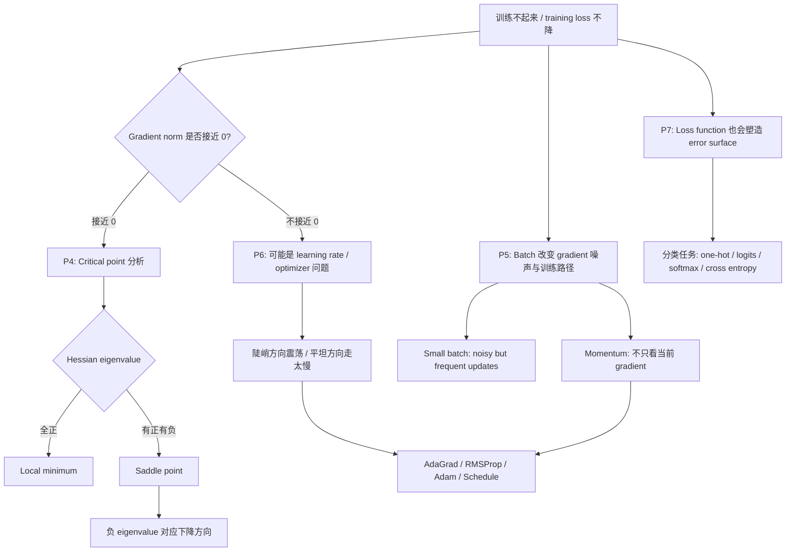

总体排查框架：

## 从 Gradient Descent 的三个问题看四讲

Gradient descent 看似只有一行：

$$
\theta^{t+1} = \theta^t - \eta g^t
$$

但这行公式背后有三个问题：

| 问题 | 对应讲次 | 解释 |
|---|---|---|
| $g^t$ 是否还存在？ | P4 | 如果 $g^t \approx 0$，要看是不是 critical point，以及是哪种 critical point。 |
| $g^t$ 是否可靠？ | P5 | Mini-batch 让 gradient 带噪声；momentum 把过去方向纳入估计。 |
| $\eta g^t$ 的步伐是否合适？ | P6 | 同一个 $\eta$ 对所有参数可能不合适，需要 adaptive LR 和 schedule。 |
| $L$ 本身是否定义得好？ | P7 | 不同 loss function 会形成不同 error surface，影响 gradient 是否好用。 |
