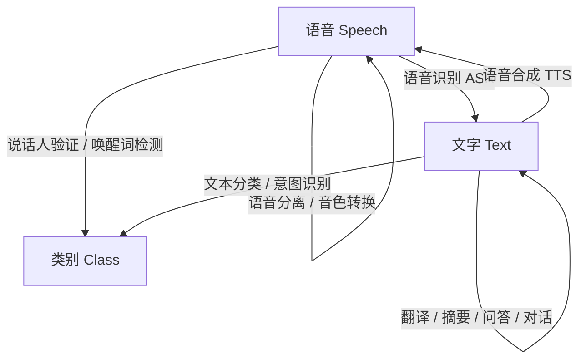
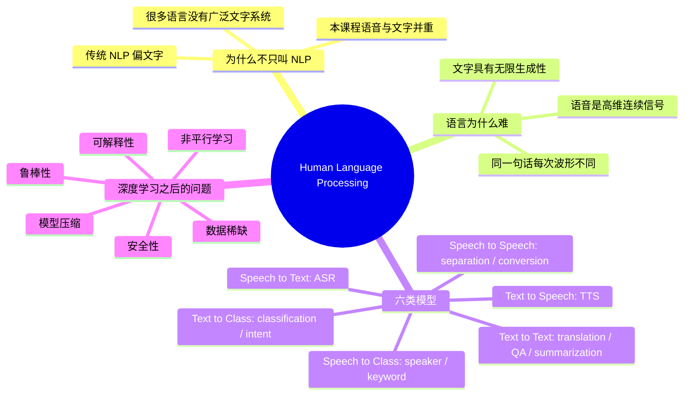

# P01 课程总览：Deep Learning for Human Language Processing

## 一、这门课研究的对象是什么

### 1.1 人类语言处理的目标

这门课的主题是 **Deep Learning for Human Language Processing**，可以翻译为“深度学习与人类语言处理”。

它关心的根本问题是：能不能让机器用人类熟悉的语言与人自然沟通？

这个问题包含两个方向：

| 方向 | 机器要做到什么 | 典型任务 |
| --- | --- | --- |
| 理解人 | 人说一句话、写一段文字，机器能听懂/看懂 | 语音识别、文本分类、问答、对话状态追踪 |
| 表达人 | 机器生成让人听得懂、看得懂的语言 | 语音合成、机器翻译、摘要、聊天机器人 |

这里的“语言”不是程序语言，而是人类自然发展出来的沟通系统。机器过去擅长处理程序语言，因为程序语言规则明确、形式严格；但人类语言充满模糊性、上下文依赖、语音变化和无限组合，因此更难处理。

### 1.2 Human Language Processing 与 NLP 的区别

通常我们更熟悉的术语是 **Natural Language Processing（NLP，自然语言处理）**。自然语言指人类在自然交流中形成的语言，例如中文、英文、日文、闽南语等。

这门课使用 **Human Language Processing（HLP）**，原因在于：

> [!IMPORTANT] HLP 的课程定位
> 传统 NLP 课程通常以文字为主，语音只占很小比例；而本课程把 **文字语言** 和 **语音语言** 放在同等重要的位置。

可以把两者关系理解为：

| 术语                | 常见关注重点              | 本课程态度    |
| ----------------- | ------------------- | -------- |
| NLP               | 主要处理文字，如分类、翻译、问答、摘要 | 重要，但不是全部 |
| Speech Processing | 主要处理语音，如识别、合成、说话人验证 | 与文字同等重要  |
| HLP               | 同时处理人类语言的文字形态与语音形态  | 本课程主线    |

**直觉**：人类语言并不是先有文字再有语音。大量语言首先以口语存在，文字只是其中一部分语言拥有的记录系统。如果只研究文字，会忽略语言中非常大的一块。

---

## 二、为什么语音不能被当成 NLP 的附属品

### 2.1 很多语言没有广泛使用的文字系统

课程中强调：世界上并不是所有语言都有稳定、广泛使用的文字系统。即使某些语言“理论上有文字”，也不代表使用者真的会用这种文字书写。

以闽南语为例，说它“没有文字”并不准确，因为它确实存在不止一种书写系统；但很多会说闽南语的人并不会熟练使用这些书写系统。这意味着，若机器只能处理文字，就无法真正服务这些语言社群。

> [!NOTE] 关键结论
> 对许多语言而言，语音不是文字处理的前置步骤，而是机器理解这种语言的主要入口。

### 2.2 语音的数据形态比文字更细密

语音通常用采样信号表示。若采样率为 16 kHz，则 1 秒声音包含：

$$
16{,}000
$$

个采样点。

也就是说，一秒钟语音就需要 16,000 个数字描述。相比一行文字，语音信号在时间维度上更密集，也更容易受到说话速度、音高、情绪、口音、设备、噪声等因素影响。

> [!TIP] 直觉
> 同一个人说两次“你好”，人耳觉得是同一句话，但波形不会完全一样。机器看到的是两个不同的高维连续信号，必须学会忽略不重要的变化、抓住语言内容。

这就是语音任务的根本困难：**声音信号变化巨大，但人类想表达的语言内容相对稳定**。

### 2.3 文字也具有无限组合性

文字看似离散、规则、比语音简单，但它也有自己的复杂性。课程引用了“最长句子”的例子说明：讨论“世界上最长的句子”没有意义，因为人类总能通过嵌套、引用、连接创造更长的句子。

这反映了自然语言的一个核心性质：

> [!IMPORTANT] 语言的生成性
> 人类语言不是有限句子的清单，而是一套可以无限组合、递归扩展的系统。

因此，语言处理不是查表问题。模型必须学会规则、语义、上下文和组合方式，而不是只记住见过的句子。

---

## 三、整门课的六类基本模型

本课程把人类语言处理任务统一为几类输入输出映射。输入可以是语音、文字；输出可以是语音、文字或类别。这样看，复杂任务会变得清晰很多。

这张图是本课程的总地图。后续许多看似不同的任务，都可以归入其中。

### 3.1 语音输入，文字输出：语音识别 ASR

**任务形式**：

$$
\text{speech} \rightarrow \text{text}
$$

语音识别（Automatic Speech Recognition, ASR）把声音信号转成文字。例如手机听写、会议转录、语音助手听指令，都属于这一类。

传统 ASR 系统通常由多个模块组成：

| 模块 | 作用 |
| --- | --- |
| 声学模型 | 判断声音片段对应哪些音素或 token |
| 语言模型 | 判断候选文字序列是否像自然语言 |
| 词典 | 连接发音单位与文字词汇 |
| 解码器 | 在候选空间中搜索最可能的句子 |

深度学习以后，ASR 越来越趋向端到端：输入声学特征，直接输出文字序列。课程中特别提到，现代手机离线语音识别已经可以把一个相对小的神经网络放进设备中。

但这并不代表 ASR 已经“简单”。语音任务有自己的结构问题，例如输入输出长度不同、对齐未知、实时性、设备端模型压缩、噪声鲁棒性等。

### 3.2 文字输入，语音输出：语音合成 TTS

**任务形式**：

$$
\text{text} \rightarrow \text{speech}
$$

语音合成（Text-to-Speech, TTS）把文字转成自然语音，例如语音助手朗读、导航播报、有声书生成。

现代 TTS 可以用神经网络生成非常自然的声音，但课程强调：效果惊人不等于问题完全解决。神经网络系统有时会出现很怪的失败模式，例如：

- 重复词表现正常，单个词反而发不出来；
- 某些短词单独朗读会破音，放进句子里又正常；
- 合成声音整体自然，但偶发错误难以解释。

> [!WARNING] TTS 的关键风险
> 神经网络 TTS 常常“多数时候很好”，但偶发错误可能很突然，而且不容易从传统规则角度解释。

这说明：端到端模型强大，但可控性、稳定性和错误诊断仍然重要。

### 3.3 语音输入，语音输出：语音分离与音色转换

**任务形式**：

$$
\text{speech} \rightarrow \text{speech}
$$

这一类任务不是把语音转成文字，而是把一段语音变成另一段语音。

#### 语音分离 Speech Separation

语音分离要解决“鸡尾酒会问题”：多人同时说话时，机器能否把不同说话人的声音分开？

| 输入 | 输出 |
| --- | --- |
| 多个说话人混在一起的声音 | 分离后的各个说话人声音 |

直觉上这像让机器拥有“选择性注意”的能力：在混杂声音中专注于某一个声源。

#### 音色转换 Voice Conversion

音色转换类似“柯南变声器”：输入一个人的语音，输出另一个人的音色，但保留原本说话内容。

理想目标是：

$$
\text{内容不变，声音身份改变}
$$

最朴素的做法需要平行语料：A 和 B 念完全相同的句子，模型学习如何把 A 的声音对应到 B 的声音。但现实中这种数据很难收集，因此课程会进一步讨论 non-parallel、one-shot 等更难也更实用的设定。

### 3.4 语音输入，类别输出：说话人验证与唤醒词检测

**任务形式**：

$$
\text{speech} \rightarrow \text{class}
$$

这一类不是生成语音或文字，而是判断语音属于哪一类。

典型任务包括：

| 任务 | 输入 | 输出 |
| --- | --- | --- |
| 说话人识别/验证 | 一段语音 | 是谁说的，或是否为本人 |
| 唤醒词检测 | 环境声音流 | 是否出现“Hey Siri / OK Google”等关键词 |

唤醒词检测的特殊之处在于：模型必须一直监听环境声音，因此不仅要准确，还要小、快、省电。

> [!IMPORTANT] 工程约束
> 语音任务不只是追求准确率。部署到手机、耳机、智能音箱时，模型大小、延迟和耗电同样是核心指标。

### 3.5 文字输入，文字输出：翻译、摘要、问答、聊天

**任务形式**：

$$
\text{text} \rightarrow \text{text}
$$

这是 NLP 中最广泛的一类任务。

| 应用 | 输入 | 输出 |
| --- | --- | --- |
| 机器翻译 | 一种语言的句子 | 另一种语言的句子 |
| 自动摘要 | 长文章 | 短摘要 |
| 问答 | 文章 + 问题 | 答案 |
| 聊天机器人 | 对话历史 | 回复 |
| 句法分析 | 句子 | 可线性化表示的句法树 |

课程强调一个重要思想：很多任务表面上不是文字生成，但可以被改写成 text-to-text。比如句法树也可以编码成字符串，于是 parsing 也能看作输入文字、输出文字。

这也是为什么后来的许多模型会走向统一范式：不同应用看似不同，但底层都可以由相近的序列到序列模型处理。

### 3.6 文字输入，类别输出：文本分类与意图识别

**任务形式**：

$$
\text{text} \rightarrow \text{class}
$$

这类任务包括情感分析、主题分类、垃圾邮件检测、意图识别等。虽然 P1 中没有展开细讲，但它属于整门课的基本任务类型之一。

例如在任务型对话系统中，用户说“帮我订一张明天去台北的车票”，模型可能需要判断：

| 字段 | 结果 |
| --- | --- |
| 意图 | 订票 |
| 时间 | 明天 |
| 目的地 | 台北 |

这类任务会和后续对话状态追踪、slot filling 等内容相连。

---

## 四、“一把神经网络训下去”为什么还不够

P1 中有一个贯穿全讲的观点：深度学习让许多任务都可以被重新表述为“收集数据，训练一个神经网络”。这确实改变了语音与 NLP 的研究范式。

但课程真正关心的不是“神经网络万能”，而是：

> [!IMPORTANT] 本课程的真正问题
> 在端到端深度学习已经成为默认工具之后，人类语言处理还剩下哪些没有解决的问题？

这些问题包括：

| 问题 | 为什么重要 |
| --- | --- |
| 数据稀缺 | 很多语言、说话人、领域没有大量标注数据 |
| 端到端失败模式 | 模型多数时候好，但偶发错误难解释 |
| 模型压缩 | 语音助手、唤醒词检测需要部署在设备端 |
| 非平行数据 | 音色转换、无监督翻译等任务无法依赖一一对应数据 |
| 鲁棒性 | 微小扰动可能骗过语音或文本模型 |
| 安全性 | 语音合成与变声可能攻击说话人验证 |
| 可解释性 | 模型给出答案后，能否说明理由 |

因此，后续课程不是重复“如何搭一个神经网络”，而是研究在语言任务中，神经网络遇到的具体瓶颈。

---

## 五、文字模型的发展主线：从词向量到巨型预训练模型

课程中提到，文字处理部分不会从 word embedding 这种大家熟悉的基础内容开始，而是直接进入 BERT 及其家族。

原因是：2018 年后，NLP 的中心迅速转向大规模预训练模型。

| 模型 | 大致时间 | 角色 |
| --- | --- | --- |
| ELMo | 2018 年 3 月 | 上下文化词表示的代表 |
| BERT | 2018 年 10 月 | 预训练 + fine-tuning 范式的关键节点 |
| GPT-2 | 2019 年 | 大规模自回归语言模型的重要代表 |
| T5 / Turing-NLG 等 | 2019 年后 | 参数规模继续扩大，任务形式进一步统一 |

这条主线背后的变化是：

> [!NOTE] 预训练范式
> 先用大规模无标注文本训练通用语言模型，再把它迁移到具体下游任务。

这使得文本分类、问答、摘要、翻译、生成等任务都能共享底层表示或统一为 text-to-text 框架。

---

## 六、后续课程会关注的开放主题

### 6.1 Meta Learning：学习如何学习

语言任务常常缺数据，尤其是低资源语言、少样本说话人、新领域任务。Meta Learning 试图让模型从许多任务中学到“如何快速适应新任务”。

直觉上，模型不是只学会某一个任务，而是成为更好的学习者。

在语音识别中，这可能意味着：

1. 先在多种语言上学习语音识别；
2. 总结跨语言的学习规律；
3. 面对新语言时，用更少数据更快适应。

### 6.2 Style Transfer：把风格转换推广到语音和文字

图像中有风格转换；语音和文字也可以有类似思想。

| 领域 | 风格可以是什么 |
| --- | --- |
| 语音 | 说话人音色、情绪、语速、口音 |
| 文字 | 正式/口语、长文/摘要、语言种类、作者风格 |

如果把英文和中文看作两种“书写风格”，甚至可以提出无监督机器翻译的问题：只有一堆英文和一堆中文，没有句子对齐，能否学会翻译？

如果把语音和文字看作两种“表达风格”，还可以进一步追问：没有明确标注语音-文字对应关系时，机器能否学会语音识别？

### 6.3 Knowledge：语言模型能否吸收知识

语言模型经常被批评“缺少常识”。课程提出的问题是：机器能否通过阅读大量文章抽取知识，并把这些知识整合进模型？

这关系到问答、推理、事实一致性和可解释性。

### 6.4 Adversarial Attack：语音和文字模型也会被攻击

对抗攻击不是图像领域独有的问题。语音和文字系统同样可能被微小扰动欺骗。

语音中的风险包括：

- 用变声技术欺骗说话人验证；
- 用人耳不明显的扰动欺骗语音识别；
- 把背景音乐扰动成语音助手能听懂的恶意指令；
- 欺骗 spoofing detection 系统。

文字中的风险包括：

- 在文章中插入无关干扰句，让问答模型输出错误答案；
- 用特殊触发词让模型行为偏离正常语义；
- 利用模型对表面模式的依赖制造错误。

> [!WARNING] 安全意义
> 当语音助手、银行验证、客服系统、问答系统进入真实世界后，鲁棒性不再是论文指标，而是安全问题。

### 6.5 Explainability：模型能否解释自己的判断

如果模型回答了一个问题，或者判断一段语音属于某个人，它能否说明理由？

这件事在图像领域已有大量研究，例如模型指出自己看图时关注了哪里。在语言处理中，也需要类似能力：

- 问答模型能否指出答案来自哪句话；
- 分类模型能否指出关键词或证据；
- 对话系统能否解释为什么采取某个动作；
- 语音模型能否说明哪些声学线索支持判断。

可解释性不是装饰，而是调试、信任和安全部署的基础。

---

## 七、本讲知识地图

---

## 八、常见误区

### 误区 1：NLP 就是处理文字

传统课程中 NLP 常常偏文字，但人类语言不只有文字。语音是许多语言更基础、更普遍的形态。

### 误区 2：语音处理就是语音识别

语音识别只是 speech-to-text。语音领域还包括 TTS、speech separation、voice conversion、speaker verification、keyword spotting 等任务。

### 误区 3：端到端模型出现后，传统问题就都消失了

端到端模型减少了人工模块设计，但带来了新的问题：不可解释、偶发错误、对抗攻击、数据需求大、部署成本高。
