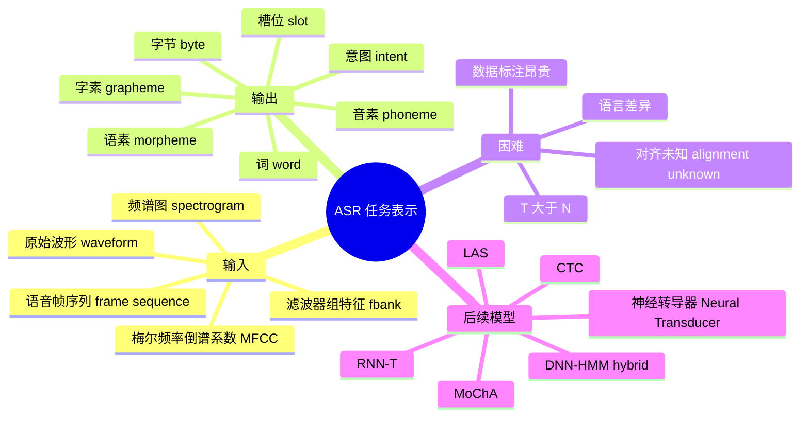

# P02 语音识别（一）：任务定义与输入输出表示

## 术语表

| 中文术语     | English term                        | 缩写/记号 | 本讲中的含义                             |
| -------- | ----------------------------------- | ----- | ---------------------------------- |
| 语音识别     | Automatic Speech Recognition        | ASR   | 把语音信号转换成文字序列                       |
| 词元/符号    | token                               | $y_n$ | 模型每一步输出的基本单位，可以是音素、字素、词等           |
| 声学特征     | acoustic feature                    | $x_t$ | 从语音波形中抽出的帧级别（frame-level）向量        |
| 对齐       | alignment                           | -     | 哪些声学帧对应哪些输出词元/符号（token）的关系         |
| 音素       | phoneme                             | -     | 区分意义的基本发音单位                        |
| 字素       | grapheme                            | -     | 书写系统的基本单位，如英文字母或汉字                 |
| 语素       | morpheme                            | -     | 有意义的最小语言单位，如 `un-`、`break`、`-able` |
| 发音词典     | pronunciation lexicon / lexicon     | -     | 记录词和发音单位之间的映射                      |
| 滤波器组特征   | filter bank features                | fbank | 深度学习 ASR 常用的声学特征                   |
| 梅尔频率倒谱系数 | Mel-frequency cepstral coefficients | MFCC  | 传统 ASR 常用的声学特征                     |
| 意图分类     | intent classification               | -     | 直接从语音判断用户想做什么                      |
| 槽位填充     | slot filling                        | -     | 从语音或文字中抽出时间、地点等结构化槽位               |

## 零、为什么 ASR 曾经被认为很难

今天手机和电脑都能做语音识别，所以 ASR 容易被误认为只是一个普通的分类问题。但在早期研究中，语音识别曾经被严肃怀疑过。课程提到 J. R. Pierce 在 1969 年的文章 *Whither Speech Recognition?* 中对 ASR 持悲观态度，认为它可能需要极大投入却难以得到实用结果。

 ASR 的困难来自多个层面：

| 困难 | 为什么麻烦 |
| --- | --- |
| 信号连续 | 声音是高频采样的连续波形，不是天然离散符号 |
| 说话差异 | 不同人、口音、语速、情绪会改变声学表现 |
| 对齐未知 | 训练资料通常只有整句文字，没有每一帧对应的 token |
| 语言约束 | “听起来像什么”和“像不像一句自然语言”要同时考虑 |
| 数据昂贵 | 每段语音都要有可靠文字标注，收集和清洗成本高 |

所以本讲先不讲模型细节，而是从输入、输出、token 和资料规模开始。这些设定决定了后面 LAS、CTC、RNN-T、DNN-HMM hybrid 等模型到底要解决什么问题。

## 一、语音识别的基本问题

### 1.1 任务定义

语音识别的目标是把一段声音信号转换成文字序列：

$$
X = (x_1, x_2, \ldots, x_T)
\quad \longrightarrow \quad
Y = (y_1, y_2, \ldots, y_N)
$$

其中：

| 符号    | 含义                               |
| ----- | -------------------------------- |
| $X$   | 输入语音，被表示成一串声学特征向量                |
| $T$   | 输入序列长度，也就是声学帧（acoustic frame）的数量 |
| $x_t$ | 第 $t$ 个声学特征向量                    |
| $Y$   | 输出文字，被表示成一串词元/符号（token）          |
| $N$   | 输出词元/符号（token）数量                 |
| $y_n$ | 第 $n$ 个输出词元/符号（token）            |

通常有：

$$
T \gg N
$$

因为声学特征一般每 10 ms 取一帧，而一个文字词元/符号（token）往往对应更长时间的声音片段。

> [!IMPORTANT] ASR 的核心困难
> 输入是长而密集的连续声学序列，输出是短得多的离散文字序列；训练资料通常只告诉你整段声音对应哪一句话，却不告诉你每一帧声音对应哪个词元/符号（token）。

这就是后续连接时序分类（CTC）、注意力机制（attention）、RNN 转导器（RNN-T）等模型反复处理的问题：**对齐（alignment）未知**。

### 1.2 概率视角

语音识别可写成：

$$
\hat{Y} = \arg\max_Y P(Y \mid X)
$$

也就是：给定声音 $X$，寻找概率最大的文字序列 $Y$。

这个概率包含两类信息：

| 信息 | 解释 |
| --- | --- |
| 声学证据 | 这段声音听起来像哪些音、字或词 |
| 语言约束 | 哪些文字序列更像自然语言 |

传统 ASR 往往把这些信息拆成多个模块；端到端 ASR 则尝试直接学习 $P(Y \mid X)$。

---

## 二、输出文字可以用什么词元/符号（token）表示

输出端的第一件事是决定：模型每一步到底输出什么单位？

### 2.1 音素（phoneme）：发音单位

**音素（phoneme）** 是语言中区分意义的基本发音单位。可以粗略类比为“音标”，但两者不完全相同：音标是书写发音的符号系统，音素则是语言系统中能区分意义的抽象声音单位。

如果输出词元/符号（token）是音素（phoneme），ASR 的流程是：

优点：

- 音素（phoneme）与声音关系更直接；
- 声学模型更容易学到“声音到发音单位”的对应。

缺点：

- 需要发音词典（pronunciation lexicon / lexicon），把词汇映射到音素（phoneme）；
- 需要语言学知识，不同语言甚至不同文献对音素集合（phoneme inventory）可能有不同划分；
- 对新语言不够方便。

> [!NOTE] 直觉
> 音素（phoneme）适合“先听出发音，再查词典变成文字”的路线。

### 2.2 字素（grapheme）：书写单位

**字素（grapheme）** 是书写系统的基本单位。它不一定等同于“一个发音”，而是文字系统中可用来拼写的基本符号。

| 语言 | 字素（grapheme）例子 |
| --- | --- |
| 英文 | 字母 `a,b,c,...`，还需要空格和标点 |
| 中文 | 方块字，如“你”“好”“中”“文” |

优点：

- 不需要发音词典；
- 对新语言更直接，只要有文字资料就能建立词元集合（token set）；
- 可能拼出训练集中没见过的新词。

缺点：

- 字母与声音关系不总是直接，例如英文中 /k/ 可写成 `c` 或 `k`；
- 英文还要自己学会何时输出空格；
- 可能出现拼写错误。

> [!TIP] 音素（phoneme）与字素（grapheme）
> 音素更接近声音，但依赖语言学资源；字素更容易落地，但要求模型自己学会复杂的发音到书写关系。

### 2.3 词（word）

直接用词（word）作为词元/符号（token），看起来最符合人类阅读习惯：

$$
\text{one punch man} \rightarrow [\text{one}, \text{punch}, \text{man}]
$$

但它有明显问题：

- 英文词汇量巨大；
- 新词、专名、拼写变化会不断出现；
- 中文等语言没有天然空格，分词本身就是问题；
- 某些语言可通过词缀不断生成超长词，词表很难穷举。

所以词级词元（word token）往往会面临 **未登录词（out-of-vocabulary, OOV）** 问题：测试时出现了训练词表中没有的词，模型就无法直接输出。

### 2.4 语素（morpheme）：有意义的最小单位

**语素（morpheme）** 是“有意义的最小语言单位”。它比词（word）小，但通常比字素（grapheme）大。

例：

$$
\text{unbreakable} = \text{un} + \text{break} + \text{able}
$$

优点：

- 比词（word）更能处理新词；
- 比字符/字素（character/grapheme）更有语义；
- 对词形变化丰富的语言更有吸引力。

缺点：

- 需要语言学分析或统计切分；
- 自动切出来的片段不一定真有语义；
- 实作复杂度高于字素（grapheme）。

### 2.5 字节（byte）：语言无关单位

更极端的做法是用字节（byte），例如 UTF-8 字节序列。这样所有语言都能用相同词元集合（token set）表示。

优点：

- 词元集合（token set）小，最多 256 种字节（byte）；
- 理论上语言无关（language-independent）；
- 不需要针对不同语言设计不同字表。

缺点：

- 字节（byte）与语言结构距离更远；
- 输出序列更长；
- 模型要学会从字节组合恢复文字。

---

## 三、输出单位对比

| 输出单位 | 粒度 | 优点 | 缺点 | 适合场景 |
| --- | --- | --- | --- | --- |
| 音素（phoneme） | 发音单位 | 与声音关系明确 | 需要发音词典（lexicon）和语言学知识 | 资源充足、发音词典可靠 |
| 字素（grapheme） | 字母/汉字 | 简单、无需词典、可处理新词 | 声音到文字关系复杂 | 端到端 ASR 常用 |
| 词（word） | 词 | 输出自然、序列短 | OOV 严重、词表大 | 封闭词表或强语言模型场景 |
| 语素（morpheme） | 语素 | 兼顾语义与泛化 | 切分不易 | 形态变化丰富语言 |
| 字节（byte） | 字节 | 语言无关、词表小 | 序列长、结构远 | 多语言统一模型 |

> [!IMPORTANT] 本讲结论
> 输出词元/符号（token）的选择不是细节，而是决定了模型要学什么：学发音、学拼写、学词表，还是学更底层的字节组合。

课程还提到，2019 年左右的 ASR 论文中，输出单位大致呈现这样的趋势：

| 输出单位                                   | 使用趋势 | 直觉解释                          |
| -------------------------------------- | ---- | ----------------------------- |
| 字素（grapheme）                           | 最常见  | 不需要发音词典，建立 token set 最直接      |
| 音素（phoneme）                            | 仍然常见 | 和声音关系清楚，但依赖 lexicon           |
| 子词/语素类单位（subword / morpheme-like unit） | 居中   | 介于 grapheme 和 word 之间，兼顾长度与泛化 |
| 词（word）                                | 较少   | OOV 和巨大词表问题明显                 |
| 字节（byte）                               | 较特别  | 追求语言无关，但序列更底层                 |

> [!NOTE] 怎么读这些趋势
> 趋势统计不是说 grapheme 永远最好，而是说明实际研究会在资源成本、语言特性、词表大小和模型难度之间折中。

---

## 四、输出不一定只能是文字

狭义 ASR 的输出是文字。但只要输入是语音，输出不一定非要停在转写文本。课程中还提到一些更直接的端到端设定：

| 任务 | 输入 | 输出 | 省掉了什么中间步骤 |
| --- | --- | --- | --- |
| 标准 ASR | speech | text | - |
| 语音翻译 | speech | translated text | 不必先转成源语言文字再翻译 |
| 语音到语义表示 | speech | word / sentence embedding | 不必显式输出可读文字 |
| 意图分类 | speech | intent label | 不必先转写再做 NLU |
| 槽位填充 | speech | slot labels | 不必先转写再抽时间、地点等槽位 |

例如订票系统中，用户说“我要买明天去台北的车票”，系统最终真正需要的可能不是完整转写，而是：

| 槽位 | 值 |
| --- | --- |
| intent | 买票 |
| date | 明天 |
| destination | 台北 |

传统 pipeline 会先做：

端到端做法则可能直接学习：

> [!TIP] 和 NLP 的连接
> ASR 不只是把声音变成文字。它也可以是语音和 NLP 任务之间的接口：翻译、对话系统、语义理解都可以直接接在语音输入之后。

---

## 五、输入语音如何表示

### 5.1 从原始波形（waveform）到语音帧（frame）

原始语音是原始波形（waveform）。若采样率为 16 kHz，则 25 ms 的窗口约有：

$$
16{,}000 \times 0.025 = 400
$$

个采样点。

最直接的做法是把这 400 个采样点当成一个 400 维向量，但这通常不是最常用的表示。

实际 ASR 中常会：

1. 取一个约 25 ms 的窗口（window）；
2. 每次向右移动约 10 ms；
3. 每个 window 提取一个声学特征向量；
4. 得到一串帧级别特征（frame-level feature）。

因为窗口有重叠，相邻语音帧的信息高度相似。这也是后续模型常做降采样（downsampling / subsampling）的原因。

### 5.2 常见声学特征

| 表示 | 含义 | 特点 |
| --- | --- | --- |
| 原始波形（waveform） | 原始波形采样点 | 最原始，维度高，变化大 |
| 频谱图（spectrogram） | 时间-频率表示 | 比原始波形（waveform）更接近人类听觉分析 |
| 滤波器组特征（filter bank features, fbank） | 滤波器组输出，常取 log | 深度学习 ASR 中常用 |
| 梅尔频率倒谱系数（Mel-frequency cepstral coefficients, MFCC） | 经过 Mel 滤波、取 log、DCT 等步骤得到的特征 | 传统 ASR 中经典特征 |

早期 ASR 常用 MFCC。深度学习兴起后，fbank 特征越来越常见，因为神经网络可以自己学习后续变换，不一定需要手工设计到 MFCC 的每一步。

> [!NOTE] 直觉
> 原始波形（waveform）太原始；频谱图（spectrogram）把声音展开到时间-频率平面；滤波器组特征（fbank）和梅尔频率倒谱系数（MFCC）进一步模仿人耳频率感知，把声音转成更适合模型处理的特征。

课程也用 2019 年论文统计说明了特征选择的变化：

| 输入特征 | 当时趋势 | 解释 |
| --- | --- | --- |
| fbank / filter bank output | 最常见，约占多数 | 深度学习模型可以接手后续表示学习，不一定需要手工 DCT 到 MFCC |
| MFCC | 仍有人使用，但比例下降 | 传统 ASR 经典特征，过去长期主流 |
| 原始波形（waveform） | 较少 | 端到端程度更高，但学习难度和数据需求更大 |
| 频谱图（spectrogram） | 可用但不是最主流 | 比 waveform 结构更清楚，但通常还会继续变成 fbank 等特征 |

> [!IMPORTANT] fbank 为什么流行
> 不是因为 MFCC “错了”，而是深度学习模型可以从较少手工压缩的 fbank 中学习更合适的表示；MFCC 中某些手工步骤在神经网络时代不一定仍然必要。

---

## 六、数据量：语音比图像更“吃数据”

语音识别需要大量成对资料：

$$
(\text{speech}, \text{text})
$$

也就是每段声音都要有文字标注。

课程中列举了常见英文 ASR 语料：

| 语料 | 大致规模 | 说明 |
| --- | --- | --- |
| TIMIT | 约 4 小时 | 小型基准，类似语音领域的 toy dataset |
| Wall Street Journal | 约 80 小时 | 经典英文读稿语料 |
| Switchboard | 约 300 小时 | 电话对话语料 |
| LibriSpeech | 约 960 小时 | 常用公开语料 |

相比图像，语音数据一秒就有 16,000 个采样点，因此“小时数”背后是非常大的连续信号量。工业系统往往使用远超论文公开规模的数据。

课程里还用了一个有意思的换算：如果把 MNIST、CIFAR 这类图像数据集的像素数粗略当作 16 kHz 音频采样点来看，它们对应的“语音时长”其实只有几十分钟到数小时量级。也就是说，图像领域的经典入门数据集，换成语音尺度后并不算大。

进一步说，公开论文中常见的几百到几千小时语音已经不小，但大公司实际产品系统使用的资料量可能达到数万甚至十万小时级别。ASR 的工程上限很大程度受资料规模、标注质量和场景覆盖影响。

> [!WARNING] 数据不是附属条件
> 在 ASR 中，模型结构固然重要，但数据规模、标注质量、说话人覆盖、口音覆盖、噪声场景同样决定系统上限。

---

## 七、后续模型地图

本讲最后预告了几类 ASR 模型：

| 模型 | 核心想法 | 后续讲解重点 |
| --- | --- | --- |
| 听-注意-拼写模型（Listen, Attend and Spell, LAS） | 用注意力式序列到序列模型（attention seq2seq）生成文字 | P3 |
| 连接时序分类（Connectionist Temporal Classification, CTC） | 每个声学帧输出词元或空白符（token/blank），再合并得到文字 | P4 |
| RNN 转导器（Recurrent Neural Network Transducer, RNN-T） | 结合声学编码器（acoustic encoder）与预测网络（prediction network），可在线识别 | P4/P5 |
| 神经转导器（Neural Transducer） | 分块处理语音，兼顾在线性与注意力机制（attention） | P4 |
| 单调分块注意力（Monotonic Chunkwise Attention, MoChA） | 单调分块注意力，让窗口动态移动 | P4 |
| DNN-HMM 混合模型（DNN-HMM hybrid model） | 保留 HMM 的对齐/解码框架，用 DNN 提供声学分数 | P5 |

这些模型都在解决同一组问题：

1. 输入很长，输出较短；
2. 对齐未知；
3. 需要在声学证据和语言约束之间取得平衡；
4. 要兼顾准确率、速度、模型大小和是否能在线识别。

---

## 八、本讲知识地图

---

## 九、自测问题

1. 为什么 ASR 输入长度 $T$ 通常远大于输出长度 $N$？
2. 音素（phoneme）和字素（grapheme）作为输出单位分别有什么优缺点？
3. 为什么词级词元（word token）容易遇到未登录词（OOV）问题？
4. 为什么说语素（morpheme）介于词（word）和字素（grapheme）之间？
5. 字节级 ASR（byte-level ASR）为什么可以做到语言无关（language-independent）？
6. 为什么说语音模型的输出不一定只能是文字？请举一个 intent classification 或 slot filling 的例子。
7. 为什么原始波形（waveform）不一定是最方便的 ASR 输入？
8. 滤波器组特征（fbank）和梅尔频率倒谱系数（MFCC）在 ASR 中各扮演什么角色？
9. 为什么深度学习时代 fbank 比 MFCC 更常见？
10. 为什么语音识别需要大量标注数据？
11. 后续的 LAS、CTC、RNN-T 共同要解决什么根本问题？
