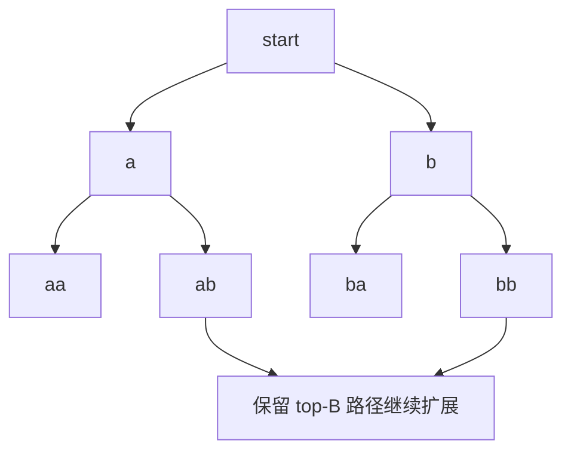
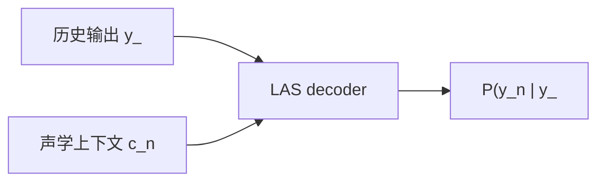
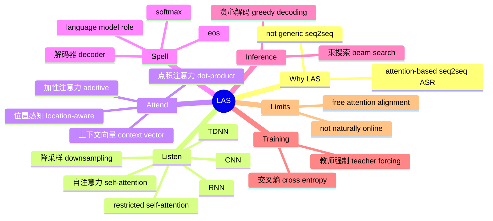

# P03 语音识别（二）：LAS 与注意力式序列到序列模型

## 术语表

| 中文术语 | English term | 缩写/记号 | 本讲中的含义 |
| --- | --- | --- | --- |
| 听-注意-拼写模型 | Listen, Attend and Spell | LAS | 用注意力式序列到序列模型做语音识别 |
| 序列到序列模型 | sequence-to-sequence model | seq2seq | 输入一个序列，输出另一个序列 |
| 编码器 | encoder | - | 把声学特征序列转换成隐藏表示 |
| 解码器 | decoder | - | 根据声学表示和历史输出逐步生成词元/符号（token） |
| 注意力机制 | attention mechanism | attention | 对编码器输出加权求和，找当前最相关的声学片段 |
| 上下文向量 | context vector | $c_n$ | 注意力加权后得到的当前声学摘要 |
| 降采样 | downsampling / subsampling | - | 缩短声学序列长度，降低计算量 |
| 金字塔式 RNN | pyramidal RNN | pRNN | 在层与层之间合并相邻时间步，减少序列长度 |
| 延时神经网络 | Time Delay Neural Network | TDNN | 语音领域常见的一维卷积式编码器 |
| 受限自注意力 | restricted self-attention | - | 只在局部窗口内做 self-attention，降低长语音计算量 |
| 位置感知注意力 | location-aware attention | - | 当前注意力分布参考前一步注意力分布的机制 |
| 贪心解码 | greedy decoding | - | 每一步只选当前概率最大的词元/符号 |
| 束搜索 | beam search | - | 每一步保留多个高分候选路径的解码方法 |
| 教师强制 | teacher forcing | - | 训练时把正确历史词元输入解码器 |
| 语言模型 | language model | LM | 根据历史文字预测后续文字的模型；LAS decoder 部分承担类似角色 |

## 一、为什么叫 LAS，而不只叫 seq2seq

LAS 本质上确实是序列到序列模型（sequence-to-sequence model, seq2seq）：输入一串声学特征，输出一串文字 token。但在 ASR 语境里，直接说“seq2seq model”并不够明确，因为 CTC、RNN-T、Neural Transducer 也都是输入序列、输出序列。

因此课程使用更具体的名称 **Listen, Attend and Spell (LAS)**。它指的是一类 attention-based seq2seq ASR：

| 名称部分 | 对应模块 | 做什么 |
| --- | --- | --- |
| Listen | encoder | 听取并编码整段语音 |
| Attend | attention | 在编码后的声学序列中找当前相关位置 |
| Spell | decoder | 逐 token 拼出文字 |

> [!NOTE] 命名的意义
> LAS 不是“所有 seq2seq ASR”的泛称，而是特指用 attention mechanism 连接 encoder 与 decoder 的那一路模型。

## 二、LAS 要解决什么问题

P2 已经把 ASR 写成：

$$
X=(x_1,\ldots,x_T) \rightarrow Y=(y_1,\ldots,y_N)
$$

听-注意-拼写模型（Listen, Attend and Spell, LAS）的目标是直接学习：

$$
P(Y\mid X)
$$

并把输出序列拆成逐步生成：

$$
P(Y\mid X)=\prod_{n=1}^{N}P(y_n\mid y_{<n},X)
$$

也就是说，模型每次生成一个词元/符号（token），生成下一个词元时会参考前面已经生成的词元和整段声音。

> [!IMPORTANT] LAS 的三段式
> Listen = 编码器（encoder）编码语音；Attend = 注意力机制（attention mechanism）寻找相关声学片段；Spell = 解码器（decoder）逐词元输出文字。

---

## 三、Listen：编码器（encoder）如何处理语音

### 3.1 编码器（encoder）的作用

编码器输入声学特征：

$$
x_1,x_2,\ldots,x_T
$$

输出新的隐藏表示：

$$
h_1,h_2,\ldots,h_{T'}
$$

理想上，编码器要把语音中和识别无关的变化压掉，例如说话人差异、背景噪声、录音设备差异，同时保留语言内容。

> [!NOTE] 直觉
> 编码器不是简单换个维度，而是在把原始声学序列变成“更适合识别文字”的表示。

### 3.2 编码器可以用什么网络

| 架构 | 怎么处理序列 | 优点 | 问题 |
| --- | --- | --- | --- |
| 递归神经网络 / 长短期记忆网络（RNN / LSTM） | 按时间递归处理 | 适合序列，能建模上下文 | 长序列慢，不易并行 |
| 双向 RNN / 双向 LSTM（BiRNN / BiLSTM） | 同时看左右上下文 | 表示更强 | 不能严格在线 |
| 一维卷积网络 / 延时神经网络（1D CNN / Time Delay Neural Network, TDNN） | 沿时间卷积 | 并行、局部模式强 | 需堆叠扩大感受野 |
| 自注意力（self-attention） | 每个位置关注其他位置 | 长程依赖强 | 语音序列太长时计算昂贵 |

语音中常见做法不是只用一种，而是组合。例如前几层用卷积神经网络（Convolutional Neural Network, CNN）降维/抽局部特征，后面接循环神经网络（RNN）或自注意力（self-attention）。

### 3.3 为什么需要降采样（downsampling / subsampling）

语音帧（frame）很密，常见设置是每 10 ms 一帧。一个 10 秒句子就有约 1000 帧，而输出文字可能只有几十个词元。

因此编码器常做 **降采样（downsampling / subsampling）**：

$$
T \rightarrow T'
\quad \text{where} \quad T' < T
$$

常见方法：

| 方法 | 做法 | 作用 |
| --- | --- | --- |
| 金字塔式 RNN（pyramidal RNN） | 每一层把相邻隐藏状态（hidden state）合并 | 减少后续时间步 |
| 时间池化（pooling over time） | 每几个时间步取一个或池化 | 降低序列长度 |
| 跨步卷积（strided CNN） | 卷积时跨步移动 | 抽特征同时降采样 |
| 受限自注意力（restricted self-attention） | 只看局部窗口 | 降低注意力计算量 |

> [!IMPORTANT] 关键判断
> 降采样不是“小优化”，而是语音序列到序列模型（seq2seq）能否训起来的关键。输入太长会让编码器、注意力机制、解码器都变得困难。

更细一点看，语音模型常见的省计算技巧可以分成几类：

| 技巧 | 解决的问题 | 直觉 |
| --- | --- | --- |
| pyramidal RNN | RNN 时间步太多 | 把相邻 hidden states 拼接或合并后送到下一层 |
| pooling over time | 相邻帧高度相似 | 每几个时间步保留一个代表 |
| TDNN / 1D CNN | 局部声学模式重复出现 | 用 filter 沿时间扫过语音特征，可用较少参数看局部上下文 |
| dilated / sparse temporal convolution | 局部窗口太密 | 间隔取样，扩大感受野并节省计算 |
| restricted self-attention | 全局 self-attention 对长语音太贵 | 当前帧只看前后固定范围，而不是整段语音 |

> [!TIP] 为什么语音特别在意这些技巧
> 机器翻译的输入可能只有十几个词，但 10 秒语音就可能有上千帧。LAS 如果不先缩短或限制声学序列，attention 和 decoder 都会被长输入拖垮。

---

## 四、Attend：注意力机制（attention）在 LAS 中做什么

### 4.1 注意力机制（attention）的基本形式

在生成第 $n$ 个词元/符号（token）时，解码器有一个状态 $z_n$。注意力机制用 $z_n$ 去和编码器输出 $h_i$ 比较，得到每个语音帧的权重：

$$
e_{n,i} = \text{score}(z_n,h_i)
$$

再做 softmax：

$$
\alpha_{n,i} =
\frac{\exp(e_{n,i})}{\sum_j \exp(e_{n,j})}
$$

最后得到上下文向量（context vector）：

$$
c_n = \sum_i \alpha_{n,i}h_i
$$

其中 $c_n$ 就是当前生成词元时，从语音中提取出的相关信息。

### 4.2 打分函数（score function）怎么设计

常见有两类：

#### 点积注意力（dot-product attention）

把 $z_n$ 和 $h_i$ 变换到同一空间后做内积：

$$
e_{n,i} = (W_q z_n)^\top (W_k h_i)
$$

直觉：两个向量越相似，注意力分数越高。

#### 加性注意力（additive attention）

先把两者加起来过非线性层，再输出分数：

$$
e_{n,i} = v^\top \tanh(W_z z_n + W_h h_i)
$$

这类注意力机制参数更多，形式更灵活。

### 4.3 语音中的注意力应该大体单调

翻译中，输出词可能对应输入句子的任意位置；但语音识别不同。语音从左到右展开，文字也大体从左到右生成。

因此 ASR 中理想的注意力分布通常应当：

$$
\text{随输出词元增加而从左向右移动}
$$

如果注意力分布在语音帧上乱跳，往往说明模型学得不稳定。

> [!WARNING] LAS 的潜在问题
> 普通注意力机制自由度过高，而语音识别的对齐应大致单调。自由度过大可能导致漏字、重复、跳读或训练不稳定。

### 4.4 位置感知注意力（location-aware attention）

为适应语音的单调性，可以让当前注意力分布参考前一步注意力分布：

$$
\alpha_{n} \text{ depends on } \alpha_{n-1}
$$

直觉上，模型会学到：上一步看了某个位置，这一步通常应该看它附近或稍微靠右的位置。

这类方法称为 **位置感知注意力（location-aware attention）**。

---

## 五、Spell：解码器（decoder）如何生成文字

解码器每一步输出一个词元/符号（token）分布：

$$
P(y_n\mid y_{<n},X)
$$

如果词元集合（token set）的大小为 $V$，解码器输出就是一个 $V$ 维 softmax 分布。

这里的 $V$ 取决于 P02 讨论过的 token 选择：

| token 选择 | decoder 输出分布的含义 |
| --- | --- |
| grapheme / character | 每一步预测一个字母、汉字、空格、标点或 `<eos>` |
| phoneme | 每一步预测一个音素 |
| word | 每一步预测一个词 |
| morpheme / subword | 每一步预测一个子词或语素片段 |
| byte | 每一步预测一个 UTF-8 byte |

所以 LAS 的 decoder 不是固定“输出字母”的模块；它输出的是你定义好的 token set 上的概率分布。

例如目标是 `cat`：

解码器需要一个特殊词元：句尾符号（end-of-sentence token, `<eos>`），表示句子结束。否则模型不知道什么时候停止生成。

---

## 六、推理：为什么需要束搜索（beam search）

### 6.1 贪心解码（greedy decoding）的问题

贪心解码（greedy decoding）每一步都选当前概率最大的词元/符号（token）：

$$
y_n = \arg\max_y P(y\mid y_{<n},X)
$$

问题是：局部最优不一定带来全局最优。第一步选了概率稍低的词元，后面可能进入更高概率的路径。

### 6.2 束搜索（beam search）

束搜索（beam search）每一步保留 $B$ 条当前分数最高的候选路径，$B$ 称为束宽（beam size）。

束宽（beam size）越大，越可能找到高分路径，但计算量越大。

> [!TIP] 直觉
> 贪心解码（greedy decoding）像每一步只看眼前最顺的选择；束搜索（beam search）像同时保留几条看起来不错的候选路线，走一段再比较。

---

## 七、训练：交叉熵（cross entropy）与教师强制（teacher forcing）

### 7.1 训练目标

训练资料给定：

$$
(X, Y^*)
$$

其中 $Y^*=(y_1^*,\ldots,y_N^*)$ 是正确文字序列。

在第 $n$ 步，模型输出分布 $P(y_n\mid y_{<n},X)$，训练目标是让正确词元的概率尽可能大。常用 **交叉熵损失（cross entropy loss）**：

$$
\mathcal{L}
= -\sum_{n=1}^{N}\log P(y_n^*\mid y_{<n}^*,X)
$$

### 7.2 教师强制（teacher forcing）

训练解码器时，生成第 $n$ 个词元前，不把模型上一步“猜出来的词元”喂进去，而是把正确答案中的上一个词元喂进去：

$$
y_{n-1}^{input}=y_{n-1}^*
$$

这叫 **教师强制（teacher forcing）**。

为什么重要？

如果训练早期模型乱输出，把错误词元继续喂给后面步骤，后面步骤学到的上下文也是乱的。教师强制（teacher forcing）让每一步都在正确前缀条件下学习。

> [!IMPORTANT] 教师强制（teacher forcing）的作用
> 它把“学会根据正确历史预测下一个词元”这件事稳定下来，避免训练早期错误连锁传播。

---

## 八、decoder 为什么像语言模型

传统 ASR 系统常把声学模型（acoustic model）和语言模型（language model, LM）分开：声学模型负责“这段声音像什么”，语言模型负责“这串文字自然不自然”。

LAS 的 decoder 在生成第 $n$ 个 token 时使用历史输出：

$$
P(y_n\mid y_{<n},X)
$$

这里的 $y_{<n}$ 就是语言历史。因此，decoder 不只是把 context vector 翻译成 token，它也在学习类似 language model 的能力：根据已经输出的前缀判断下一个 token 应该是什么。

> [!IMPORTANT] 端到端的含义
> LAS 不一定需要外接 language model，因为 decoder 已经承担了部分 LM 角色。但在实际系统或作业中，额外融合外部 LM 仍可能进一步提升识别效果。

---

## 九、LAS 的价值与局限

LAS 后来确实可以在较大数据上取得很强结果，并且端到端系统的模型体积可能比传统多模块系统小很多。

它的价值主要在于：

| 价值 | 说明 |
| --- | --- |
| 端到端 | 直接学习 $P(Y\mid X)$，减少传统 ASR 的多模块拼接 |
| 结构直观 | encoder 听语音，attention 找位置，decoder 生成文字 |
| 可学习对齐 | attention weight 常能学出从左到右移动的 alignment |
| 模型可压缩 | 相比传统 acoustic model + pronunciation model + language model 的组合，整体系统可能更紧凑 |

Google 等早期 LAS 工作中的 attention 可视化显示，模型往往能学到从左到右移动的注意力轨迹。这很重要，因为它说明 attention 虽然自由度很大，但在足够数据和合适技巧下，模型可以学出符合 ASR 直觉的 alignment。

但 LAS 也有局限：

| 局限 | 原因 |
| --- | --- |
| 不天然在线 | encoder 和 attention 往往需要看完整段输入 |
| 输入太长时难训 | 语音帧多，注意力计算重 |
| 对齐太自由 | 可能出现跳读、漏读、重复 |
| 推理成本高 | 束搜索（beam search）需要扩展多条路径 |
| 训练依赖技巧 | 降采样、教师强制、注意力设计都很关键 |

在线语音识别（online ASR）要求系统边听边输出，不能等整句话结束才开始识别。LAS 的困难在于：普通 attention 会在所有 encoder outputs 上搜索相关位置；如果未来的语音还没听到，attention 的可用范围就不完整。即使限制窗口，也会带来延迟、准确率和复杂度之间的取舍。

| 在线需求 | LAS 的挑战 |
| --- | --- |
| 边听边出字 | 普通 attention 依赖完整或较长输入上下文 |
| 低延迟 | beam search 和 attention 都增加计算与等待 |
| 长语音稳定识别 | attention 搜索范围变大，容易漏字或重复 |

这就是为什么后续还要讲连接时序分类（Connectionist Temporal Classification, CTC）、RNN 转导器（Recurrent Neural Network Transducer, RNN-T）、神经转导器（Neural Transducer）等模型：它们用不同方式限制对齐、支持在线识别或降低搜索难度。

---

## 十、本讲知识地图

---

## 十一、自测问题

1. LAS 三个词 Listen、Attend、Spell 分别对应模型中的哪三个部分？
2. 为什么在 ASR 语境里不能简单把 LAS 叫作“seq2seq model”就结束？
3. 为什么语音编码器（encoder）常常需要降采样（downsampling / subsampling）？
4. pyramidal RNN、TDNN、restricted self-attention 分别在节省什么？
5. 注意力机制中 $\alpha_{n,i}$ 和上下文向量 $c_n$ 分别代表什么？
6. 为什么 ASR 的注意力分布通常应大体从左到右移动？
7. 贪心解码（greedy decoding）为什么不一定找到最高概率序列？
8. 束宽（beam size）变大会带来什么收益和代价？
9. 教师强制（teacher forcing）为什么能稳定解码器训练？
10. 为什么 LAS decoder 可以看成某种 language model？
11. LAS 为什么不天然适合在线识别？
